# CIVITAS — Catálogo Definitorio de Casos de Uso (UML) y Especificación Técnica Completa

**Versión:** 3.1 (Actualizada — Desarrollador e Integrador separados)  
**Proyecto:** CIVITAS — Observatorio Urbano, Asequibilidad Inmobiliaria y Verificación Criptográfica  
**Alcance:** Fases I, II, III y IV (Fase I/II Scrum Sprints 1–16 + Fase III/IV Desarrollo en Espiral)  

---

## 0. Resumen Arquitectónico y Mapa General de Actores

El sistema CIVITAS estructura sus interacciones mediante **12 actores definidos**, divididos en actores primarios (humanos) y actores secundarios (sistemas externos/servicios). 

### Convenciones UML
* **Asociación Directa:** Actor ↔ Caso de Uso Principal.
* **«include»:** Relación de inclusión obligatoria (el caso base siempre ejecuta el caso incluido).
* **«extend»:** Relación de extensión condicional (se ejecuta solo bajo condiciones específicas).
* **«generaliza»:** Relación de herencia entre actores (única relación actor-actor válida en UML).

---

### Diagrama 0: Mapa General de Actores y Herencia

```mermaid
flowchart TB
    classDef actor fill:#ffffff,stroke:#333,stroke-width:1px,color:#000;
    classDef abstracto fill:#f0f0f0,stroke:#666,stroke-width:1px,stroke-dasharray:3 3,color:#000;

    Visitante(["🧑 Visitante no autenticado"]):::actor
    Inquilino(["🧑 Inquilino"]):::actor
    Comprador(["🧑 Comprador"]):::actor
    Ciudadano(["🧑 Ciudadano Aportador de Datos"]):::actor
    Validador(["🧑 Validador DAO"]):::actor
    Inversionista(["🧑 Inversionista"]):::actor
    Urbanista(["🧑 Urbanista"]):::actor
    Administradora(["🏢 Administradora de Propiedades"]):::actor
    PropTech(["🏢 Cliente PropTech"]):::actor
    Admin(["🛡️ Administrador de la plataforma"]):::actor
    Dev(["👨‍💻 Desarrollador"]):::actor
    Integrador(["🔧 Integrador"]):::actor
    ActorInstitucional(["Actor Institucional<br/>(abstracto, opcional)"]):::abstracto

    Validador -.->|"«generaliza» de"| Ciudadano
    Inversionista -.->|"«generaliza» de (opcional)"| ActorInstitucional
    Administradora -.->|"«generaliza» de (opcional)"| ActorInstitucional
    PropTech -.->|"«generaliza» de (opcional)"| ActorInstitucional
```

---

## 1. Visitante no Autenticado

### Diagrama 1: Visitante no Autenticado

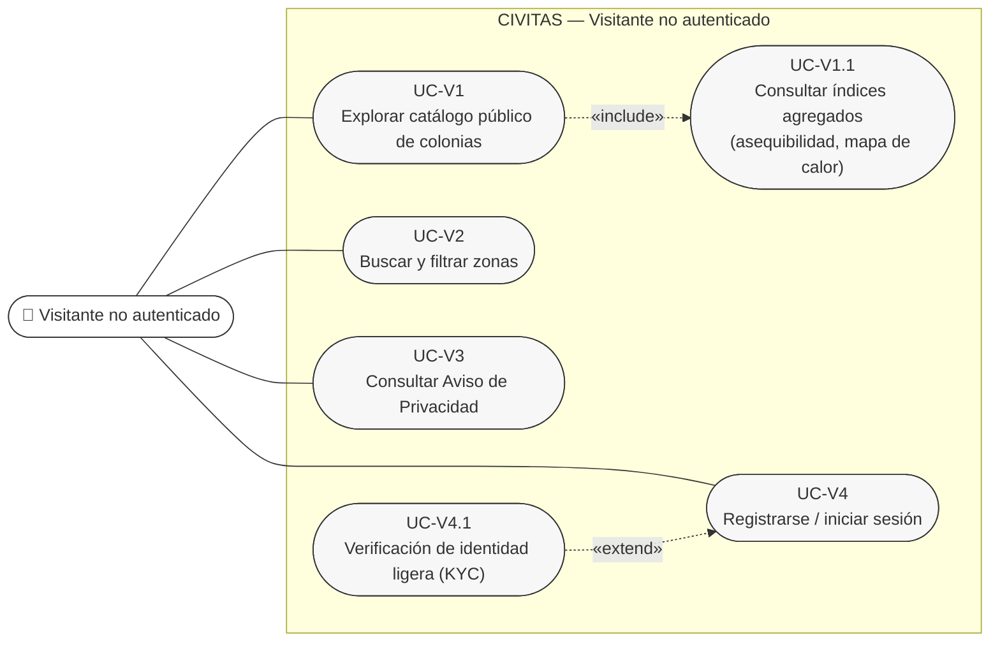

### Tabla de Casos de Uso — Visitante
| Código | Nombre | Relación / Tipo | Descripción Breve |
|---|---|---|---|
| **UC-V1** | Explorar catálogo público de colonias | Base | Navegación libre por fichas agregadas de colonias sin requerir credenciales. |
| **UC-V1.1** | Consultar índices agregados | `«include»` de UC-V1 | Muestra métricas promediadas por polígono (renta mediana, asequibilidad, servicios). |
| **UC-V2** | Buscar y filtrar zonas | Base | Búsqueda geolocalizada por rango de precio, transporte, equipamiento y seguridad. |
| **UC-V3** | Consultar Aviso de Privacidad | Base | Acceso público y directo a términos normativos y tratamiento de datos (OE4). |
| **UC-V4** | Registrarse / iniciar sesión | Base | Creación de cuenta con correo/contraseña y confirmación mail. |
| **UC-V4.1** | Verificación de identidad ligera (KYC) | `«extend»` de UC-V4 | Verificación de documento + selfie (Proof of Humanity). Opcional al registro. |

---

## 2. Inquilino

### Diagrama 2: Inquilino

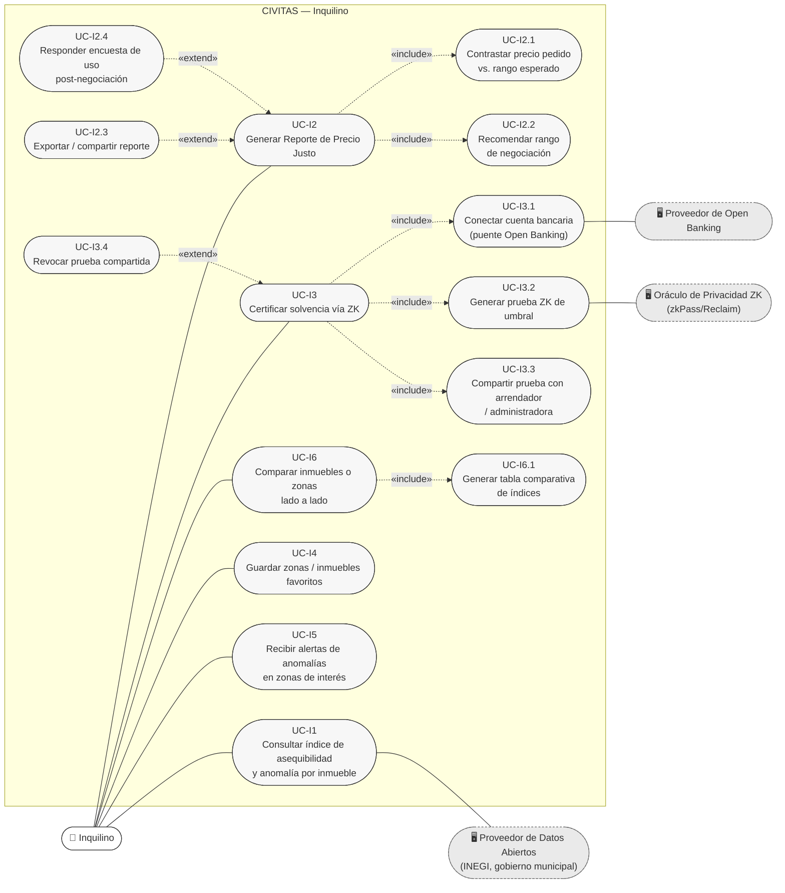

### Tabla de Casos de Uso — Inquilino
| Código | Nombre | Relación / Tipo | Descripción Breve |
|---|---|---|---|
| **UC-I1** | Consultar índice y anomalía por inmueble | Base | Muestra el desglose de sobreprecio/subprecio de una propiedad específica. Requiere cuenta. |
| **UC-I2** | Generar Reporte de Precio Justo | Base | Emisión de documento con sustento técnico de valoración justa para arrendamiento. |
| **UC-I2.1** | Contrastar precio vs. rango esperado | `«include»` de UC-I2 | Comparación algorítmica del precio ofertado contra el modelo econométrico local. |
| **UC-I2.2** | Recomendar rango de negociación | `«include»` de UC-I2 | Cálculo de montos objetivo, aceptable y límite para postura de oferta. |
| **UC-I2.3** | Exportar / compartir reporte | `«extend»` de UC-I2 | Generación de archivo PDF o enlace público temporal. |
| **UC-I2.4** | Responder encuesta post-negociación | `«extend»` de UC-I2 | Captura del precio final acordado para retroalimentar el KPI de impacto. |
| **UC-I3** | Certificar solvencia vía ZK | Base | Generación de credencial de solvencia económica sin revelar saldo bancario. |
| **UC-I3.1** | Conectar cuenta bancaria | `«include»` de UC-I3 | Enlace seguro mediante Open Banking API para lectura criptográfica. |
| **UC-I3.2** | Generar prueba ZK de umbral | `«include»` de UC-I3 | Ejecución del circuito ZK (zkPass/Reclaim) que valida: `ingreso >= 3x renta`. |
| **UC-I3.3** | Compartir prueba con arrendador | `«include»` de UC-I3 | Envío de token de verificación a la administradora o propietario. |
| **UC-I3.4** | Revocar prueba compartida | `«extend»` de UC-I3 | Cancelación inmediata del acceso del tercero a la verificación de la prueba. |
| **UC-I4** | Guardar favoritos | Base | Almacenamiento de colonias e inmuebles en el perfil de usuario. |
| **UC-I5** | Recibir alertas de anomalías | Base | Notificaciones automáticas ante variaciones críticas de precios en zonas guardadas. |
| **UC-I6** | Comparar inmuebles/zonas | Base | Matriz comparativa lado a lado (hasta 4 elementos simultáneos). |
| **UC-I6.1** | Generar tabla comparativa | `«include»` de UC-I6 | Mapeo de indicadores normativos, precios e infraestructura en tabla resumida. |

---

## 3. Comprador

### Diagrama 3: Comprador

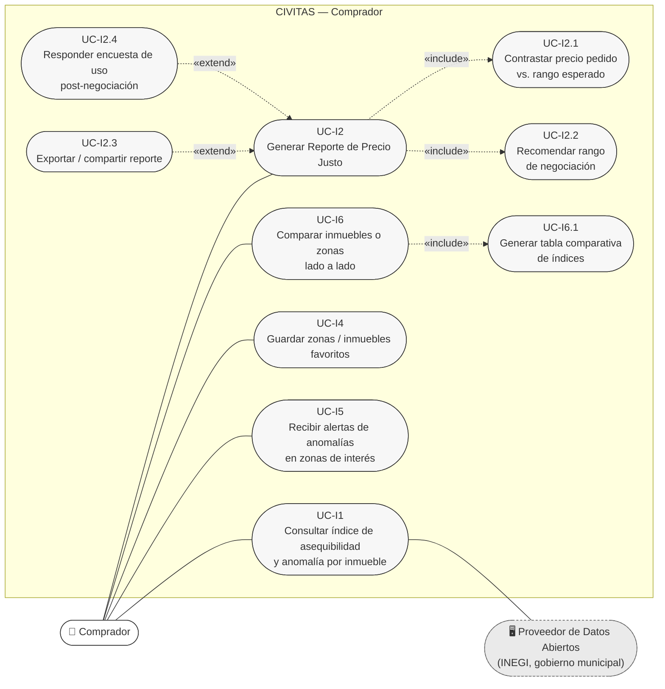

### Tabla de Casos de Uso — Comprador
*(Nota: Comparte la lógica analítica de precios del Inquilino, omitiendo los flujos de solvencia para arrendamiento).*

---

## 4. Ciudadano Aportador de Datos

### Diagrama 4: Ciudadano Aportador de Datos

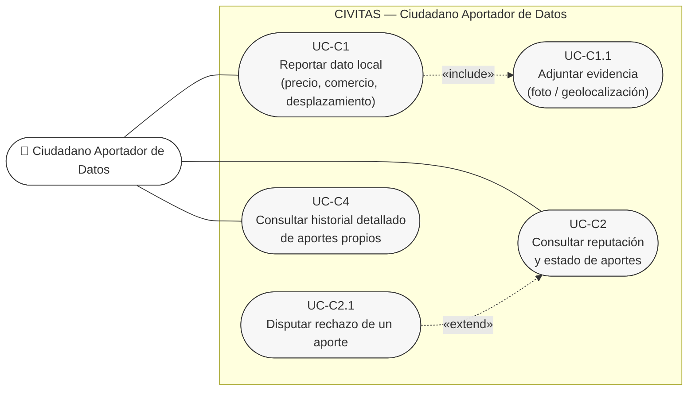

### Tabla de Casos de Uso — Ciudadano Aportador
| Código | Nombre | Relación / Tipo | Descripción Breve |
|---|---|---|---|
| **UC-C1** | Reportar dato local | Base | Envío de observación territorial (precios, comercios, transporte, seguridad). |
| **UC-C1.1** | Adjuntar evidencia | `«include»` de UC-C1 | Carga obligatoria de prueba (fotografía georreferenciada o coordenadas GPS). |
| **UC-C2** | Consultar reputación y estado | Base | Visualización del puntaje acumulado y estado de aportes en cola. |
| **UC-C2.1** | Disputar rechazo de aporte | `«extend»` de UC-C2 | Apertura de apelación ante la comunidad DAO tras voto negativo. |
| **UC-C4** | Consultar historial de aportes | Base | Bitácora de contribuciones validadas, rechazadas o pendientes. |

---

## 5. Validador DAO

### Diagrama 5: Validador DAO

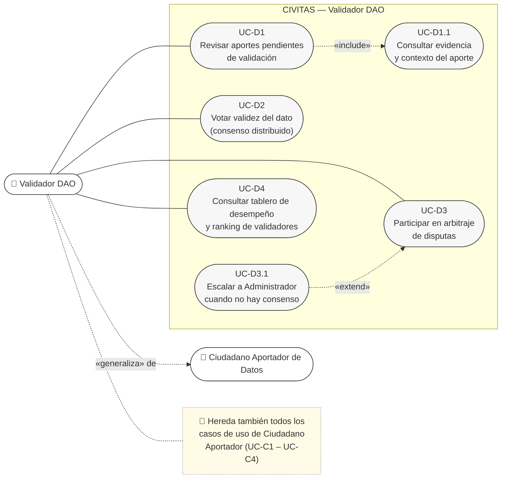

### Tabla de Casos de Uso — Validador DAO
| Código | Nombre | Relación / Tipo | Descripción Breve |
|---|---|---|---|
| **UC-D1** | Revisar aportes pendientes | Base | Acceso a la cola de validación asignada según geolocalización y reputación. |
| **UC-D1.1** | Consultar evidencia y contexto | `«include»` de UC-D1 | Análisis detallado del dato enviado por el ciudadano contra fuentes históricas. |
| **UC-D2** | Votar validez del dato | Base | Emisión de voto (Aprobar / Rechazar) en el mecanismo de consenso distribuido. |
| **UC-D3** | Participar en arbitraje | Base | Resolución colectiva de disputas o aportes impugnados. |
| **UC-D3.1** | Escalar a Administrador | `«extend»` de UC-D3 | Remisión de caso sin consenso alcanzado a la moderación central. |
| **UC-D4** | Consultar tablero de desempeño | Base | Indicadores de precisión de voto, slashing y recompensas recibidas. |

---

## 6. Inversionista

### Diagrama 6: Inversionista

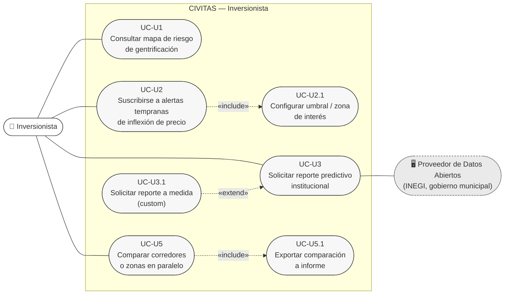

### Tabla de Casos de Uso — Inversionista
| Código | Nombre | Relación / Tipo | Descripción Breve |
|---|---|---|---|
| **UC-U1** | Consultar mapa de riesgo de gentrificación | Base | Visualización de capas térmicas con proyección de plusvalía y desplazamiento. |
| **UC-U2** | Suscribirse a alertas tempranas | Base | Configuración de notificaciones por cambios acelerados en métricas urbanas. |
| **UC-U2.1** | Configurar umbral / zona | `«include»` de UC-U2 | Ajuste de parámetros de tolerancia y polígonos de interés financiero. |
| **UC-U3** | Solicitar reporte predictivo | Base | Generación de análisis prospectivo con modelos econométricos institucionales. |
| **UC-U3.1** | Solicitar reporte a medida | `«extend»` de UC-U3 | Parametrización personalizada del estudio predictivo. |
| **UC-U5** | Comparar corredores o zonas | Base | Evaluación comparativa multivariable de rendimiento inmobiliario regional. |
| **UC-U5.1** | Exportar comparación a informe | `«include»` de UC-U5 | Descarga de dossier en PDF/Excel para comités de inversión. |

---

## 7. Urbanista

### Diagrama 7: Urbanista

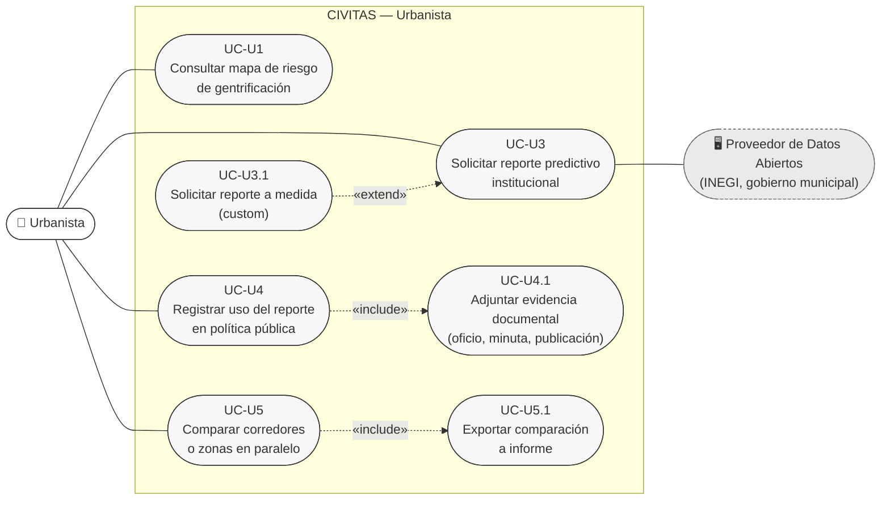

### Tabla de Casos de Uso — Urbanista
| Código | Nombre | Relación / Tipo | Descripción Breve |
|---|---|---|---|
| **UC-U4** | Registrar uso en política pública | Base | Vinculación formal de los reportes CIVITAS con planes directores o regulaciones. |
| **UC-U4.1** | Adjuntar evidencia documental | `«include»` de UC-U4 | Carga de folios, gacetas oficiales o minutas de cabildo que acrediten el impacto. |

---

## 8. Administradora de Propiedades

### Diagrama 8: Administradora de Propiedades

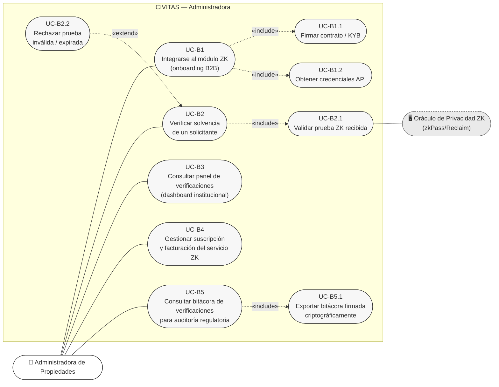

### Tabla de Casos de Uso — Administradora
| Código | Nombre | Relación / Tipo | Descripción Breve |
|---|---|---|---|
| **UC-B1** | Integrarse al módulo ZK | Base | Proceso de vinculación B2B institucional. |
| **UC-B1.1** | Firmar contrato / KYB | `«include»` de UC-B1 | Validación legal de la empresa arrendadora (Know Your Business). |
| **UC-B1.2** | Obtener credenciales API | `«include»` de UC-B1 | Generación de llaves públicas/privadas para integración de software. |
| **UC-B2** | Verificar solvencia de solicitante | Base | Evaluación de prueba ZK remitida por candidatos a arrendamiento. |
| **UC-B2.1** | Validar prueba ZK recibida | `«include»` de UC-B2 | Verificación matemática de la firma del oráculo sin ver cuentas de origen. |
| **UC-B2.2** | Rechazar prueba inválida/expirada | `«extend»` de UC-B2 | Descarte automático de tokens modificados o fuera del marco temporal. |
| **UC-B3** | Consultar panel institucional | Base | Dashboard corporativo de expedientes procesados y aprobaciones. |
| **UC-B4** | Gestionar suscripción B2B | Base | Administración de planes de consulta y facturación por volumen. |
| **UC-B5** | Consultar bitácora de verificaciones | Base | Registro inmutable de validaciones para auditorías de no-discriminación. |
| **UC-B5.1** | Exportar bitácora firmada | `«include»` de UC-B5 | Emisión de reporte criptográfico sellado. |

---

## 9. Cliente PropTech

### Diagrama 9: Cliente PropTech

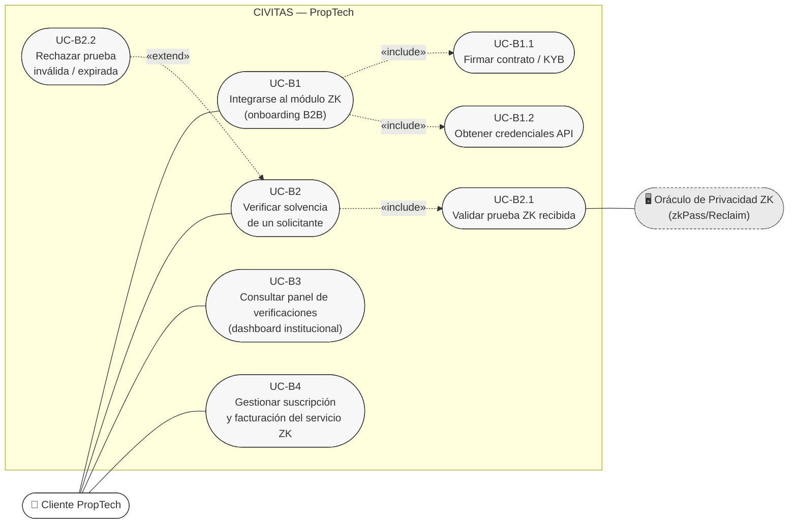

### Tabla de Casos de Uso — PropTech
*(Utiliza la API B2B ZK de CIVITAS embebida dentro de plataformas externas de inmobiliarias).*

---

## 10. Administrador de la Plataforma

### Diagrama 10: Administrador de la Plataforma

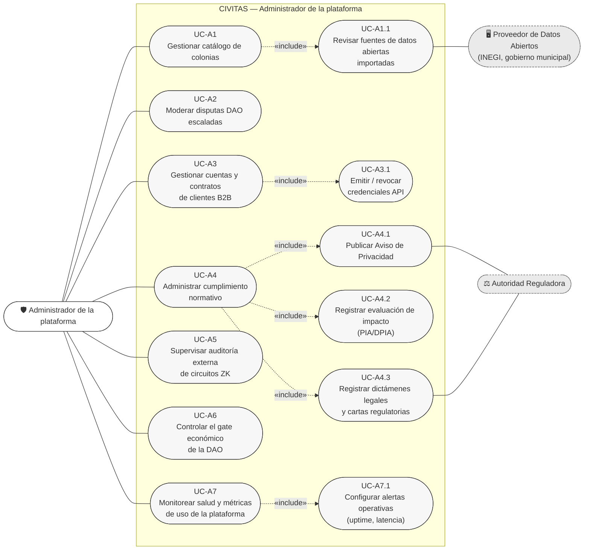

### Tabla de Casos de Uso — Administrador
| Código | Nombre | Relación / Tipo | Descripción Breve |
|---|---|---|---|
| **UC-A1** | Gestionar catálogo de colonias | Base | Alta, baja, modificación y control de completitud de zonas. |
| **UC-A1.1** | Revisar fuentes de datos abiertas | `«include»` de UC-A1 | Inspección de conectores automáticos con INEGI, mapas y catastro. |
| **UC-A2** | Moderar disputas DAO escaladas | Base | Intervención final en empates o impugnaciones del sistema DAO. |
| **UC-A3** | Gestionar cuentas B2B | Base | Alta de empresas, acuerdos comerciales y límites de consumo. |
| **UC-A3.1** | Emitir/revocar credenciales API | `«include»` de UC-A3 | Gestión del ciclo de vida de tokens institucionales. |
| **UC-A4** | Administrar cumplimiento normativo | Base | Monitoreo del compliance normativo (ARCO, LFPDPPP). |
| **UC-A4.1** | Publicar Aviso de Privacidad | `«include»` de UC-A4 | Actualización legal obligatoria antes del despliegue de fases. |
| **UC-A4.2** | Registrar evaluaciones DPIA | `«include»` de UC-A4 | Carga de dictámenes de impacto en protección de datos personales. |
| **UC-A4.3** | Registrar dictámenes regulatorios | `«include»` de UC-A4 | Repositorio de cartas y autorizaciones del marco legal Fintech/Inmobiliario. |
| **UC-A5** | Supervisar auditoría de circuitos ZK | Base | Verificación de reportes de seguridad en el código de zk-SNARKs. |
| **UC-A6** | Controlar gate económico DAO | Base | Interruptor de activación de incentivos económicos tras autorización legal. |
| **UC-A7** | Monitorear salud y métricas | Base | Consola de rendimiento del sistema, disponibilidad y latencia. |
| **UC-A7.1** | Configurar alertas operativas | `«include»` de UC-A7 | Umbrales de fallos de infraestructura o caídas de APIs externas. |

---

## 11. Desarrollador

*(Rol técnico general: construye software propio consumiendo el catálogo público de CIVITAS. No necesariamente maneja datos financieros/ZK.)*

### Diagrama 11: Desarrollador

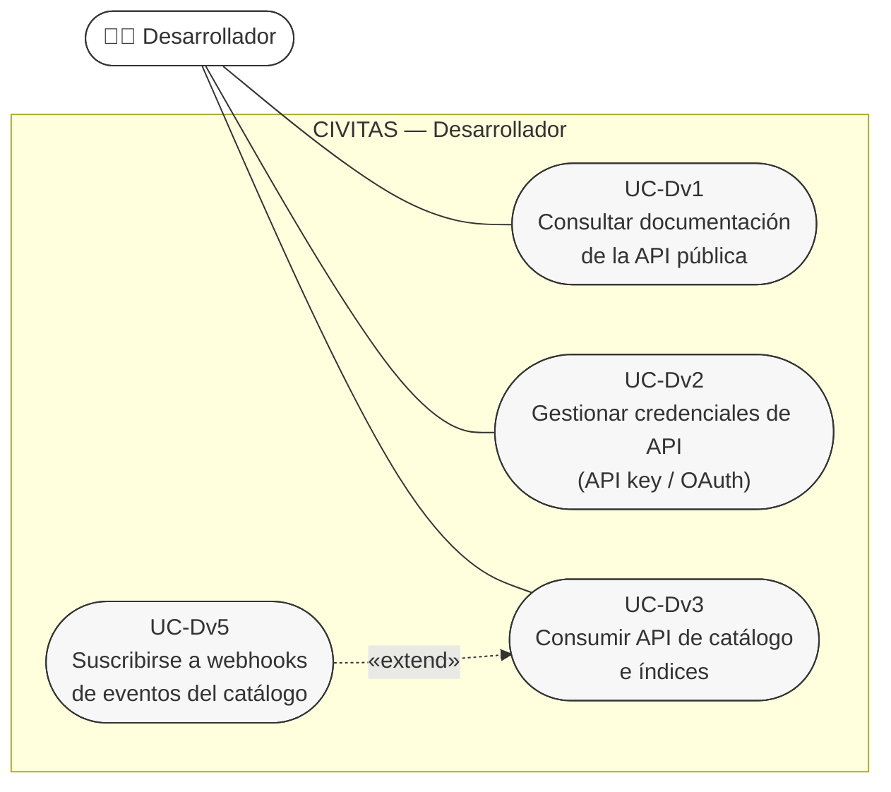

### Tabla de Casos de Uso — Desarrollador
| Código | Nombre | Relación / Tipo | Descripción Breve |
|---|---|---|---|
| **UC-Dv1** | Consultar documentación API | Base | Acceso al portal OpenAPI / Swagger interactivo. |
| **UC-Dv2** | Gestionar credenciales API | Base | Solicitud y rotación de tokens de prueba y producción. |
| **UC-Dv3** | Consumir API de catálogo | Base | Consultas HTTP/REST de índices de asequibilidad y datos agregados. |
| **UC-Dv5** | Suscribirse a webhooks | `«extend»` de UC-Dv3 | Configuración de callbacks para recepción de eventos en tiempo real. |

---

## 12. Integrador

*(Rol técnico especializado: implementa el SDK de verificación de solvencia ZK dentro de sistemas propios o de terceros — distinto del Desarrollador porque opera sobre el módulo financiero/criptográfico sensible, típicamente en nombre de un cliente institucional. Comparte con el Desarrollador el acceso base a documentación y credenciales.)*

### Diagrama 12: Integrador

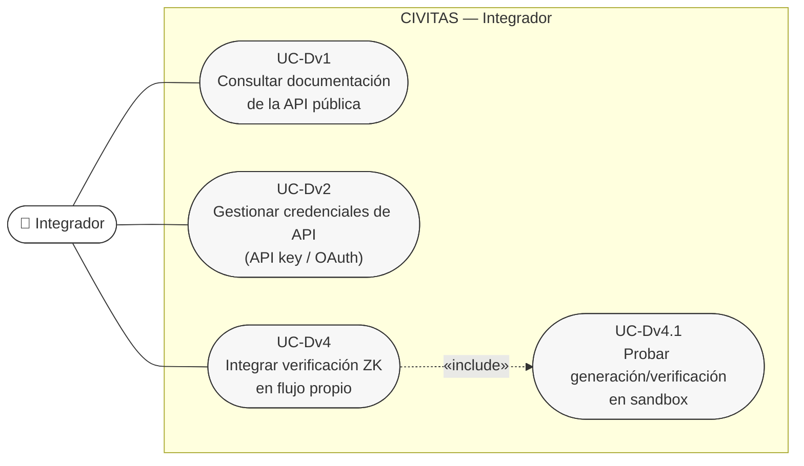

### Tabla de Casos de Uso — Integrador
| Código | Nombre | Relación / Tipo | Descripción Breve |
|---|---|---|---|
| **UC-Dv1** | Consultar documentación API | Base (compartido con Desarrollador) | Acceso al portal OpenAPI / Swagger interactivo. |
| **UC-Dv2** | Gestionar credenciales API | Base (compartido con Desarrollador) | Solicitud y rotación de tokens de prueba y producción. |
| **UC-Dv4** | Integrar verificación ZK | Base | Implementación del SDK de verificación de solvencia en aplicaciones propias/de terceros. |
| **UC-Dv4.1** | Probar en sandbox | `«include»` de UC-Dv4 | Entorno de simulación con datos de prueba sin costo ni riesgo. |

---

## Matriz de Trazabilidad: Actores vs. Fases de Despliegue

| Actor | Tipo de Rol | Fase I / II (Scrum Sprints 1–16) | Fase III / IV (Desarrollo en Espiral) |
|---|---|:---:|:---:|
| **Visitante** | Primario |  SI |  SI |
| **Inquilino** | Primario |  SI |  SI |
| **Comprador** | Primario |  SI |  SI |
| **Ciudadano Aportador** | Primario | ❌ |  SI |
| **Validador DAO** | Primario | ❌ |  SI |
| **Inversionista** | Primario | ❌ |  SI |
| **Urbanista** | Primario | ❌ |  SI |
| **Administradora** | Primario | ❌ |  SI |
| **PropTech** | Primario | ❌ |  SI |
| **Administrador** | Primario |  SI |  SI |
| **Desarrollador** | Primario | ❌ |  SI |
| **Integrador** | Primario | ❌ |  SI |
| **Proveedor Datos Abiertos** | Secundario |  SI |  SI |
| **Oráculo ZK** | Secundario | ❌ |  SI |
| **Open Banking** | Secundario | ❌ |  SI |
| **Autoridad Reguladora** | Secundario |  SI |  SI |
