# CIVITAS — Diagramas de Secuencia UML

> Diagramas de secuencia (notación Mermaid, estándar de facto para UML basado en texto) para
> los **25 casos de uso atómicos de ingeniería** de la versión definitiva del catálogo
> (9 Auth + 9 ZK + 7 DAO). Cada diagrama muestra el flujo principal y las ramas de
> excepción más relevantes con bloques `alt`/`opt`. Los casos de uso a nivel de negocio del
> catálogo por actor (Parte 1 del documento anterior) no tienen intercambio de mensajes
> técnico propio — son ellos los que estos 25 diagramas implementan por debajo.
>
> Pégalos en cualquier visor con soporte Mermaid (VS Code, GitHub, Typora, mermaid.live)
> para renderizarlos como diagrama.

---

## FAMILIA A · Autenticación y Sesión

### UC-AUTH-01 · Iniciar Sesión

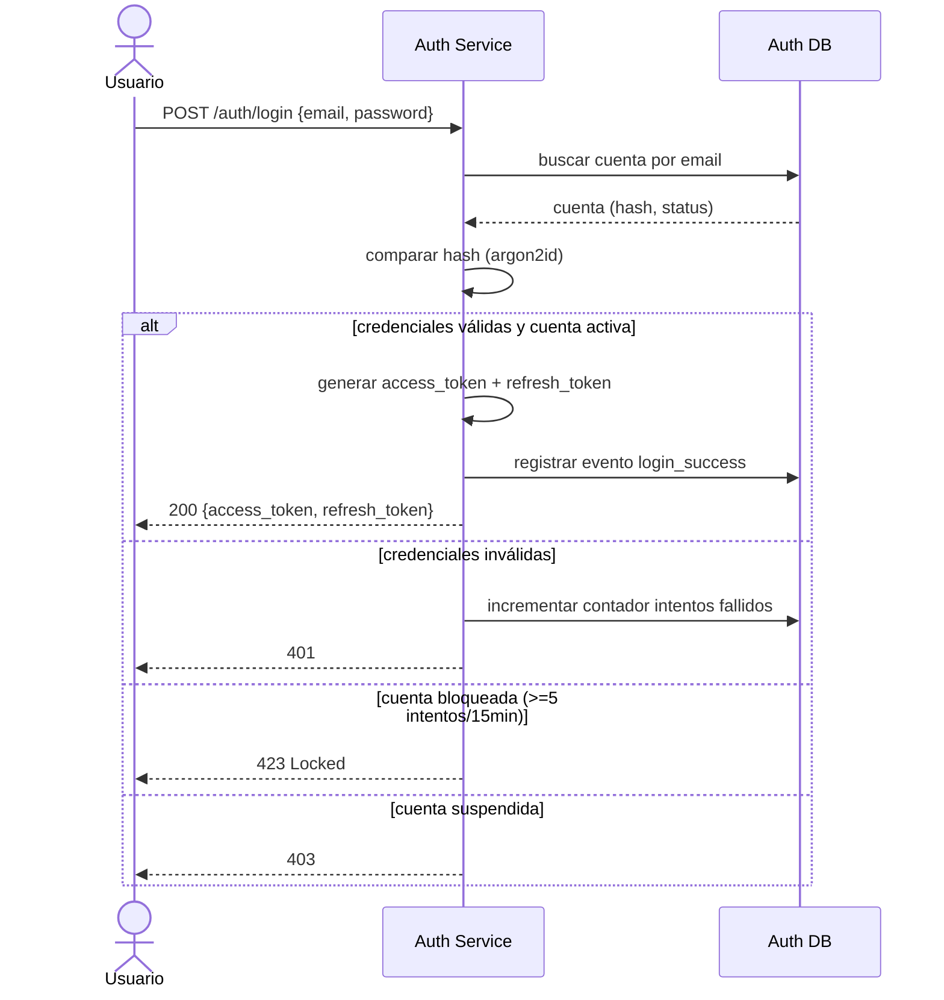
```mermaid
sequenceDiagram
    actor U as Usuario
    participant AS as Auth Service
    participant DB as Auth DB

    U->>AS: POST /auth/login {email, password}
    AS->>DB: buscar cuenta por email
    DB-->>AS: cuenta (hash, status)
    AS->>AS: comparar hash (argon2id)
    alt credenciales válidas y cuenta activa
        AS->>AS: generar access_token + refresh_token
        AS->>DB: registrar evento login_success
        AS-->>U: 200 {access_token, refresh_token}
    else credenciales inválidas
        AS->>DB: incrementar contador intentos fallidos
        AS-->>U: 401
    else cuenta bloqueada (>=5 intentos/15min)
        AS-->>U: 423 Locked
    else cuenta suspendida
        AS-->>U: 403
    end
```

### UC-AUTH-02 · Cerrar Sesión

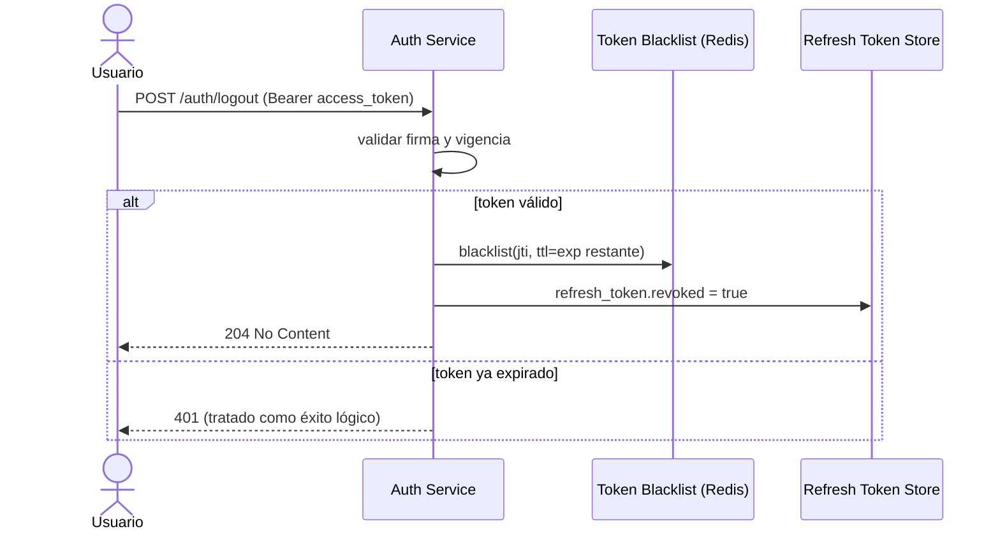
```mermaid
sequenceDiagram
    actor U as Usuario
    participant AS as Auth Service
    participant BL as Token Blacklist (Redis)
    participant DB as Refresh Token Store

    U->>AS: POST /auth/logout (Bearer access_token)
    AS->>AS: validar firma y vigencia
    alt token válido
        AS->>BL: blacklist(jti, ttl=exp restante)
        AS->>DB: refresh_token.revoked = true
        AS-->>U: 204 No Content
    else token ya expirado
        AS-->>U: 401 (tratado como éxito lógico)
    end
```

### UC-AUTH-03 · Refrescar Token de Sesión

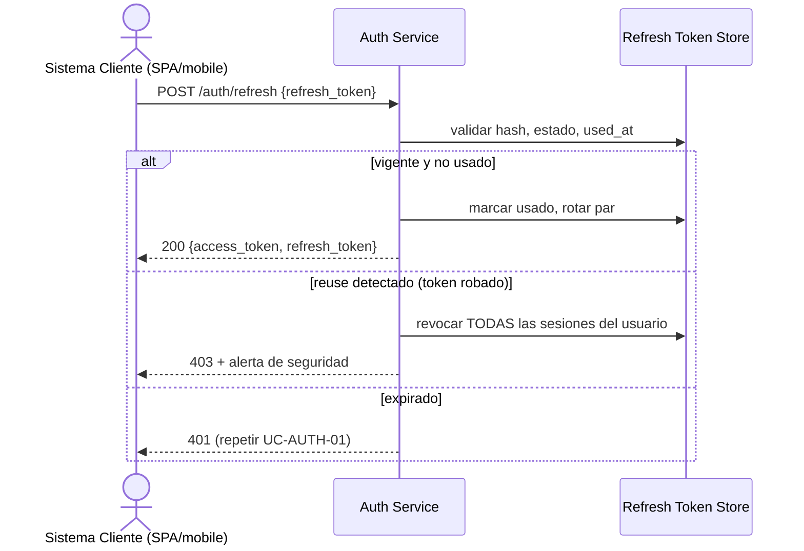
```mermaid
sequenceDiagram
    actor C as Sistema Cliente (SPA/mobile)
    participant AS as Auth Service
    participant DB as Refresh Token Store

    C->>AS: POST /auth/refresh {refresh_token}
    AS->>DB: validar hash, estado, used_at
    alt vigente y no usado
        AS->>DB: marcar usado, rotar par
        AS-->>C: 200 {access_token, refresh_token}
    else reuse detectado (token robado)
        AS->>DB: revocar TODAS las sesiones del usuario
        AS-->>C: 403 + alerta de seguridad
    else expirado
        AS-->>C: 401 (repetir UC-AUTH-01)
    end
```

### UC-AUTH-04 · Recuperar Contraseña

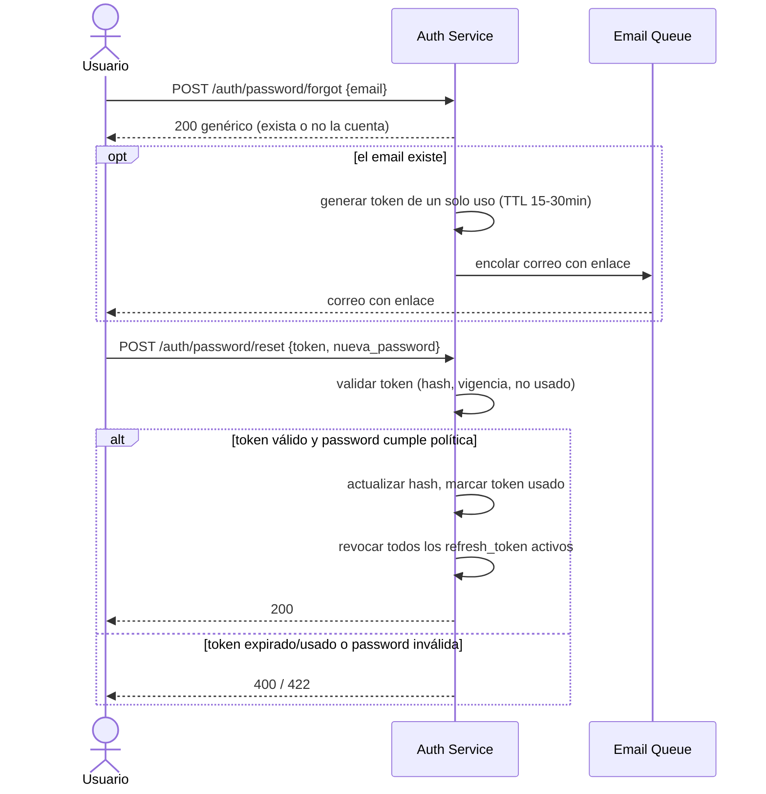
```mermaid
sequenceDiagram
    actor U as Usuario
    participant AS as Auth Service
    participant MQ as Email Queue

    U->>AS: POST /auth/password/forgot {email}
    AS-->>U: 200 genérico (exista o no la cuenta)
    opt el email existe
        AS->>AS: generar token de un solo uso (TTL 15-30min)
        AS->>MQ: encolar correo con enlace
        MQ-->>U: correo con enlace
    end
    U->>AS: POST /auth/password/reset {token, nueva_password}
    AS->>AS: validar token (hash, vigencia, no usado)
    alt token válido y password cumple política
        AS->>AS: actualizar hash, marcar token usado
        AS->>AS: revocar todos los refresh_token activos
        AS-->>U: 200
    else token expirado/usado o password inválida
        AS-->>U: 400 / 422
    end
```

### UC-AUTH-05 · Revocar Sesión

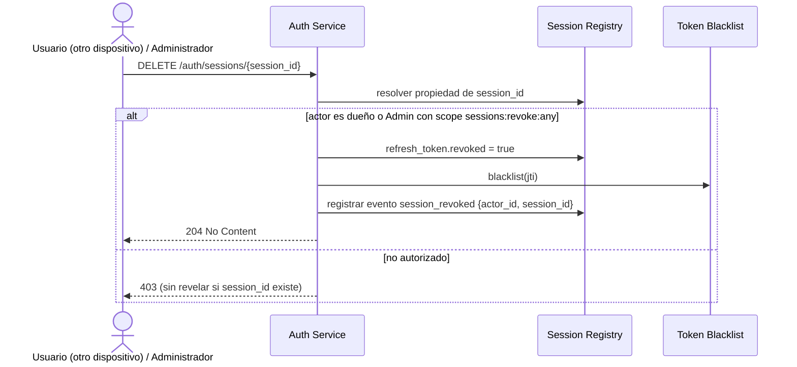
```mermaid
sequenceDiagram
    actor A as Usuario (otro dispositivo) / Administrador
    participant AS as Auth Service
    participant SR as Session Registry
    participant BL as Token Blacklist

    A->>AS: DELETE /auth/sessions/{session_id}
    AS->>SR: resolver propiedad de session_id
    alt actor es dueño o Admin con scope sessions:revoke:any
        AS->>SR: refresh_token.revoked = true
        AS->>BL: blacklist(jti)
        AS->>SR: registrar evento session_revoked {actor_id, session_id}
        AS-->>A: 204 No Content
    else no autorizado
        AS-->>A: 403 (sin revelar si session_id existe)
    end
```

### UC-AUTH-06 · Registrar Cuenta

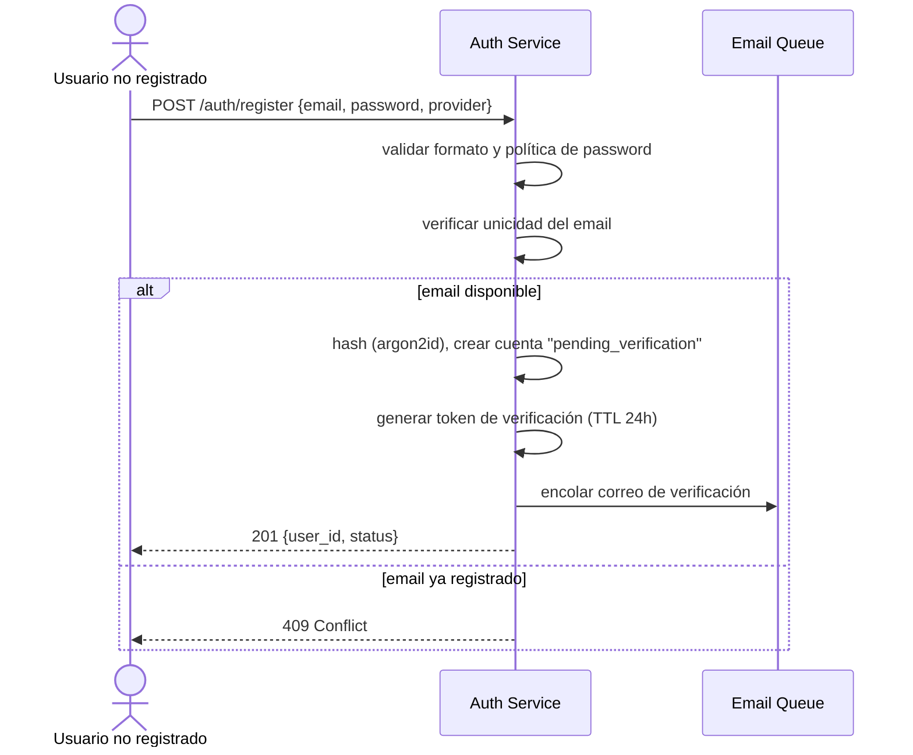
```mermaid
sequenceDiagram
    actor U as Usuario no registrado
    participant AS as Auth Service
    participant MQ as Email Queue

    U->>AS: POST /auth/register {email, password, provider}
    AS->>AS: validar formato y política de password
    AS->>AS: verificar unicidad del email
    alt email disponible
        AS->>AS: hash (argon2id), crear cuenta "pending_verification"
        AS->>AS: generar token de verificación (TTL 24h)
        AS->>MQ: encolar correo de verificación
        AS-->>U: 201 {user_id, status}
    else email ya registrado
        AS-->>U: 409 Conflict
    end
```

### UC-AUTH-07 · Verificar Correo Electrónico

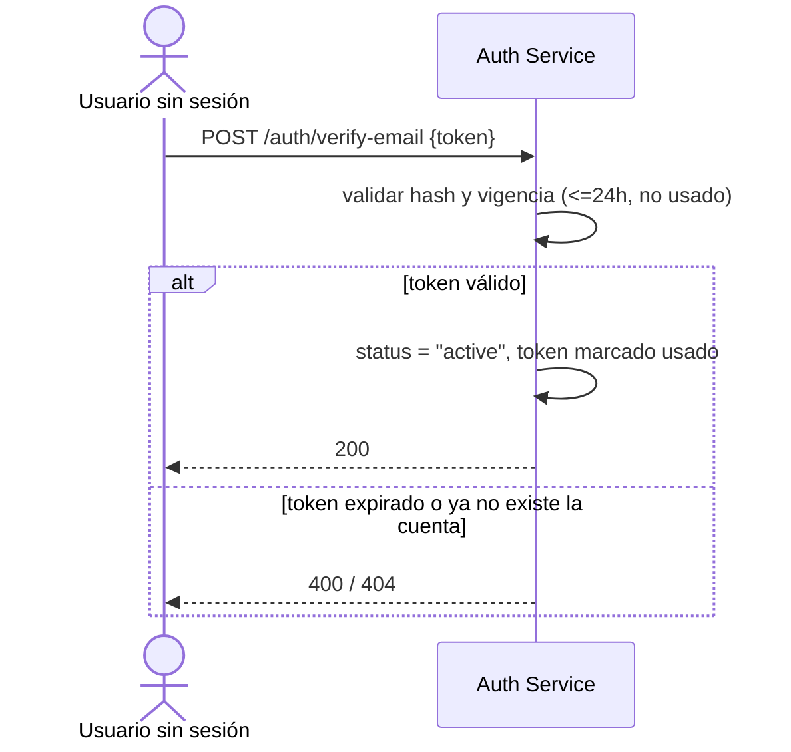
```mermaid
sequenceDiagram
    actor U as Usuario sin sesión
    participant AS as Auth Service

    U->>AS: POST /auth/verify-email {token}
    AS->>AS: validar hash y vigencia (<=24h, no usado)
    alt token válido
        AS->>AS: status = "active", token marcado usado
        AS-->>U: 200
    else token expirado o ya no existe la cuenta
        AS-->>U: 400 / 404
    end
```

### UC-AUTH-08 · Cambiar Contraseña (Autenticado)

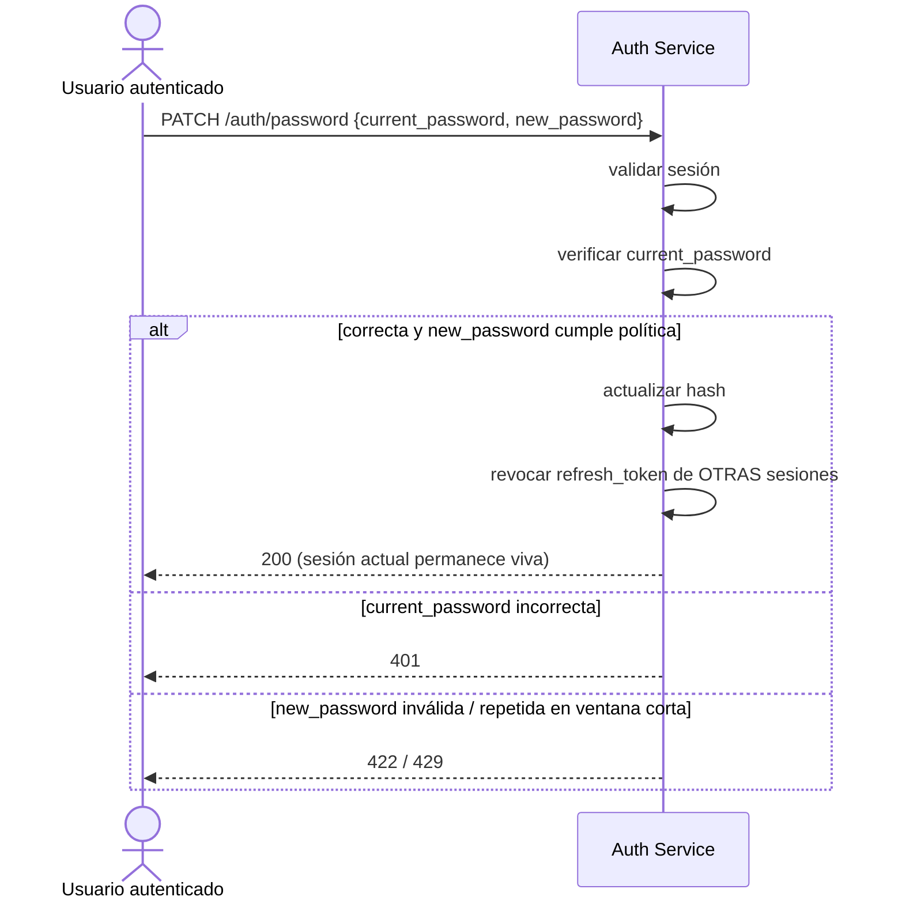
```mermaid
sequenceDiagram
    actor U as Usuario autenticado
    participant AS as Auth Service

    U->>AS: PATCH /auth/password {current_password, new_password}
    AS->>AS: validar sesión
    AS->>AS: verificar current_password
    alt correcta y new_password cumple política
        AS->>AS: actualizar hash
        AS->>AS: revocar refresh_token de OTRAS sesiones
        AS-->>U: 200 (sesión actual permanece viva)
    else current_password incorrecta
        AS-->>U: 401
    else new_password inválida / repetida en ventana corta
        AS-->>U: 422 / 429
    end
```

### UC-AUTH-09 · Listar Sesiones Activas

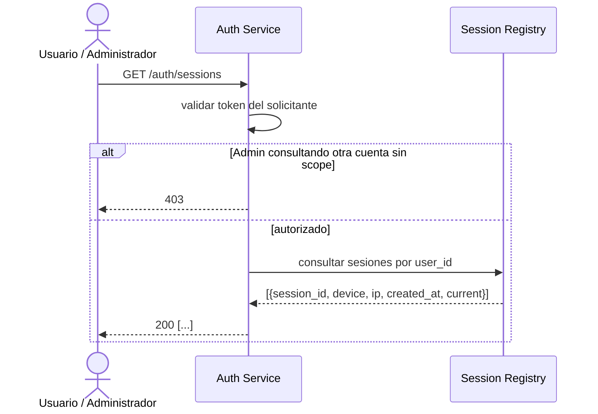
```mermaid
sequenceDiagram
    actor A as Usuario / Administrador
    participant AS as Auth Service
    participant SR as Session Registry

    A->>AS: GET /auth/sessions
    AS->>AS: validar token del solicitante
    alt Admin consultando otra cuenta sin scope
        AS-->>A: 403
    else autorizado
        AS->>SR: consultar sesiones por user_id
        SR-->>AS: [{session_id, device, ip, created_at, current}]
        AS-->>A: 200 [...]
    end
```

---

## FAMILIA B · Verificación de Solvencia ZK

### UC-ZK-01 · Conectar Cuenta Bancaria (Open Banking)

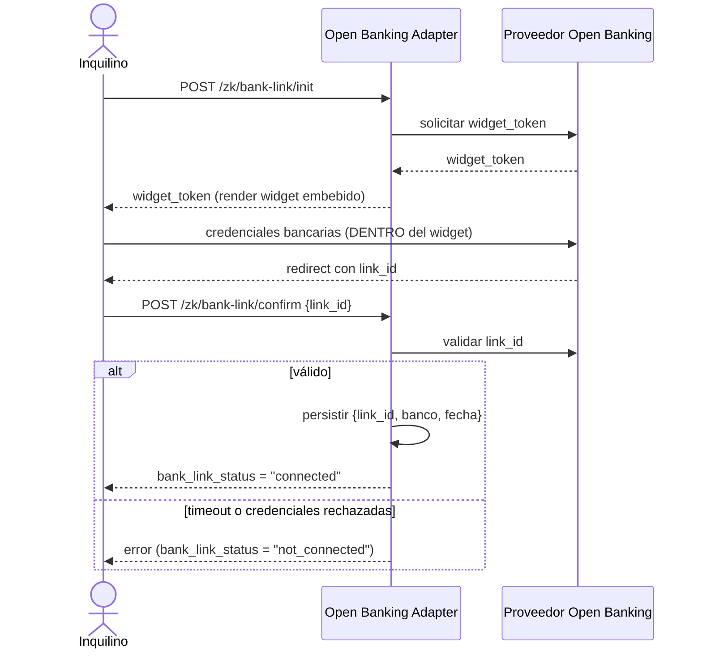
```mermaid
sequenceDiagram
    actor I as Inquilino
    participant OBA as Open Banking Adapter
    participant OB as Proveedor Open Banking

    I->>OBA: POST /zk/bank-link/init
    OBA->>OB: solicitar widget_token
    OB-->>OBA: widget_token
    OBA-->>I: widget_token (render widget embebido)
    I->>OB: credenciales bancarias (DENTRO del widget)
    OB-->>I: redirect con link_id
    I->>OBA: POST /zk/bank-link/confirm {link_id}
    OBA->>OB: validar link_id
    alt válido
        OBA->>OBA: persistir {link_id, banco, fecha}
        OBA-->>I: bank_link_status = "connected"
    else timeout o credenciales rechazadas
        OBA-->>I: error (bank_link_status = "not_connected")
    end
```

### UC-ZK-02 · Generar Witness de Solvencia

```mermaid
sequenceDiagram
    actor I as Inquilino
    participant OBA as Open Banking Adapter
    participant OR as Oráculo de Privacidad ZK
    participant WS as Witness Store (Redis cifrado)

    I->>OBA: POST /zk/witness/generate {link_id, threshold_type, threshold_value}
    OBA->>OBA: obtener dato financiero temporal (solo memoria, TTL<=60s)
    alt balance >= umbral
        OBA->>OR: atestiguar fuente del dato
        OR-->>OBA: attestation
        OBA->>OBA: construir witness (privado: monto; público: threshold)
        OBA->>WS: persistir witness cifrado (TTL corto)
        OBA->>OBA: descartar dato bancario crudo de memoria
        OBA-->>I: 201 {witness_id, expires_at}
    else balance insuficiente
        OBA-->>I: 422 "no cumple el umbral"
    end
```

### UC-ZK-03 · Generar Prueba ZK de Solvencia

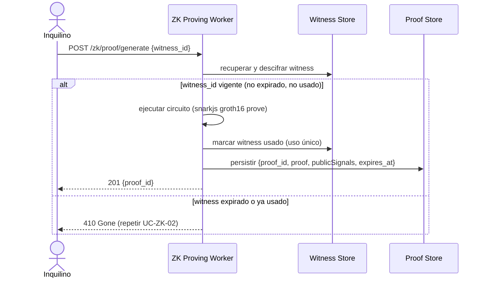
```mermaid
sequenceDiagram
    actor I as Inquilino
    participant ZKW as ZK Proving Worker
    participant WS as Witness Store
    participant PS as Proof Store

    I->>ZKW: POST /zk/proof/generate {witness_id}
    ZKW->>WS: recuperar y descifrar witness
    alt witness_id vigente (no expirado, no usado)
        ZKW->>ZKW: ejecutar circuito (snarkjs groth16 prove)
        ZKW->>WS: marcar witness usado (uso único)
        ZKW->>PS: persistir {proof_id, proof, publicSignals, expires_at}
        ZKW-->>I: 201 {proof_id}
    else witness expirado o ya usado
        ZKW-->>I: 410 Gone (repetir UC-ZK-02)
    end
```

### UC-ZK-04 · Verificar Prueba ZK

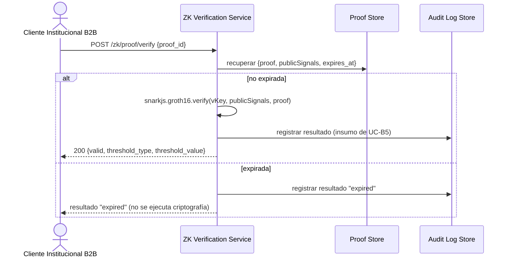
```mermaid
sequenceDiagram
    actor B as Cliente Institucional B2B
    participant ZKV as ZK Verification Service
    participant PS as Proof Store
    participant AL as Audit Log Store

    B->>ZKV: POST /zk/proof/verify {proof_id}
    ZKV->>PS: recuperar {proof, publicSignals, expires_at}
    alt no expirada
        ZKV->>ZKV: snarkjs.groth16.verify(vKey, publicSignals, proof)
        ZKV->>AL: registrar resultado (insumo de UC-B5)
        ZKV-->>B: 200 {valid, threshold_type, threshold_value}
    else expirada
        ZKV->>AL: registrar resultado "expired"
        ZKV-->>B: resultado "expired" (no se ejecuta criptografía)
    end
```

### UC-ZK-05 · Compartir Prueba ZK con Tercero

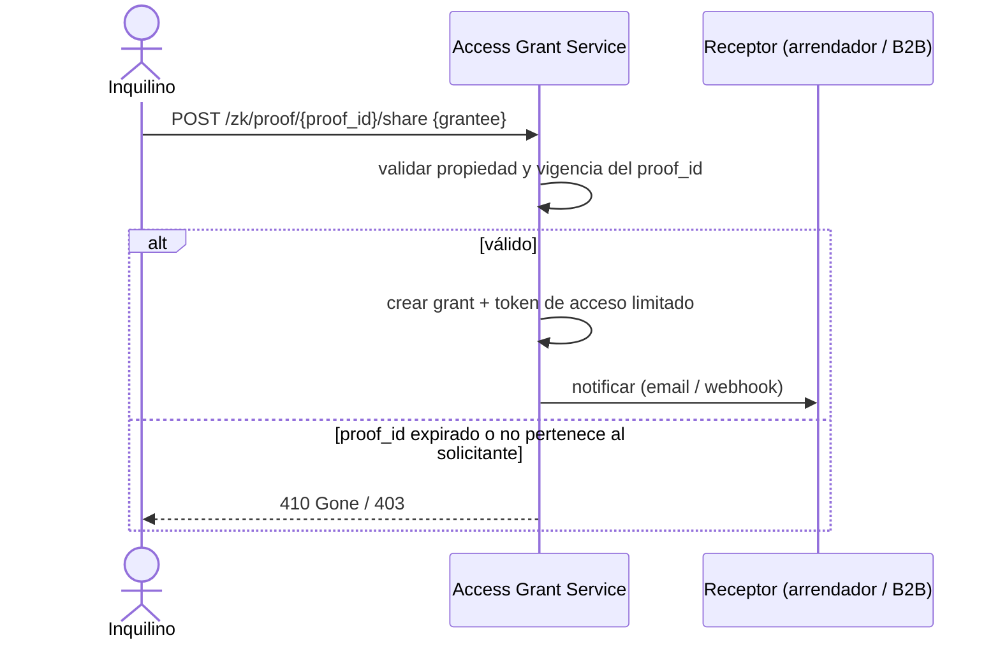
```mermaid
sequenceDiagram
    actor I as Inquilino
    participant AGS as Access Grant Service
    participant R as Receptor (arrendador / B2B)

    I->>AGS: POST /zk/proof/{proof_id}/share {grantee}
    AGS->>AGS: validar propiedad y vigencia del proof_id
    alt válido
        AGS->>AGS: crear grant + token de acceso limitado
        AGS->>R: notificar (email / webhook)
    else proof_id expirado o no pertenece al solicitante
        AGS-->>I: 410 Gone / 403
    end
```

### UC-ZK-06 · Revocar Prueba ZK Compartida

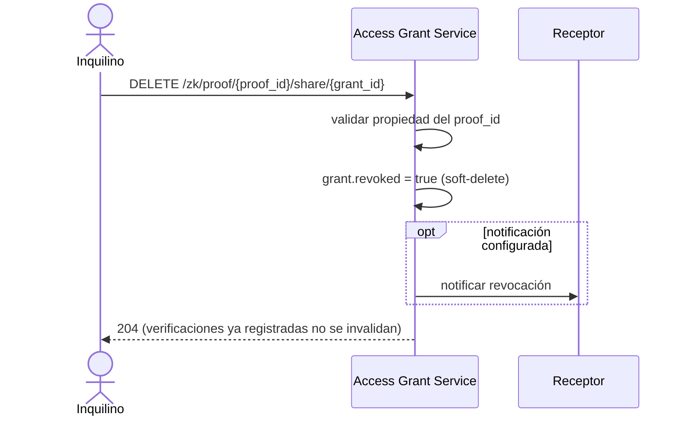
```mermaid
sequenceDiagram
    actor I as Inquilino
    participant AGS as Access Grant Service
    participant R as Receptor

    I->>AGS: DELETE /zk/proof/{proof_id}/share/{grant_id}
    AGS->>AGS: validar propiedad del proof_id
    AGS->>AGS: grant.revoked = true (soft-delete)
    opt notificación configurada
        AGS->>R: notificar revocación
    end
    AGS-->>I: 204 (verificaciones ya registradas no se invalidan)
```

### UC-ZK-07 · Desconectar Cuenta Bancaria

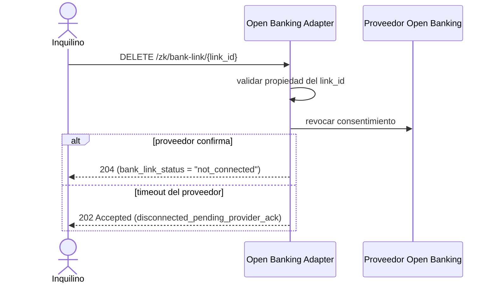
```mermaid
sequenceDiagram
    actor I as Inquilino
    participant OBA as Open Banking Adapter
    participant OB as Proveedor Open Banking

    I->>OBA: DELETE /zk/bank-link/{link_id}
    OBA->>OBA: validar propiedad del link_id
    OBA->>OB: revocar consentimiento
    alt proveedor confirma
        OBA-->>I: 204 (bank_link_status = "not_connected")
    else timeout del proveedor
        OBA-->>I: 202 Accepted (disconnected_pending_provider_ack)
    end
```

### UC-ZK-08 · Renovar Prueba ZK Próxima a Expirar

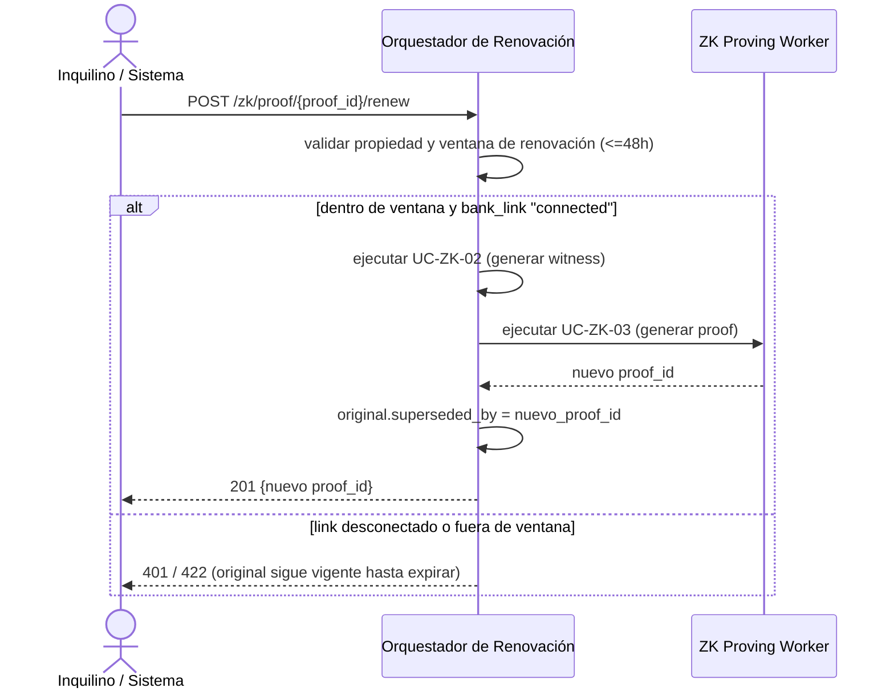
```mermaid
sequenceDiagram
    actor I as Inquilino / Sistema
    participant ORQ as Orquestador de Renovación
    participant ZKW as ZK Proving Worker

    I->>ORQ: POST /zk/proof/{proof_id}/renew
    ORQ->>ORQ: validar propiedad y ventana de renovación (<=48h)
    alt dentro de ventana y bank_link "connected"
        ORQ->>ORQ: ejecutar UC-ZK-02 (generar witness)
        ORQ->>ZKW: ejecutar UC-ZK-03 (generar proof)
        ZKW-->>ORQ: nuevo proof_id
        ORQ->>ORQ: original.superseded_by = nuevo_proof_id
        ORQ-->>I: 201 {nuevo proof_id}
    else link desconectado o fuera de ventana
        ORQ-->>I: 401 / 422 (original sigue vigente hasta expirar)
    end
```

### UC-ZK-09 · Listar Pruebas Compartidas (Grants Activos)

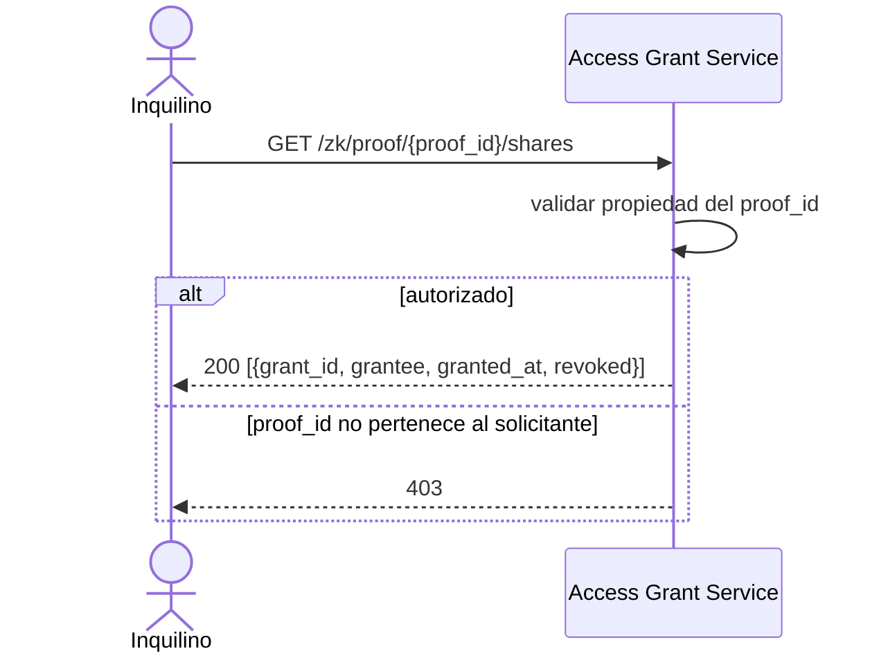
```mermaid
sequenceDiagram
    actor I as Inquilino
    participant AGS as Access Grant Service

    I->>AGS: GET /zk/proof/{proof_id}/shares
    AGS->>AGS: validar propiedad del proof_id
    alt autorizado
        AGS-->>I: 200 [{grant_id, grantee, granted_at, revoked}]
    else proof_id no pertenece al solicitante
        AGS-->>I: 403
    end
```

---

## FAMILIA C · Gobernanza DAO

### UC-DAO-01 · Crear Propuesta de Gobernanza DAO

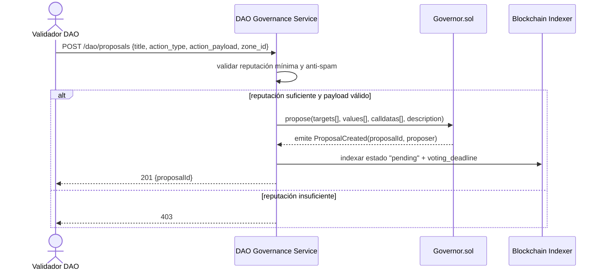
```mermaid
sequenceDiagram
    actor V as Validador DAO
    participant SVC as DAO Governance Service
    participant GOV as Governor.sol
    participant IDX as Blockchain Indexer

    V->>SVC: POST /dao/proposals {title, action_type, action_payload, zone_id}
    SVC->>SVC: validar reputación mínima y anti-spam
    alt reputación suficiente y payload válido
        SVC->>GOV: propose(targets[], values[], calldatas[], description)
        GOV-->>SVC: emite ProposalCreated(proposalId, proposer)
        SVC->>IDX: indexar estado "pending" + voting_deadline
        SVC-->>V: 201 {proposalId}
    else reputación insuficiente
        SVC-->>V: 403
    end
```

### UC-DAO-02 · Votar Propuesta de Gobernanza DAO

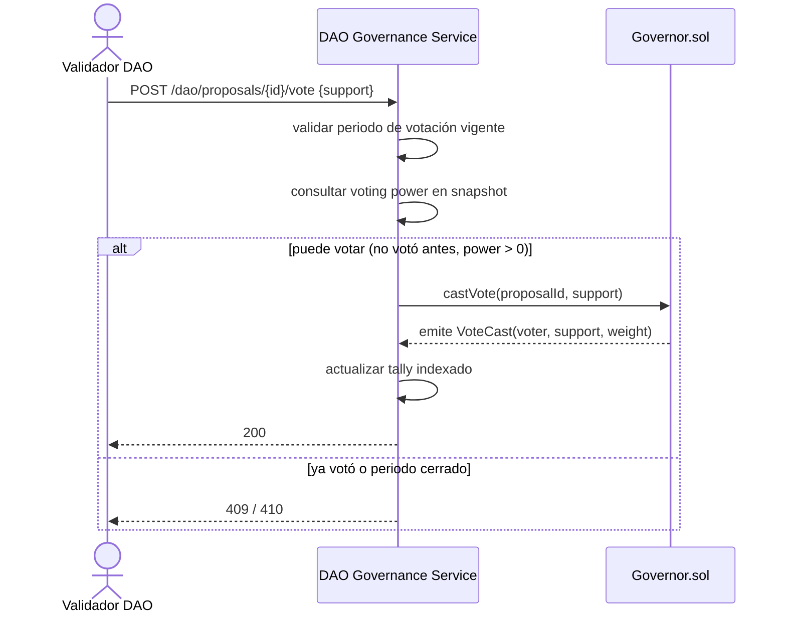
```mermaid
sequenceDiagram
    actor V as Validador DAO
    participant SVC as DAO Governance Service
    participant GOV as Governor.sol

    V->>SVC: POST /dao/proposals/{id}/vote {support}
    SVC->>SVC: validar periodo de votación vigente
    SVC->>SVC: consultar voting power en snapshot
    alt puede votar (no votó antes, power > 0)
        SVC->>GOV: castVote(proposalId, support)
        GOV-->>SVC: emite VoteCast(voter, support, weight)
        SVC->>SVC: actualizar tally indexado
        SVC-->>V: 200
    else ya votó o periodo cerrado
        SVC-->>V: 409 / 410
    end
```

### UC-DAO-03 · Contabilizar Quórum de Propuesta

```mermaid
sequenceDiagram
    actor K as Keeper (cronjob) / Actor consultante
    participant SVC as DAO Governance Service
    participant GOV as Governor.sol

    K->>SVC: GET /dao/proposals/{id}/tally
    alt periodo de votación ya venció
        SVC->>GOV: state(proposalId) + quorum(snapshotBlock)
        GOV-->>SVC: ProposalState (Succeeded / Defeated)
        SVC->>SVC: mapear e indexar transición de estado
        opt resultado = succeeded
            SVC->>SVC: notificar Validadores (propuesta ejecutable)
        end
        SVC-->>K: 200 {state, for_votes, against_votes, quorum_required}
    else periodo aún no vence
        SVC-->>K: 425 Too Early
    end
```

### UC-DAO-04 · Ejecutar Propuesta de Gobernanza DAO

```mermaid
sequenceDiagram
    actor V as Validador DAO / Keeper
    participant SVC as DAO Governance Service
    participant GOV as Governor.sol
    participant TL as Timelock Controller

    V->>SVC: POST /dao/proposals/{id}/execute
    SVC->>SVC: validar state == "queued" y eta cumplido
    alt eta cumplido
        SVC->>GOV: execute(targets[], values[], calldatas[], descriptionHash)
        GOV->>TL: ejecutar operación agendada
        TL-->>GOV: aplicado (ej. setConsensusThreshold)
        GOV-->>SVC: emite ProposalExecuted(proposalId)
        SVC->>SVC: indexar "executed"
        SVC-->>V: 200
    else eta no cumplido
        SVC-->>V: 425 Too Early
    else ejecución revertida por contrato objetivo
        SVC-->>V: 500 (revert reason; estado permanece "queued")
    end
```

### UC-DAO-05 · Poner en Cola Propuesta en Timelock (Queue)

```mermaid
sequenceDiagram
    actor V as Validador DAO / Keeper
    participant SVC as DAO Governance Service
    participant GOV as Governor.sol
    participant TL as Timelock Controller

    V->>SVC: POST /dao/proposals/{id}/queue
    SVC->>SVC: validar state == "succeeded"
    alt succeeded y no encolada antes
        SVC->>GOV: queue(targets[], values[], calldatas[], descriptionHash)
        GOV->>TL: schedule(operation)
        TL-->>GOV: eta = now + delay
        GOV-->>SVC: emite ProposalQueued(proposalId, eta)
        SVC->>SVC: indexar "queued" + eta
        SVC-->>V: 200 {eta}
    else no succeeded o colisión de operationId
        SVC-->>V: 409
    end
```

### UC-DAO-06 · Delegar Poder de Voto

```mermaid
sequenceDiagram
    actor V as Validador DAO (delegante)
    participant TK as Token de Gobernanza (ERC20Votes/ERC721Votes)

    V->>TK: delegate(delegatee_address)
    alt dirección válida
        TK->>TK: actualizar checkpoint on-chain
        TK-->>V: emite DelegateChanged, DelegateVotesChanged
        opt ejecutada durante snapshot block de propuesta activa
            TK-->>V: 200 + advertencia (no afecta snapshot ya pasado)
        end
    else delegatee_address inválida
        TK-->>V: 422
    end
```

### UC-DAO-07 · Cancelar Propuesta

```mermaid
sequenceDiagram
    actor A as Proponente original / Guardian-Administrador
    participant SVC as DAO Governance Service
    participant GOV as Governor.sol
    participant TL as Timelock Controller

    A->>SVC: DELETE /dao/proposals/{id}
    SVC->>SVC: validar autoría/rol y estado cancelable (no "executed")
    alt autorizado y cancelable
        SVC->>GOV: cancel(targets[], values[], calldatas[], descriptionHash)
        opt propuesta estaba "queued"
            GOV->>TL: cancelar operación agendada
        end
        GOV-->>SVC: emite ProposalCanceled(proposalId)
        SVC->>SVC: indexar "canceled"
        SVC-->>A: 200
    else ya ejecutada o sin autorización
        SVC-->>A: 409 / 403
    end
```

---

## Notas de lectura

- Los `alt`/`else` representan las ramas de excepción documentadas en las especificaciones
  atómicas; se incluyeron las más relevantes por diagrama, no las 3-4 excepciones completas
  de cada ficha, para mantener el diagrama legible.
- Los actores `Sistema`/`Keeper` en UC-DAO-03/04/05 reflejan que esos pasos pueden ser
  disparados por un proceso automatizado (cronjob) además de por un Validador DAO — así lo
  especifica la ficha de origen.
- Si necesitas también los diagramas de secuencia de los casos de uso de negocio por actor
  (los 70 del catálogo UML tras la revisión de actores compuestos), dime cuáles priorizar:
  al no tener detalle de mensajes técnico propio, habría que definir primero qué llamadas a
  estos 25 casos atómicos representa cada uno.

[[CIVITAS]] [[UML]]