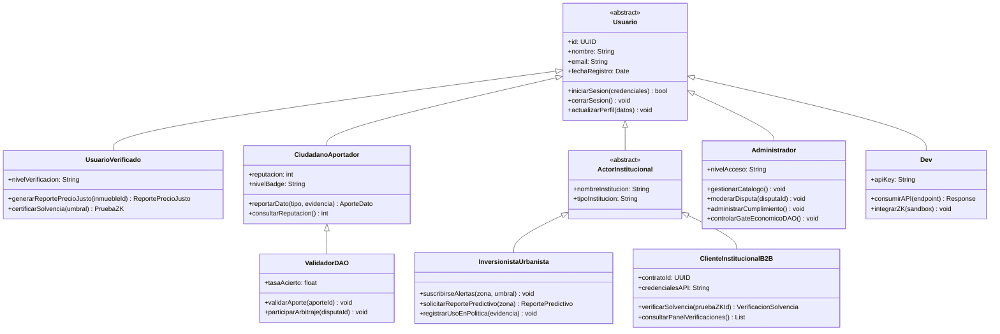
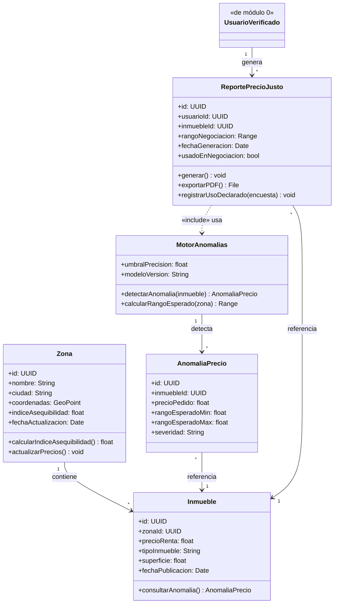
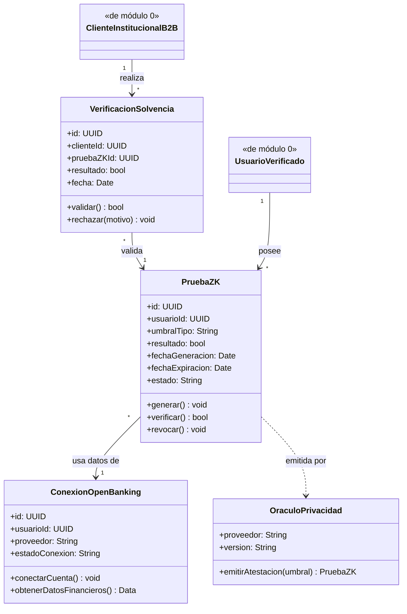
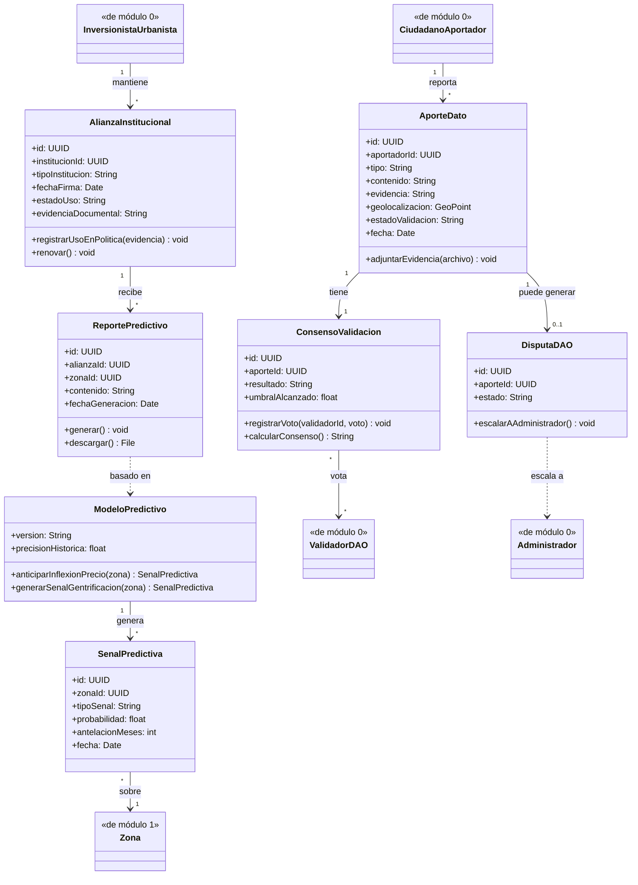
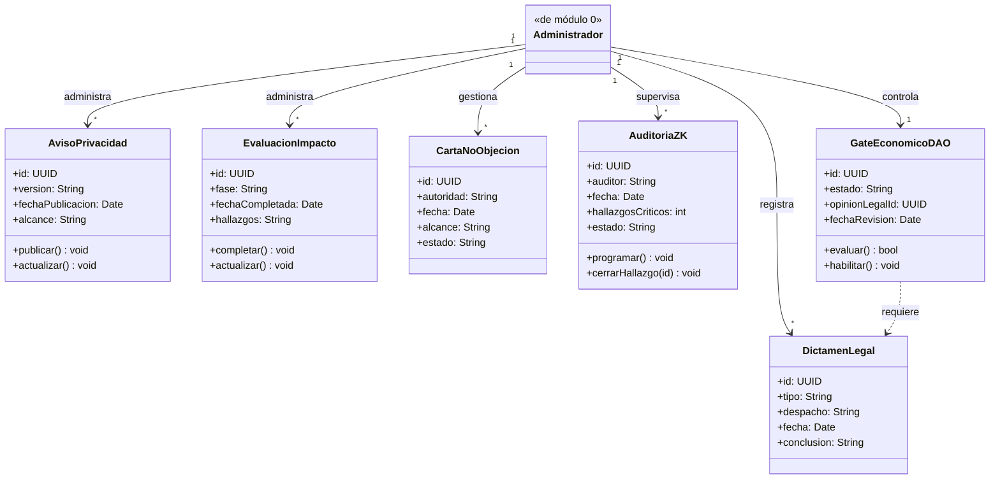

# CIVITAS — Diagramas de Clase (UML)

Organizados por módulo, siguiendo la misma estructura que los objetivos
específicos (OE1–OE4) y el catálogo de casos de uso. Sintaxis Mermaid:
copia cada bloque en [mermaid.live](https://mermaid.live) o en cualquier
editor con soporte Mermaid para exportarlo como imagen/SVG; también se
puede importar a draw.io.

Convenciones: `+` público, `-` privado, `#` protegido. `<|--` generalización,
`-->` asociación (con multiplicidad), `..>` dependencia (uso/`«include»`),
`o--` agregación, `*--` composición.

---

## 0. Núcleo de Actores (generalización, transversal a todos los módulos)

*El Visitante no autenticado no se modela como clase: es la ausencia de una
instancia de `Usuario` en la sesión, no un objeto persistente.*

---

## 1. Catálogo y Motor de Anomalías — OE1 (Web 1.0 / 2.0)

---

## 2. Verificación de Solvencia — OE2 (Web 3.0 · ZK)

---

## 3. Red DAO e IA Predictiva — OE3 (Web 3.0 · IA + Gobernanza)

---

## 4. Cumplimiento Normativo — OE4 (Marco Legal Transversal)

---

## Nota sobre alcance

Estos diagramas son de **diseño conceptual** (nivel de análisis): atributos y
firmas de método bastan para justificar responsabilidades y relaciones, no
para compilar directamente. Si tu profesor pide un diagrama único integrado
en vez de por módulo, la clase `Usuario` (módulo 0) es el punto de fusión:
todas las asociaciones externas de los módulos 1–4 cuelgan de sus
subclases.

[[CIVITAS]]