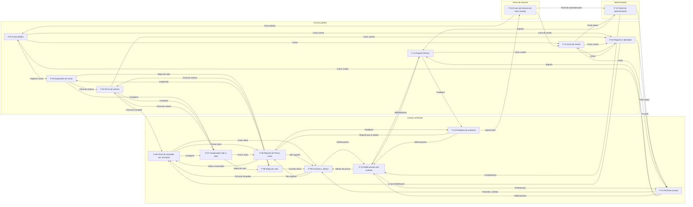

# CIVITAS — Diagramas de Interfaz (wireframes)

Baja fidelidad, sin identidad visual: bloques, jerarquía y flujo de las **16 pantallas**
del pliego de wireframes (Fase I y II · Web 1.0 / 2.0 · Sprints 1–16). Cada región lleva
un marcador `(n)` que remite a su anotación y al caso de uso que la origina.
Fuente: catálogo UC v3 · diagramas de clase · plan de sprints v0.1.

**Convenciones del wireframe**

| Símbolo | Significado |
|---|---|
| `░` `▒` | Bloque con contenido visual pendiente (mapa, gráfica, imagen) |
| `—` `0.00` `00` | Texto o dato real que irá en producción |
| `┄` (borde punteado) | Elemento condicional «extend», opcional o fuera del alcance de la fase |
| `(n)` | Marcador que liga la región con su anotación |
| `[ botón ]` `[ ..... ]` `( )` `[x]` | Botón · campo de texto · opción · casilla |

---

## 1. Índice de pantallas

| # | Pantalla | Actor | Casos de uso | Sprint |
|---|---|---|---|---|
| P-01 | Inicio público | Visitante no autenticado | UC-V1 · V1.1 · V2 · V3 · V4 | 1, 3, 4 |
| P-02 | Explorador de zonas | Visitante · Inquilino · Comprador | UC-V2 · UC-V1.1 | 3, 4 |
| P-03 | Ficha de colonia | Visitante · Inquilino · Comprador | UC-V1.1 · UC-I1 (parcial) | 3, 5, 11 |
| P-04 | Registro e identidad | Visitante → Usuario Verificado | UC-V4 · V4.1 · UC-AUTH-06 · UC-AUTH-07 | 6 |
| P-05 | Ficha de inmueble con anomalía | Inquilino · Comprador | UC-I1 · I4 · I5 · entrada a UC-I2 | 10 |
| P-06 | Reporte de Precio Justo | Inquilino · Comprador | UC-I2 · I2.1 · I2.2 · I2.3 · I2.4 | 13, 14 |
| P-07 | Comparador lado a lado | Inquilino · Comprador | UC-I6 · UC-I6.1 | 4 (zonas) · 12 (índices) |
| P-08 | Mapa de calor | Usuario verificado | Visualización de OE1 y del motor de OE1/OE2 | 11, 12, 15 |
| P-09 | Favoritos y alertas | Inquilino · Comprador | UC-I4 · UC-I5 | Backlog — sin sprint asignado |
| P-10 | Panel de administración | Administrador de la plataforma | UC-A1 · A1.1 · A4.1 · A4.2 · A4.3 · A7 | 1, 2, 8 |
| P-11 | Inicio de sesión | Visitante → cualquier cuenta | UC-V4 (parcial) · UC-AUTH-01 · UC-AUTH-02 | 6 |
| P-12 | Perfil de usuario | Visitante · Usuario Verificado · Administrador | UC-AUTH-04 · UC-AUTH-05 | 6 (base) · 9 (vista admin) |
| P-13 | Notificaciones del sistema | Usuario Verificado · Administrador | UC-SYS-01 · UC-SYS-02 | Backlog — sin sprint asignado |
| P-14 | Soporte técnico | Visitante (FAQ) · Usuario Verificado · Administrador | UC-SYS-03 · UC-SYS-04 | Backlog — sin sprint asignado |
| P-15 | Feedback de producto | Usuario Verificado · Administrador | UC-SYS-05 | Backlog — sin sprint asignado |
| P-16 | Fuera del alcance de este mockup | — | OE2 · OE3 (Fases III y IV) | Desarrollo en espiral y XP, no Scrum |

---

## 2. Mapa de navegación

Sintaxis Mermaid: copia el bloque en [mermaid.live](https://mermaid.live). Cada flecha es una
salida real de la pantalla de origen (botón, enlace o redirección) tal como está en el mockup.



---

## 3. Pantallas

### P-01 · Inicio público

**Actor:** Visitante no autenticado · **Casos de uso:** UC-V1 · V1.1 · V2 · V3 · V4 · **Sprint:** 1, 3, 4

```text
┌──────────────────────────────────────────────────────────────────────────────────┐
│ ◄ ►  [ civitas.mx ]                                                              │
├──────────────────────────────────────────────────────────────────────────────────┤
│ ┌──────────────────────────────────────────────────────────────────────────────┐ │
│ │ CIVITAS  Colonias  Cómo funciona  Privacidad (4) [Entrar] [Crear cuenta] (5) │ │
│ └──────────────────────────────────────────────────────────────────────────────┘ │
│ ┌──────────────────────────────────────────────────────────────────────────────┐ │
│ │ [ buscar una colonia, calle o ciudad ................. ]   [Explorar] (2)    │ │
│ └──────────────────────────────────────────────────────────────────────────────┘ │
│ ┌────────────────────────┐ ┌────────────────────────┐ ┌────────────────────────┐ │
│ │ 200+                   │ │ 2                      │ │ —                      │ │
│ │ colonias en catálogo   │ │ ciudades piloto        │ │ última actualización   │ │
│ └────────────────────────┘ └────────────────────────┘ └────────────────────────┘ │
│ ┌──────────────────────────────────────────────────────────────────────────────┐ │
│ │ ░░░░░░░░ MAPA — índice de asequibilidad por colonia (3) ░░░░░░░░             │ │
│ │ (agregado y anónimo, sin detalle por inmueble)                               │ │
│ │                                                                              │ │
│ │ Colonia · índice 0.00      Colonia · índice 0.00      Colonia · índice 0.00  │ │
│ └──────────────────────────────────────────────────────────────────────────────┘ │
│ ┌┄┄┄┄┄┄┄┄┄┄┄┄┄┄┄┄┄┄┄┄┄┄┄┄┄┄┄┄┄┄┄┄┄┄┄┄┄┄┄┄┄┄┄┄┄┄┄┄┄┄┄┄┄┄┄┄┄┄┄┄┄┄┄┄┄┄┄┄┄┄┄┄┄┄┄┄┄┄┐ │
│ ┆ (1) Para ver precio por inmueble y señal de anomalía necesitas una cuenta    ┆ │
│ └┄┄┄┄┄┄┄┄┄┄┄┄┄┄┄┄┄┄┄┄┄┄┄┄┄┄┄┄┄┄┄┄┄┄┄┄┄┄┄┄┄┄┄┄┄┄┄┄┄┄┄┄┄┄┄┄┄┄┄┄┄┄┄┄┄┄┄┄┄┄┄┄┄┄┄┄┄┄┘ │
│ Fuentes: INEGI · gobierno municipal · datos de movilidad                         │
│ Aviso de privacidad · Metodología · Centro de ayuda                              │
└──────────────────────────────────────────────────────────────────────────────────┘
```

**Anotaciones**

- **(1)** UC-V1 — el visitante explora sin cuenta, pero solo con datos agregados por colonia. Este muro es la frontera con UC-I1.
- **(2)** UC-V2 — buscar y filtrar zonas (Sprint 4: buscador y comparador geolocalizado).
- **(3)** UC-V1.1 — consultar índices agregados; el mapa nunca muestra inmuebles individuales.
- **(4)** UC-V3 — el aviso de privacidad se publica en el Sprint 1, antes de cualquier registro (requisito de OE4).
- **(5)** UC-V4 — puerta de entrada al registro; la verificación KYC es una rama condicional, no un paso obligatorio.
- Meta asociada: 200+ colonias en 2 ciudades piloto al cierre de Fase I (Sprint 8).

---

### P-02 · Explorador de zonas

**Actor:** Visitante · Inquilino · Comprador · **Casos de uso:** UC-V2 · UC-V1.1 · **Sprint:** 3, 4

```text
┌──────────────────────────────────────────────────────────────────────────────────┐
│ ◄ ►  [ civitas.mx/colonias?ciudad=…&renta=… ]                                    │
├──────────────────────────────────────────────────────────────────────────────────┤
│ ┌──────────────────────────────────────────────────────────────────────────────┐ │
│ │ CIVITAS  Colonias  Comparar  Mapa de calor                          [Entrar] │ │
│ └──────────────────────────────────────────────────────────────────────────────┘ │
│ ┌─ Filtros (1) ────────────────┐ ┌─────────────────────────────────────────────┐ │
│ │ ciudad          [ ...... v ] │ │ ░░ MAPA interactivo — geolocalizado (2) ░░  │ │
│ │ rango de renta  [ ... – ... ]│ │                                             │ │
│ │ equipamiento                 │ │ 00 colonias encontradas                     │ │
│ │   [Transporte] [Escuelas]    │ │ Ordenar: asequibilidad     Vista: lista     │ │
│ │   [Salud]      [Comercio]    │ │ ┌──────────────────────────────────────────┐│ │
│ │ seguridad                    │ │ │ Colonia                                  ││ │
│ │   (Baja) (Media) (Alta)      │ │ │ renta mediana · índice · transporte      ││ │
│ │                              │ │ │ [Comparar] [Ver ficha]                   ││ │
│ │ [Aplicar]                    │ │ └──────────────────────────────────────────┘│ │
│ │                              │ │ ┌──────────────────────────────────────────┐│ │
│ │                              │ │ │ Colonia                                  ││ │
│ │                              │ │ │ renta mediana · índice · transporte      ││ │
│ │                              │ │ │ [Comparar] [Ver ficha]                   ││ │
│ │                              │ │ └──────────────────────────────────────────┘│ │
│ │                              │ │ · · ·                                       │ │
│ └──────────────────────────────┘ └─────────────────────────────────────────────┘ │
│ ┌┄┄┄┄┄┄┄┄┄┄┄┄┄┄┄┄┄┄┄┄┄┄┄┄┄┄┄┄┄┄┄┄┄┄┄┄┄┄┄┄┄┄┄┄┄┄┄┄┄┄┄┄┄┄┄┄┄┄┄┄┄┄┄┄┄┄┄┄┄┄┄┄┄┄┄┄┄┄┐ │
│ ┆ (3) Señal de anomalía por inmueble: disponible con cuenta verificada         ┆ │
│ └┄┄┄┄┄┄┄┄┄┄┄┄┄┄┄┄┄┄┄┄┄┄┄┄┄┄┄┄┄┄┄┄┄┄┄┄┄┄┄┄┄┄┄┄┄┄┄┄┄┄┄┄┄┄┄┄┄┄┄┄┄┄┄┄┄┄┄┄┄┄┄┄┄┄┄┄┄┄┘ │
└──────────────────────────────────────────────────────────────────────────────────┘
```

**Anotaciones**

- **(1)** UC-V2 — los filtros son las cuatro dimensiones del catálogo: transporte, equipamiento, seguridad y servicios (Sprint 3).
- **(2)** Buscador y comparador geolocalizado (Sprint 4). El mapa y la lista son la misma consulta con dos representaciones.
- **(3)** El mismo motor de índices sirve al visitante y al usuario verificado: cambia el nivel de exposición, no la consulta.
- La selección múltiple de tarjetas alimenta el comparador (P-07).
- Pendiente de decidir: si el mapa o la lista es la vista por defecto en móvil.

---

### P-03 · Ficha de colonia

**Actor:** Visitante · Inquilino · Comprador · **Casos de uso:** UC-V1.1 · UC-I1 (parcial) · **Sprint:** 3, 5, 11

```text
┌──────────────────────────────────────────────────────────────────────────────────┐
│ ◄ ►  [ civitas.mx/colonias/{ciudad}/{colonia} ]                                  │
├──────────────────────────────────────────────────────────────────────────────────┤
│ ┌──────────────────────────────────────────────────────────────────────────────┐ │
│ │ CIVITAS  Colonias  Comparar                                         [Entrar] │ │
│ └──────────────────────────────────────────────────────────────────────────────┘ │
│ Colonias › Ciudad › Colonia        actualizado el —        [Comparar] [Guardar]  │
│ ┌─ Índice de asequibilidad (1) ────────────────────────────────────────────────┐ │
│ │ 0.00   renta mediana ÷ ingreso mediano de la zona                            │ │
│ └──────────────────────────────────────────────────────────────────────────────┘ │
│ [Precios] [Servicios] [Seguridad] [Transporte]                                   │
│ ┌────────────────────────────────────────────────────┐ ┌───────────────────────┐ │
│ │ GRÁFICA — histórico renta y servicios por zona (2) │ │ ░░ MINIMAPA ░░        │ │
│ │                                                    │ │ límites de la colonia │ │
│ │                                                    │ │                       │ │
│ └────────────────────────────────────────────────────┘ │                       │ │
│ ┌────────────────────────────────────────────────────┐ │                       │ │
│ │ Indicador                Colonia   Ciudad   Fuente │ │                       │ │
│ │ ────────────────────────────────────────────────── │ │                       │ │
│ │ Renta mediana            —         —        —      │ │                       │ │
│ │ Cobertura de transporte  —         —        —      │ │                       │ │
│ │ Equipamiento urbano      —         —        —      │ │                       │ │
│ └────────────────────────────────────────────────────┘ └───────────────────────┘ │
│ inmuebles publicados en la zona (3)                                              │
│ ┌┄┄┄┄┄┄┄┄┄┄┄┄┄┄┄┄┄┄┄┄┄┄┄┄┐ ┌┄┄┄┄┄┄┄┄┄┄┄┄┄┄┄┄┄┄┄┄┄┄┄┄┐ ┌┄┄┄┄┄┄┄┄┄┄┄┄┄┄┄┄┄┄┄┄┄┄┄┄┐ │
│ ┆ Inmueble               ┆ ┆ Inmueble               ┆ ┆ Inmueble               ┆ │
│ ┆ $ 00,000               ┆ ┆ $ 00,000               ┆ ┆ $ 00,000               ┆ │
│ ┆ detalle con cuenta     ┆ ┆ detalle con cuenta     ┆ ┆ detalle con cuenta     ┆ │
│ └┄┄┄┄┄┄┄┄┄┄┄┄┄┄┄┄┄┄┄┄┄┄┄┄┘ └┄┄┄┄┄┄┄┄┄┄┄┄┄┄┄┄┄┄┄┄┄┄┄┄┘ └┄┄┄┄┄┄┄┄┄┄┄┄┄┄┄┄┄┄┄┄┄┄┄┄┘ │
│ Metodología del índice · Reportar un dato incorrecto                             │
└──────────────────────────────────────────────────────────────────────────────────┘
```

**Anotaciones**

- **(1)** `Zona.calcularIndiceAsequibilidad()` del diagrama de clases. El índice dinámico llega en el Sprint 11; antes solo se muestra el histórico.
- **(2)** Histórico de precios de alquiler y servicios por zona: entregable del Sprint 5.
- **(3)** La lista de inmuebles existe desde Fase I, pero su señal de anomalía depende del motor del Sprint 10; hasta entonces la tarjeta va sin badge.
- «Reportar un dato incorrecto» es el punto de enganche futuro con UC-C1 (Fase III, fuera de este mockup).
- Esta pantalla se construye dos veces: versión Fase I sin anomalía y versión Fase II con ella.

---

### P-04 · Registro e identidad

**Actor:** Visitante → Usuario Verificado · **Casos de uso:** UC-V4 · V4.1 · UC-AUTH-06 · UC-AUTH-07 · **Sprint:** 6

```text
┌──────────────────────────────────────────────────────────────────────────────────┐
│ ◄ ►  [ civitas.mx/crear-cuenta ]                                                 │
├──────────────────────────────────────────────────────────────────────────────────┤
│ ┌──────────────────────────────────────────────────────────────────────────────┐ │
│ │ CIVITAS  Colonias  Cómo funciona  Aviso de privacidad        Ya tengo cuenta │ │
│ └──────────────────────────────────────────────────────────────────────────────┘ │
│ Paso 1 Datos │ Paso 2 Confirmar correo (3) │ Paso 3 Identidad, opcional (4)      │
│ ┌─ FORMULARIO · paso 1 de 3 · UC-V4 obligatorio ───────────────────────────────┐ │
│ │ correo electrónico   [ ................................ ]                    │ │
│ │ contraseña           [ ................................ ]                    │ │
│ │ fuerza de la contraseña: regla declarada, no oculta                          │ │
│ │                                                                              │ │
│ │ ¿para qué vas a usar CIVITAS? (1)                                            │ │
│ │   (•) Voy a rentar   ( ) Voy a comprar   ( ) Otro                            │ │
│ │                                                                              │ │
│ │ [x] Acepto el aviso de privacidad y el tratamiento de datos (2)              │ │
│ │                                                                              │ │
│ │ [Crear cuenta]   [Entrar]                                                    │ │
│ │ al enviar: correo de confirmación → bandeja del sistema (3)                  │ │
│ └──────────────────────────────────────────────────────────────────────────────┘ │
│ ┌┄ RAMA CONDICIONAL «extend» UC-V4.1 (4) · omitible ┄┄┄┄┄┄┄┄┄┄┄┄┄┄┄┄┄┄┄┄┄┄┄┄┄┄┄┐ │
│ ┆ se dispara al pedir una función verificada                                   ┆ │
│ ┆ documento de identidad [ subir ]     selfie / prueba de vida [ tomar ]       ┆ │
│ ┆ resultado: en revisión                                                       ┆ │
│ ┆ [Verificar ahora]   [Hacerlo después]                                        ┆ │
│ └┄┄┄┄┄┄┄┄┄┄┄┄┄┄┄┄┄┄┄┄┄┄┄┄┄┄┄┄┄┄┄┄┄┄┄┄┄┄┄┄┄┄┄┄┄┄┄┄┄┄┄┄┄┄┄┄┄┄┄┄┄┄┄┄┄┄┄┄┄┄┄┄┄┄┄┄┄┄┘ │
│ ┌─ QUÉ DESBLOQUEA CADA NIVEL (5) ──────────────────────────────────────────────┐ │
│ │ Nivel        Qué ve                                  Ejemplo                 │ │
│ │ ─────────────────────────────────────────────────────────────                │ │
│ │ Visitante    índices agregados por colonia           P-01                    │ │
│ │ Cuenta       favoritos, alertas, comparador          P-09                    │ │
│ │ Verificada   anomalía por inmueble, Precio Justo     P-05                    │ │
│ └──────────────────────────────────────────────────────────────────────────────┘ │
│ A DÓNDE SIGUE: P-12 Perfil · P-09 Favoritos y alertas · P-05 Ficha con anomalía  │
└──────────────────────────────────────────────────────────────────────────────────┘
```

**Anotaciones**

- **(1)** Esta pregunta separa Inquilino de Comprador (actores distintos en el catálogo): el Inquilino es el único que más adelante certifica solvencia vía ZK.
- **(2)** El consentimiento apunta al aviso publicado en el Sprint 1; sin él no debería existir esta pantalla.
- **(3)** UC-AUTH-07 — verificar correo electrónico.
- **(4)** UC-V4.1 — el KYC es «extend»: solo se dispara si el usuario intenta una función que exige identidad confirmada. Debe poder saltarse.
- **(5)** Hacer visible el gate evita que la verificación se sienta arbitraria.
- Roles base Visitante → Usuario Verificado: entregable del Sprint 6.

---

### P-05 · Ficha de inmueble con anomalía

**Actor:** Inquilino · Comprador · **Casos de uso:** UC-I1 · I4 · I5 · entrada a UC-I2 · **Sprint:** 10

```text
┌──────────────────────────────────────────────────────────────────────────────────┐
│ ◄ ►  [ civitas.mx/inmuebles/{id} ]                                               │
├──────────────────────────────────────────────────────────────────────────────────┤
│ ┌──────────────────────────────────────────────────────────────────────────────┐ │
│ │ CIVITAS  Colonias  Mis alertas  Favoritos                  Cuenta verificada │ │
│ └──────────────────────────────────────────────────────────────────────────────┘ │
│ ┌────────────────────────────────────────────────┐ ┌───────────────────────────┐ │
│ │ ░░ FOTOGRAFÍA / GALERÍA del inmueble ░░        │ │ ░░ MINIMAPA ░░            │ │
│ │                                                │ │ ubicación aproximada      │ │
│ │ colonia · superficie · tipo                    │ └───────────────────────────┘ │
│ │ precio pedido    $ 00,000                      │ ┌───────────────────────────┐ │
│ └────────────────────────────────────────────────┘ │ Índices de la colonia     │ │
│ ┌─ Contraste vs. rango esperado (1) ─────────────┐ │ ver ficha completa        │ │
│ │ severidad: alta                                │ └───────────────────────────┘ │
│ │ mín ├───────[ rango esperado ]───────────┤ máx │ ┌───────────────────────────┐ │
│ │                               ▲ precio pedido  │ │ Avisarme si cambia (5)    │ │
│ │ El precio pedido queda 00% por encima del      │ │ umbral variación [ ... ]  │ │
│ │ rango esperado para inmuebles comparables de   │ │ [Crear alerta]            │ │
│ │ la colonia. (2)                                │ │                           │ │
│ └────────────────────────────────────────────────┘ │                           │ │
│ ┌────────────────────────────────────────────────┐ │                           │ │
│ │ [Generar Reporte de Precio Justo] (3)          │ │                           │ │
│ │ [Guardar en favoritos] (4)      [Comparar]     │ │                           │ │
│ └────────────────────────────────────────────────┘ │                           │ │
│ ┌────────────────────────────────────────────────┐ │                           │ │
│ │ Comparable    Superficie  Precio    Distancia  │ │                           │ │
│ │ ─────────────────────────────────────────────  │ │                           │ │
│ │ —             —           —         —          │ │                           │ │
│ │ —             —           —         —          │ │                           │ │
│ └────────────────────────────────────────────────┘ └───────────────────────────┘ │
└──────────────────────────────────────────────────────────────────────────────────┘
```

**Anotaciones**

- **(1)** UC-I1 — aquí vive `MotorAnomalias.detectarAnomalia()`. Es la primera pantalla que un visitante no puede ver.
- **(2)** La anomalía se explica en lenguaje de usuario, nunca como puntaje del modelo. Si la precisión cae bajo el umbral, el bloque no se muestra.
- **(3)** UC-I2 — única entrada al Reporte de Precio Justo (P-06).
- **(4)** UC-I4 — guardar favoritos.
- **(5)** UC-I5 — alertas de anomalías en zonas de interés.
- KPI del Sprint 10: ≥85 % de precisión validada contra panel de expertos antes de exponer este bloque al usuario.

---

### P-06 · Reporte de Precio Justo

**Actor:** Inquilino · Comprador · **Casos de uso:** UC-I2 · I2.1 · I2.2 · I2.3 · I2.4 · **Sprint:** 13, 14

```text
┌──────────────────────────────────────────────────────────────────────────────────┐
│ ◄ ►  [ civitas.mx/reportes/{folio} ]                                             │
├──────────────────────────────────────────────────────────────────────────────────┤
│ ┌──────────────────────────────────────────────────────────────────────────────┐ │
│ │ CIVITAS                  [Exportar PDF] (4) [Compartir enlace]  Mis reportes │ │
│ └──────────────────────────────────────────────────────────────────────────────┘ │
│ ┌───────────────────────────────────────────────────────────┐ ┌────────────────┐ │
│ │ folio — · generado el — · vigencia 30 días                │ │ SELLO / QR     │ │
│ └───────────────────────────────────────────────────────────┘ └────────────────┘ │
│ ┌─ 1 · Precio pedido contra rango esperado (1) ────────────────────────────────┐ │
│ │ mínimo $ ———        precio pedido ▲        máximo $ ———                      │ │
│ │ mín ├──────────[ rango esperado ]──────────┤ máx                             │ │
│ └──────────────────────────────────────────────────────────────────────────────┘ │
│ ┌─ 2 · Rango de negociación recomendado (2) ───────────────────────────────────┐ │
│ │ objetivo $ —          aceptable $ —          límite $ —                      │ │
│ └──────────────────────────────────────────────────────────────────────────────┘ │
│ ┌─ 3 · Sustento (3) ───────────────────────────────────────────────────────────┐ │
│ │ ░░ GRÁFICA — distribución de comparables ░░                                  │ │
│ │                                                                              │ │
│ │ fuentes y fecha de corte: —                                                  │ │
│ └──────────────────────────────────────────────────────────────────────────────┘ │
│ ┌┄ RAMA CONDICIONAL «extend» (5) ┄┄┄┄┄┄┄┄┄┄┄┄┄┄┄┄┄┄┄┄┄┄┄┄┄┄┄┄┄┄┄┄┄┄┄┄┄┄┄┄┄┄┄┄┄┄┐ │
│ ┆ ¿Usaste este reporte para negociar? ¿En cuánto cerraste?                     ┆ │
│ ┆ [Responder]   [Ahora no]                                                     ┆ │
│ └┄┄┄┄┄┄┄┄┄┄┄┄┄┄┄┄┄┄┄┄┄┄┄┄┄┄┄┄┄┄┄┄┄┄┄┄┄┄┄┄┄┄┄┄┄┄┄┄┄┄┄┄┄┄┄┄┄┄┄┄┄┄┄┄┄┄┄┄┄┄┄┄┄┄┄┄┄┄┘ │
└──────────────────────────────────────────────────────────────────────────────────┘
```

**Anotaciones**

- **(1)** UC-I2.1 «include» — contrastar precio pedido vs. rango esperado. Sin este bloque el reporte no existe.
- **(2)** UC-I2.2 «include» — recomendar rango de negociación: el usuario se lleva tres números, no un puntaje.
- **(3)** Sustento visible: el reporte sirve frente a un arrendador solo si se puede defender.
- **(4)** UC-I2.3 «extend» — exportar o compartir es opcional; el reporte es válido aunque nunca salga de la plataforma.
- **(5)** UC-I2.4 «extend» — encuesta de uso declarado; es el instrumento de medición del KPI, por eso se pide después de la negociación y no antes.
- KPI del Sprint 16: ≥5 % de diferencia en el precio de cierre en el piloto controlado de negociación.

---

### P-07 · Comparador lado a lado

**Actor:** Inquilino · Comprador · **Casos de uso:** UC-I6 · UC-I6.1 · **Sprint:** 4 (zonas) · 12 (índices)

```text
┌──────────────────────────────────────────────────────────────────────────────────┐
│ ◄ ►  [ civitas.mx/comparar?items=… ]                                             │
├──────────────────────────────────────────────────────────────────────────────────┤
│ ┌──────────────────────────────────────────────────────────────────────────────┐ │
│ │ CIVITAS  Colonias  Comparar                             [Exportar tabla] (3) │ │
│ └──────────────────────────────────────────────────────────────────────────────┘ │
│ comparando 3 de 4 máximo (1)          [Solo diferencias] [Todos los indicadores] │
│ ┌──────────────────────────────────────────────────────────────────────────────┐ │
│ │ Indicador                    Colonia A       Colonia B       Colonia C       │ │
│ │ ───────────────────────────────────────────────────────────────────────────  │ │
│ │ Índice de asequibilidad      —               —               —               │ │
│ │ Renta mediana                —               —               —               │ │
│ │ Anomalías detectadas (2)     —               —               —               │ │
│ │ Transporte                   —               —               —               │ │
│ │ Equipamiento                 —               —               —               │ │
│ │ Seguridad                    —               —               —               │ │
│ │ Inflación local proyectada   —               —               —               │ │
│ └──────────────────────────────────────────────────────────────────────────────┘ │
│ ┌────────────────────────┐ ┌────────────────────────┐ ┌────────────────────────┐ │
│ │ ░ MINIMAPA A ░         │ │ ░ MINIMAPA B ░         │ │ ░ MINIMAPA C ░         │ │
│ └────────────────────────┘ └────────────────────────┘ └────────────────────────┘ │
│ [Quitar una columna]  [Añadir colonia]                                           │
│ [Generar Precio Justo del mejor candidato]                                       │
└──────────────────────────────────────────────────────────────────────────────────┘
```

**Anotaciones**

- **(1)** UC-I6 — comparar inmuebles o zonas en paralelo. Tope de 3–4 columnas: más deja de ser legible en móvil.
- **(2)** Fila disponible solo desde Fase II; en Fase I la tabla existe sin ella.
- **(3)** UC-I6.1 «include» — la tabla comparativa exportable es insumo de UC-I2.3.
- La misma pantalla, con corredores en vez de colonias, cubre UC-U5 del Inversionista y el Urbanista en Fase III.
- Decisión abierta: en móvil, ¿tabla con scroll horizontal o tarjetas apiladas por indicador?

---

### P-08 · Mapa de calor

**Actor:** Usuario verificado · **Casos de uso:** Visualización de OE1 y del motor de OE1/OE2 · **Sprint:** 11, 12, 15

```text
┌──────────────────────────────────────────────────────────────────────────────────┐
│ ◄ ►  [ civitas.mx/mapa?capa=anomalias ]                                          │
├──────────────────────────────────────────────────────────────────────────────────┤
│ ┌──────────────────────────────────────────────────────────────────────────────┐ │
│ │ CIVITAS  Colonias  Mapa de calor                             [Guardar vista] │ │
│ └──────────────────────────────────────────────────────────────────────────────┘ │
│ ┌──────────────────────────────────────┐ ┌─────────────────────────────────────┐ │
│ │ Capa activa (una a la vez)           │ │ ▒▒▒▒▒▒ MAPA DE CALOR ▒▒▒▒▒▒         │ │
│ │ (•) Anomalías de precio (1)          │ │ capa activa sobre polígonos         │ │
│ │ ( ) Índice de asequibilidad (2)      │ │ de colonia                          │ │
│ │ ( ) Inflación local proyectada (3)   │ │                                     │ │
│ │                                      │ │                                     │ │
│ │ Leyenda (4)                          │ │                                     │ │
│ │ bajo ▁▂▃▄▅▆▇ alto                    │ │                                     │ │
│ │ escala y método de corte declarados  │ │                                     │ │
│ │                                      │ │                                     │ │
│ │ Colonia seleccionada                 │ │                                     │ │
│ │ [Ver ficha]                          │ │                                     │ │
│ └──────────────────────────────────────┘ └─────────────────────────────────────┘ │
│ ┌──────────────────────────────────────────────────────────────────────────────┐ │
│ │ línea de tiempo (5)   ◄──────────●─────────────────►   — / —                 │ │
│ └──────────────────────────────────────────────────────────────────────────────┘ │
└──────────────────────────────────────────────────────────────────────────────────┘
```

**Anotaciones**

- **(1)** Capa de anomalías: motor en Sprint 10, visualización en Sprint 12.
- **(2)** Capa de asequibilidad: índice dinámico del Sprint 11.
- **(3)** Capa predictiva: primera versión del modelo de inflación local (Sprint 15). Debe rotularse como proyección, no como dato observado.
- **(4)** La escala y el método de corte se declaran en la leyenda, no en el código.
- **(5)** El control temporal solo aparece en capas con histórico (Sprint 5 en adelante).
- Una sola capa activa a la vez: superponerlas hace ilegible el mapa y confunde dos métricas distintas.
- Hito de cierre de Fase II: motor de anomalías y mapas de calor validados.

---

### P-09 · Favoritos y alertas

**Actor:** Inquilino · Comprador · **Casos de uso:** UC-I4 · UC-I5 · **Sprint:** Backlog — sin sprint asignado

```text
┌──────────────────────────────────────────────────────────────────────────────────┐
│ ◄ ►  [ civitas.mx/mi-cuenta/alertas ]                                            │
├──────────────────────────────────────────────────────────────────────────────────┤
│ ┌──────────────────────────────────────────────────────────────────────────────┐ │
│ │ CIVITAS  Favoritos  Alertas  Mis reportes                             Cuenta │ │
│ └──────────────────────────────────────────────────────────────────────────────┘ │
│ ┌────────────────────────┐ ┌─ Nueva alerta (1) ────────────────────────────────┐ │
│ │ Secciones              │ │ zona o inmueble  [ ................ ]             │ │
│ │                        │ │ condición        [ ........... v ]                │ │
│ │ > Alertas activas      │ │ umbral           [ ....... ]                      │ │
│ │   Zonas guardadas      │ │ canal            (x) Correo  ( ) En la app        │ │
│ │   Inmuebles guardados  │ │ [Crear alerta]                                    │ │
│ │   Mis reportes (4)     │ └───────────────────────────────────────────────────┘ │
│ │                        │ ┌─ Historial (2) · 00 sin leer ─────────────────────┐ │
│ │                        │ │ Fecha     Zona      Qué cambió                    │ │
│ │                        │ │ ───────────────────────────────────────────────   │ │
│ │                        │ │ —         —         —                     [Ver]   │ │
│ │                        │ │ —         —         —                     [Ver]   │ │
│ │                        │ └───────────────────────────────────────────────────┘ │
│ │                        │ ┌┄ Estado vacío (3) ┄┄┄┄┄┄┄┄┄┄┄┄┄┄┄┄┄┄┄┄┄┄┄┄┄┄┄┄┄┄┄┄┐ │
│ │                        │ ┆ Aún no tienes alertas.  [Explorar colonias]       ┆ │
│ └────────────────────────┘ └┄┄┄┄┄┄┄┄┄┄┄┄┄┄┄┄┄┄┄┄┄┄┄┄┄┄┄┄┄┄┄┄┄┄┄┄┄┄┄┄┄┄┄┄┄┄┄┄┄┄┄┘ │
└──────────────────────────────────────────────────────────────────────────────────┘
```

**Anotaciones**

- **(1)** UC-I5 — la alerta se define con zona + condición + umbral; es el mismo patrón que UC-U2.1 usará en Fase III.
- **(2)** El historial permite saber si la alerta sirvió; sin él no hay forma de medir utilidad.
- **(3)** El estado vacío es la primera pantalla que casi todo usuario nuevo ve: se diseña, no se improvisa.
- **(4)** `ReportePrecioJusto` del diagrama de clases: los reportes generados viven aquí, no en la ficha del inmueble.
- **Sin sprint:** hay que meterla en Fase I (con favoritos, Sprint 6) o aceptar que las alertas del Sprint 10 no tienen dónde vivir.

---

### P-10 · Panel de administración

**Actor:** Administrador de la plataforma · **Casos de uso:** UC-A1 · A1.1 · A4.1 · A4.2 · A4.3 · A7 · **Sprint:** 1, 2, 8

```text
┌──────────────────────────────────────────────────────────────────────────────────┐
│ ◄ ►  [ admin.civitas.mx/catalogo ]                                               │
├──────────────────────────────────────────────────────────────────────────────────┤
│ ┌──────────────────────────────────────────────────────────────────────────────┐ │
│ │ CIVITAS · admin   soporte                                 rol: administrador │ │
│ └──────────────────────────────────────────────────────────────────────────────┘ │
│ ┌───────────────────────────┐ ┌─ Colonias en catálogo (1) [Filtrar][Añadir] ───┐ │
│ │ Módulos                   │ │ Colonia Ciudad  Completit. Estado              │ │
│ │                           │ │ ─────────────────────────────────────────────  │ │
│ │ > Catálogo de colonias    │ │ —       —       ▓▓▓▓░      publicada [Editar]  │ │
│ │   Fuentes de datos        │ │ —       —       ▓▓░░░      borrador  [Editar]  │ │
│ │   Cumplimiento            │ │ —       —       ▓▓▓░░      revisión  [Editar]  │ │
│ │   Salud de la plataforma  │ └────────────────────────────────────────────────┘ │
│ │ ~ Disputas DAO · Fase III │ ┌─ Fuentes de datos abiertas (2) ────────────────┐ │
│ │ ~ Cuentas B2B · Fase III  │ │ INEGI ok · Gobierno municipal ok               │ │
│ │                           │ │ Movilidad retraso                              │ │
│ │ ~ = deshabilitado         │ └────────────────────────────────────────────────┘ │
│ │                           │ ┌─ Cumplimiento normativo (3) ───────────────────┐ │
│ │                           │ │ Aviso de privacidad ...... publicado v—        │ │
│ │                           │ │ Evaluación de impacto ..... en curso           │ │
│ │                           │ │ Dictámenes legales ....... 00 registrados      │ │
│ │                           │ │ Gate económico DAO ....... bloqueado           │ │
│ │                           │ └────────────────────────────────────────────────┘ │
│ │                           │ ┌─ Salud (4) ────────────────────────────────────┐ │
│ │                           │ │ uptime —   latencia p95 —                      │ │
│ │                           │ │ usuarios activos —   reportes generados —      │ │
│ └───────────────────────────┘ └────────────────────────────────────────────────┘ │
└──────────────────────────────────────────────────────────────────────────────────┘
```

**Anotaciones**

- **(1)** UC-A1 — gestionar catálogo de colonias. La columna de completitud permite decidir si una colonia ya puede publicarse.
- **(2)** UC-A1.1 — revisar fuentes de datos abiertas importadas (Sprint 2). El Proveedor de Datos Abiertos es actor secundario, no humano.
- **(3)** UC-A4.1–4.3 — cumplimiento de OE4. El aviso de privacidad debe estar publicado antes del Sprint 6, cuando aparece el registro.
- **(4)** UC-A7 — monitoreo de salud y métricas de uso.
- Los módulos de DAO y B2B quedan visibles pero deshabilitados (marcados con ~): existen en el catálogo, no en estas dos fases.
- Consumidor real del hito del Sprint 8: catálogo en producción en zonas piloto.

---

### P-11 · Inicio de sesión

**Actor:** Visitante → cualquier cuenta · **Casos de uso:** UC-V4 (parcial) · UC-AUTH-01 · UC-AUTH-02 · **Sprint:** 6

```text
┌──────────────────────────────────────────────────────────────────────────────────┐
│ ◄ ►  [ civitas.mx/entrar ]                                                       │
├──────────────────────────────────────────────────────────────────────────────────┤
│ ┌──────────────────────────────────────────────────────────────────────────────┐ │
│ │ CIVITAS  Colonias  Ayuda                                ¿Nuevo? Crear cuenta │ │
│ └──────────────────────────────────────────────────────────────────────────────┘ │
│ Paso 1 Credenciales │ Paso 2 Se resuelve el rol (2) │ Paso 3 Destino según rol   │
│ ┌─ ACCESO · UC-AUTH-01 ──────────────────┐ ┌┄ «extend» UC-AUTH-02 (1) ┄┄┄┄┄┄┄┄┄┐ │
│ │ correo electrónico  [ ............. ]  │ ┆ correo electrónico  [ ........ ]  ┆ │
│ │ contraseña        [ ............. ]    │ ┆ [Enviar enlace]                   ┆ │
│ │ [ ] Recordarme en este equipo          │ ┆                                   ┆ │
│ │ ¿olvidaste tu contraseña? →            │ ┆ 1 enlace por correo               ┆ │
│ │                                        │ ┆ 2 nueva contraseña                ┆ │
│ │ [Entrar]   [Crear cuenta]              │ ┆ 3 vuelve a este acceso            ┆ │
│ │                                        │ ┆                                   ┆ │
│ │ error: credenciales inválidas          │ ┆ Sesión: sin sesión · rol —        ┆ │
│ │ 3 intentos → bloqueo temporal          │ ┆ token vigencia 30 días            ┆ │
│ │                                        │ ┆                                   ┆ │
│ │ sin selector «entro como…» (2)         │ ┆                                   ┆ │
│ └────────────────────────────────────────┘ └┄┄┄┄┄┄┄┄┄┄┄┄┄┄┄┄┄┄┄┄┄┄┄┄┄┄┄┄┄┄┄┄┄┄┄┘ │
│ ┌─ A DÓNDE TE LLEVA ESTA PUERTA (3) ───────────────────────────────────────────┐ │
│ │ Rol de la cuenta                Destino tras autenticar                      │ │
│ │ ─────────────────────────────────────────────────────────────────────────    │ │
│ │ Usuario Verificado              Mi cuenta → favoritos y alertas     P-12     │ │
│ │ Administrador                   Panel de administración             P-10     │ │
│ │ ~ Validador DAO · Cliente B2B   sin cuenta operativa (F. I/II) (4)  P-16     │ │
│ └──────────────────────────────────────────────────────────────────────────────┘ │
└──────────────────────────────────────────────────────────────────────────────────┘
```

**Anotaciones**

- **(1)** UC-AUTH-02 — recuperar contraseña, rama «extend» desde el mismo formulario de acceso.
- **(2)** UC-AUTH-01 — misma puerta para las dos cuentas con acceso en esta fase (Usuario Verificado, Administrador); el destino lo resuelve el rol tras autenticar, por eso no hay selector «entro como…».
- **(3)** La tabla es la especificación de a dónde va cada rol.
- **(4)** Validador DAO y Cliente B2B verían esta misma pantalla si el gate económico o el contrato aún no existen: fila deshabilitada, no oculta.
- Se entrega junto con el registro (P-04) en el Sprint 6: sin login no hay a dónde llevar el «Entrar» de la topbar en P-01–P-03.

---

### P-12 · Perfil de usuario

**Actor:** Visitante · Usuario Verificado · Administrador · **Casos de uso:** UC-AUTH-04 · UC-AUTH-05 · **Sprint:** 6 (base) · 9 (vista admin)

```text
┌──────────────────────────────────────────────────────────────────────────────────┐
│ ◄ ►  [ civitas.mx/mi-cuenta/perfil ]                                             │
├──────────────────────────────────────────────────────────────────────────────────┤
│ ┌──────────────────────────────────────────────────────────────────────────────┐ │
│ │ CIVITAS  Favoritos  Alertas  Mis reportes  Cuenta                 Verificada │ │
│ └──────────────────────────────────────────────────────────────────────────────┘ │
│ ┌─────────────────────┐ ┌─ IDENTIDAD · UC-AUTH-04 (3) ─────────────────────────┐ │
│ │ Perfil              │ │ [foto]  [Verificada] [Inquilino]  alta: —  [Editar]  │ │
│ │ Notificaciones      │ │                                                      │ │
│ │ Favoritos y alertas │ │ Campo                  Valor         Editable        │ │
│ │ Soporte             │ │ ───────────────────────────────────────────────      │ │
│ │                     │ │ Nombre                 —             sí              │ │
│ │                     │ │ Correo                 —             reverificar     │ │
│ │                     │ │ Teléfono               —             sí              │ │
│ │                     │ │ Identidad verificada   confirmada    no              │ │
│ │                     │ └──────────────────────────────────────────────────────┘ │
│ │                     │ ┌─ Estado de verificación ─────────────────────────────┐ │
│ │                     │ │ 1 correo confirmado    2 identidad ligera → P-04     │ │
│ │                     │ └──────────────────────────────────────────────────────┘ │
│ │                     │ ┌─ Accesos rápidos ────────────────────────────────────┐ │
│ │                     │ │ P-09 Favoritos y alertas · P-06 Mis reportes         │ │
│ │                     │ │ P-13 Notificaciones · P-14 Soporte · P-15 Feedback   │ │
│ │                     │ └──────────────────────────────────────────────────────┘ │
│ │                     │ ┌─ Privacidad de la cuenta ────────────────────────────┐ │
│ │                     │ │ datos [descargar copia]   cuenta [eliminar]   (OE4)  │ │
│ │                     │ │ [Cerrar sesión]                                      │ │
│ └─────────────────────┘ └──────────────────────────────────────────────────────┘ │
│ MISMA RUTA, OTRO ROL · solo para revisión (1)                                    │
│ ┌─ Visitante (sin cuenta) ───────────────┐ ┌─ Administrador (4) · nivel total ─┐ │
│ │ GET /mi-cuenta/perfil → redirige a P-11│ │ [foto]  Nombre                    │ │
│ │ sin instancia de Usuario en la sesión: │ │ Correo institucional              │ │
│ │ no hay campos que editar (2)           │ │ mismo layout, accesos de P-10:    │ │
│ │ [Crear cuenta]                         │ │ [Panel de administración]         │ │
│ │                                        │ │ [Cerrar sesión]                   │ │
│ └────────────────────────────────────────┘ └───────────────────────────────────┘ │
└──────────────────────────────────────────────────────────────────────────────────┘
```

**Anotaciones**

- **(1)** El marco muestra las tres vistas juntas solo para revisión; en producción cada sesión ve únicamente la suya.
- **(2)** UC-AUTH-04 parcial — el Visitante no tiene ficha de perfil persistente: solo hay redirección.
- **(3)** Aquí solo se edita identidad; P-09 y P-06 dan por hecha esta ficha y no se repite su detalle.
- **(4)** UC-AUTH-05 — la vista de Administrador reutiliza el layout pero cambia los accesos rápidos por los de P-10.
- Validador DAO, Administradora de Propiedades y Cliente B2B no tienen esta pantalla en Fase I/II (ver P-16).
- Los campos editables por rol los define el modelo de datos (Sprint 6) y se extienden en el Sprint 9 con el panel de administración.

---

### P-13 · Notificaciones del sistema

**Actor:** Usuario Verificado · Administrador · **Casos de uso:** UC-SYS-01 · UC-SYS-02 · **Sprint:** Backlog — sin sprint asignado

```text
┌──────────────────────────────────────────────────────────────────────────────────┐
│ ◄ ►  [ civitas.mx/notificaciones ]                                               │
├──────────────────────────────────────────────────────────────────────────────────┤
│ ┌──────────────────────────────────────────────────────────────────────────────┐ │
│ │ CIVITAS  Bandeja  Preferencias                                    3 sin leer │ │
│ └──────────────────────────────────────────────────────────────────────────────┘ │
│ Filtrar: [Todas] [Cuenta] [Seguridad] [Producto] [┄ Cumplimiento (3)]            │
│ ┌─ Bandeja (1)                                     [Marcar todo como leído] ───┐ │
│ │    Tipo           Mensaje                             Cuándo                 │ │
│ │ ───────────────────────────────────────────────────────────────────────      │ │
│ │ ●  Seguridad      —                                   hace —      [Ver]      │ │
│ │ ●  Cuenta         —                                   hace —      [Ver]      │ │
│ │    Producto       —                                   hace —      [Ver]      │ │
│ │ ●  Cumplimiento   —                                   hace —      [Ver]      │ │
│ └──────────────────────────────────────────────────────────────────────────────┘ │
│ ┌─ Preferencias de notificación (2) ───────────────────────────────────────────┐ │
│ │ Categoría                     Correo      En la app                          │ │
│ │ ────────────────────────────────────────────────────                         │ │
│ │ Cuenta y seguridad            activo      activo                             │ │
│ │ Alertas de precio (P-09)      activo      apagado                            │ │
│ │ Producto y novedades          apagado     activo                             │ │
│ └──────────────────────────────────────────────────────────────────────────────┘ │
└──────────────────────────────────────────────────────────────────────────────────┘
```

**Anotaciones**

- **(1)** UC-SYS-01 — centro de notificaciones del sistema: cuenta, seguridad y producto. No sustituye a P-09 (alertas de precio/zona sobre datos del catálogo).
- **(2)** UC-SYS-02 — preferencias por categoría y canal; reutiliza el patrón de chips Correo / En la app de P-09.
- **(3)** La categoría «Cumplimiento» solo aparece en la vista de Administrador (vencimiento de dictámenes, gate económico): mismo componente, filtro distinto según rol.
- **Sin sprint:** la bandeja depende de que existan eventos que notificar (verificación, KYC, catálogo), así que no puede entrar antes del Sprint 6.

---

### P-14 · Soporte técnico

**Actor:** Visitante (FAQ) · Usuario Verificado · Administrador · **Casos de uso:** UC-SYS-03 · UC-SYS-04 · **Sprint:** Backlog — sin sprint asignado

```text
┌──────────────────────────────────────────────────────────────────────────────────┐
│ ◄ ►  [ civitas.mx/soporte ]                                                      │
├──────────────────────────────────────────────────────────────────────────────────┤
│ ┌──────────────────────────────────────────────────────────────────────────────┐ │
│ │ CIVITAS  Centro de ayuda  Mis tickets                              Mi cuenta │ │
│ └──────────────────────────────────────────────────────────────────────────────┘ │
│ ┌──────────────────────────────────────────────────────────────────────────────┐ │
│ │ [ buscar en el centro de ayuda ........................ ]   [Buscar]         │ │
│ └──────────────────────────────────────────────────────────────────────────────┘ │
│ artículos 00 · 1ª respuesta —                                                    │
│ Temas: [Cuenta] [Verificación] [Precio Justo] [Privacidad] [Datos y fuentes]     │
│ ┌┄┄┄┄┄┄┄┄┄┄┄┄┄┄┄┄┄┄┄┄┄┄┄┄┄┄┄┄┄┄┄┄┄┄┄┄┄┄┄┄┄┄┄┄┄┄┄┄┄┄┄┄┄┄┄┄┄┄┄┄┄┄┄┄┄┄┄┄┄┄┄┄┄┄┄┄┄┄┐ │
│ ┆ (2) Abrir un ticket requiere cuenta                                          ┆ │
│ └┄┄┄┄┄┄┄┄┄┄┄┄┄┄┄┄┄┄┄┄┄┄┄┄┄┄┄┄┄┄┄┄┄┄┄┄┄┄┄┄┄┄┄┄┄┄┄┄┄┄┄┄┄┄┄┄┄┄┄┄┄┄┄┄┄┄┄┄┄┄┄┄┄┄┄┄┄┄┘ │
│ ┌─ PREGUNTAS FRECUENTES · UC-SYS-03 (1) · público, sin cuenta ─────────────────┐ │
│ │ + pregunta frecuente ...                                                     │ │
│ │ − pregunta frecuente ...   respuesta desplegada     ¿te sirvió? [sí] [no]    │ │
│ │ + pregunta frecuente ...                                                     │ │
│ └──────────────────────────────────────────────────────────────────────────────┘ │
│ ┌─ ABRIR UN TICKET · UC-SYS-04 (3) · requiere cuenta ──────────────────────────┐ │
│ │ asunto        [ ...................................... ]                     │ │
│ │ categoría     [ ........ v ]    prioridad [ ........ v ]                     │ │
│ │ descripción   [ ...................................... ]                     │ │
│ │ categoría y prioridad alimentan el enrutamiento interno · SLA sin definir    │ │
│ │ [Adjuntar captura]   [Enviar ticket]                                         │ │
│ └──────────────────────────────────────────────────────────────────────────────┘ │
│ ┌─ MIS TICKETS (4) · historial ────────────────────────────────────────────────┐ │
│ │ Folio    Asunto                                    Estado                    │ │
│ │ ──────────────────────────────────────────────────────────────────────       │ │
│ │ #0000    —                                         en revisión   [Ver]       │ │
│ │ #0000    —                                         resuelto      [Ver]       │ │
│ └──────────────────────────────────────────────────────────────────────────────┘ │
│ Estado vacío: sin tickets abiertos    ·    [Mandar feedback en vez de ticket]    │
└──────────────────────────────────────────────────────────────────────────────────┘
```

**Anotaciones**

- **(1)** UC-SYS-03 — centro de ayuda visible sin cuenta, igual que el catálogo en P-01: el visitante resuelve dudas antes de registrarse.
- **(2)** El muro para abrir ticket reutiliza el patrón de P-01 y P-02: consultar es público, actuar requiere cuenta.
- **(3)** UC-SYS-04 — abrir ticket. Categoría y prioridad alimentan el enrutamiento interno; falta definir si hay SLA distinto por tipo de cuenta.
- **(4)** El historial evita que el usuario repita el problema por otro canal mientras espera respuesta.
- **Sin sprint:** depende de decidir el canal real de soporte (interno vs. proveedor externo).

---

### P-15 · Feedback de producto

**Actor:** Usuario Verificado · Administrador · **Casos de uso:** UC-SYS-05 · **Sprint:** Backlog — sin sprint asignado

```text
┌──────────────────────────────────────────────────────────────────────────────────┐
│ ◄ ►  [ civitas.mx/feedback ]                                                     │
├──────────────────────────────────────────────────────────────────────────────────┤
│ ┌──────────────────────────────────────────────────────────────────────────────┐ │
│ │ CIVITAS  Mi cuenta  Feedback                             ¿Necesitas soporte? │ │
│ └──────────────────────────────────────────────────────────────────────────────┘ │
│ Mi cuenta › Feedback de producto                                                 │
│ ┌─ ENVIAR FEEDBACK · UC-SYS-05 (1) · sin folio formal, sin SLA ────────────────┐ │
│ │ ¿qué tan útil fue lo que acabas de usar?   ( 1 )( 2 )( 3 )( 4 )( 5 )         │ │
│ │ tipo (2)   [Error] [Idea] [Dato incorrecto de la interfaz] [Otro]            │ │
│ │ describe tu experiencia  [ ................................ ]                │ │
│ │ contexto adjunto solo: pantalla de origen, folio, versión                    │ │
│ │ [Adjuntar captura]  [Enviar]  [Prefiero abrir un ticket]                     │ │
│ └──────────────────────────────────────────────────────────────────────────────┘ │
│ ┌─ TU HISTORIAL (3) · cierra el círculo ───────────────────────────────────────┐ │
│ │ Folio    Tipo        Estado                                                  │ │
│ │ ────────────────────────────────────────                                     │ │
│ │ #0000    Idea        recibido      [Ver]                                     │ │
│ │ #0000    Error       aplicado      [Ver]                                     │ │
│ └──────────────────────────────────────────────────────────────────────────────┘ │
│ ┌┄ NO CONFUNDIR CON (4) ┄┄┄┄┄┄┄┄┄┄┄┄┄┄┄┄┄┄┐ ┌─ Dónde / qué pasa ───────────────┐ │
│ ┆ AporteDato del Ciudadano Aportador      ┆ │ Se dispara desde:                │ │
│ ┆ reportar un precio o dato de zona       ┆ │ · P-06 encuesta del reporte      │ │
│ ┆ es UC-C1 (DAO) → P-16                   ┆ │ · P-03 reportar dato             │ │
│ ┆                                         ┆ │ · P-14 FAQ «no me sirvió»        │ │
│ ┆                                         ┆ │ Envío: recibido → triaje → aviso │ │
│ └┄┄┄┄┄┄┄┄┄┄┄┄┄┄┄┄┄┄┄┄┄┄┄┄┄┄┄┄┄┄┄┄┄┄┄┄┄┄┄┄┄┘ └──────────────────────────────────┘ │
└──────────────────────────────────────────────────────────────────────────────────┘
```

**Anotaciones**

- **(1)** UC-SYS-05 — calificación rápida + categoría + texto libre, sin la fricción de un ticket formal.
- **(2)** «Dato incorrecto» reporta un error de la interfaz o del reporte mostrado, no un aporte de dato ciudadano.
- **(3)** El historial cierra el círculo: sin mostrar qué pasó con el feedback, la pantalla se siente como un buzón sin fondo.
- **(4)** El deslinde con `AporteDato` (diagrama de clases, módulo 3) es la razón de esta pantalla separada de P-16: una es UX de producto, la otra gobernanza DAO.
- **Sin sprint:** útil desde el primer piloto (Sprint 8); quick win de bajo costo junto con P-13.

---

### P-16 · Fuera del alcance de este mockup

**Actor:** — · **Casos de uso:** OE2 · OE3 (Fases III y IV) · **Sprint:** Desarrollo en espiral y XP, no Scrum

```text
┌──────────────────────────────────────────────────────────────────────────────────┐
│ ◄ ►  [ sin ruta: fuera de alcance ]                                              │
├──────────────────────────────────────────────────────────────────────────────────┤
│ ┌─ FASE I ────────┐ ┌─ FASE II ───────┐ ┌┄ FASE III ┄┄┄┄┄┄┐ ┌┄ FASE IV ┄┄┄┄┄┄┄┐  │
│ │ Fundamentos     │ │ Anomalías       │ ┆ Web 3.0, DAO    ┆ ┆ Escala y        ┆  │
│ │ y web 1.0       │ │ y web 2.0       │ ┆ y B2B           ┆ ┆ federación      ┆  │
│ │ Sprints 1–8     │ │ Sprints 9–16    │ ┆ espiral y XP (1)┆ ┆ sin iteraciones ┆  │
│ └─────────────────┘ └─────────────────┘ └┄┄┄┄┄┄┄┄┄┄┄┄┄┄┄┄┄┘ └┄┄┄┄┄┄┄┄┄┄┄┄┄┄┄┄┄┘  │
│ en este pliego: Fases I–II │ fuera de alcance: Fases III–IV, por iteración       │
│ ┌┄ QUÉ QUEDA FUERA Y DE QUÉ DEPENDE (2) ┄┄┄┄┄┄┄┄┄┄┄┄┄┄┄┄┄┄┄┄┄┄┄┄┄┄┄┄┄┄┄┄┄┄┄┄┄┄┄┐ │
│ ┆ OE2 · Web 3.0   Certificar solvencia vía ZK (UC-I3 · ZK-01 a 09) · Inquilino ┆ │
│ ┆    bloqueo: oráculo de privacidad + puente Open Banking        hoy: P-04     ┆ │
│ ┆ OE2 · B2B       Panel institucional de verificaciones (UC-B1 a B5)           ┆ │
│ ┆    bloqueo: contrato, KYB y credenciales de API                hoy: P-10     ┆ │
│ ┆ OE3 · DAO e IA  Aportes, validación, arbitraje (UC-C1–4 · D1–4 · DAO-01–07)  ┆ │
│ ┆    bloqueo: gate económico sin dictamen legal                  hoy: P-15     ┆ │
│ └┄┄┄┄┄┄┄┄┄┄┄┄┄┄┄┄┄┄┄┄┄┄┄┄┄┄┄┄┄┄┄┄┄┄┄┄┄┄┄┄┄┄┄┄┄┄┄┄┄┄┄┄┄┄┄┄┄┄┄┄┄┄┄┄┄┄┄┄┄┄┄┄┄┄┄┄┄┄┘ │
│ ┌─ ACTORES DEL CATÁLOGO SIN PANTALLA · 3 de 11 (3) ────────────────────────────┐ │
│ │ Actor sin pantalla             Casos de uso          Se asoma hoy en         │ │
│ │ ─────────────────────────────────────────────────────────────────────────────│ │
│ │ Validador DAO                  UC-D1–4 · DAO-01–07   P-11 · fila bloqueada   │ │
│ │ Administradora de Propiedades  UC-B1–B5              P-10 · módulo bloqueado │ │
│ │ Cliente PropTech               UC-B3 · UC-B4         P-10 · módulo bloqueado │ │
│ └──────────────────────────────────────────────────────────────────────────────┘ │
└──────────────────────────────────────────────────────────────────────────────────┘
```

**Anotaciones**

- **(1)** El plan de sprints solo cubre Fase I y II; desde Fase III el proyecto pasa a desarrollo en espiral y las pantallas se definen por iteración.
- **(2)** La interfaz no se puede dibujar antes de fijar el circuito ZK, el contrato B2B o el mecanismo DAO aprobado; diseñarla ahora sería comprometerse con algo no validado.
- **(3)** Tres de los once actores del catálogo no aparecen en ninguna pantalla del pliego. Es correcto para este alcance, pero conviene decirlo explícitamente al presentar.

---

## 4. Lo que deja al descubierto el pliego

- **P-09, P-13, P-14 y P-15 no tienen sprint asignado** en el plan actual.
- **La ficha de colonia (P-03) se construye dos veces:** Fase I sin anomalía y Fase II con ella.
- **Tres de los once actores del catálogo no tienen interfaz** en estas dos fases: Validador DAO, Administradora de Propiedades y Cliente PropTech (ver P-16).
- **P-11 a P-15 son pantallas transversales** (sesión, perfil, notificaciones, soporte, feedback) que el catálogo de casos de uso no modela por actor; se anotan con códigos internos `UC-AUTH` / `UC-SYS`, no con códigos del catálogo v3.
- **Decisiones abiertas:** mapa o lista por defecto en móvil (P-02); tabla con scroll horizontal o tarjetas apiladas en móvil (P-07); canal real de soporte, interno o externo (P-14).

[[CIVITAS]]
