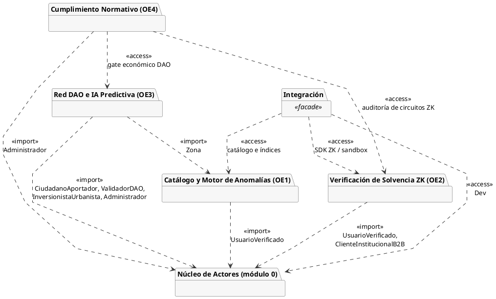
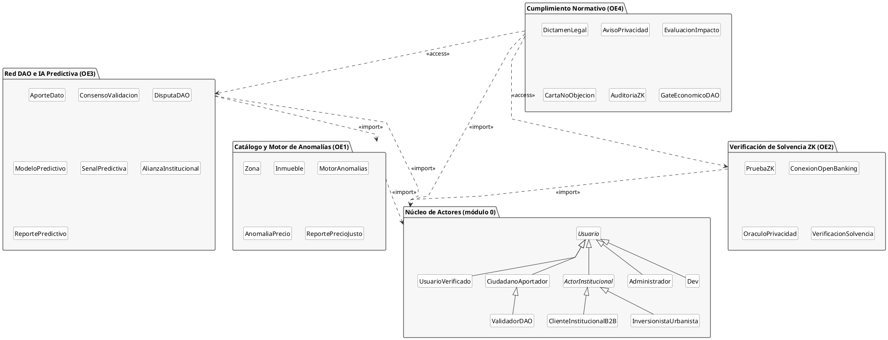
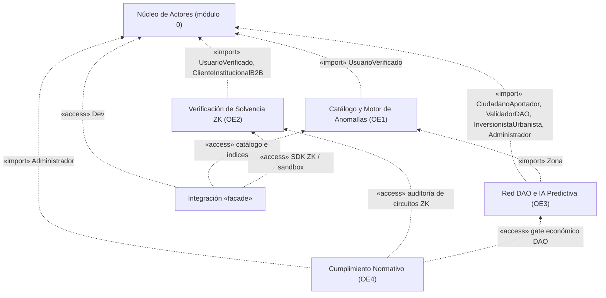

# CIVITAS — Diagramas de Paquetes (UML)

Organizados con la misma estructura modular que los diagramas de clase y el UML
general: **Núcleo de Actores (módulo 0)** + **OE1–OE4** + **Integración**.
Sintaxis PlantUML: copia cada bloque en [plantuml.com/plantuml](https://www.plantuml.com/plantuml)
(o cualquier editor con soporte PlantUML) para exportarlo como PNG/SVG.

Convenciones: `<<import>>` = el paquete usa clases públicas del otro (dependencia
fuerte, tomada de las asociaciones de los diagramas de clase); `<<access>>` =
dependencia conceptual o de servicio, sin importar clases concretas. La flecha
apunta del paquete cliente al proveedor.

---

## 1. Vista general — paquetes y dependencias

---

## 2. Vista de contenido — clases por paquete

*Integración no tiene clases propias en los diagramas de clase (`Dev` vive en el
Núcleo), por eso solo aparece en la vista general.*

---

## 3. Alternativa en Mermaid (vista general)

Para [mermaid.live](https://mermaid.live), por si no usas PlantUML.

---

## Notas de diseño

- **Origen de las dependencias `<<import>>`:** las clases marcadas `<<de módulo 0>>` en cada
  diagrama de clase y la asociación `SenalPredictiva → Zona` (OE3 → OE1).
- **Origen de las dos `<<access>>` de OE4:** vienen del catálogo de casos de uso (el
  Administrador audita los circuitos ZK y controla el gate económico de la DAO), no de los
  diagramas de clase; si tu profesor pide trazabilidad estricta con las clases, se pueden quitar.
- **Ciclo Núcleo ↔ módulos:** los métodos de los actores devuelven tipos de los módulos
  (`generarReportePrecioJusto → ReportePrecioJusto`, `certificarSolvencia → PruebaZK`,
  `reportarDato → AporteDato`, etc.), así que en rigor el Núcleo también depende de OE1–OE3.
  Aquí se modeló solo módulo → Núcleo (como en los diagramas de clase). Si te lo señalan,
  la salida estándar es mover esas firmas a los módulos o introducir interfaces en el Núcleo.

[[CIVITAS]]
