# CIVITAS — UML General

Vista consolidada (todo el sistema en un solo diagrama), a diferencia de los
archivos anteriores que estaban divididos por módulo/actor. Usa esto para la
lámina "diagrama general" que suelen pedir separada de los diagramas de
detalle.

---

## 1. Diagrama de Casos de Uso General

**Correcciones aplicadas**

| # | Problema | Corrección |
|---|---|---|
| 1 | Las 7 relaciones `«extend»` tenían la flecha invertida (base → extensión) | Dirección corregida en las 7: extensión → base (UC-I2.4→UC-I2, UC-I3.4→UC-I3, UC-B2.2→UC-B2, UC-C2.1→UC-C2, UC-D3.1→UC-D3, UC-U3.1→UC-U3, UC-V4.1→UC-V4) |
| 2 | UC-I2.3 (exportar/compartir reporte) modelado como `«include»` obligatorio | Cambiado a `«extend»`, mismo criterio ya aplicado en los diagramas por actor |
| 3 | UC-C3 y UC-Dv3.1 no son objetivos iniciados por el actor | Eliminados del diagrama |
| 4 | Sin actores secundarios (Open Banking, Oráculo ZK, Datos Abiertos, Autoridad Reguladora) | Se agregaron los 4 con sus asociaciones |
| 5 | Faltaban 11 casos de uso 🆕 presentes en los diagramas por actor (UC-I6, UC-U5, UC-C4, UC-D4, UC-A7, UC-B5, UC-Dv5 y sus anidados) | Se añadieron para que la vista general quede completa |
| 6 | Actores compuestos desincronizados con la revisión crítica aplicada en `civitas-diagramas-casos-de-uso1.md` y `CIVITAS.md` (Usuario Verificado, Inversionista/Urbanista y Cliente Institucional B2B seguían combinando dos roles cada uno) | Se separaron en los mismos 11 actores primarios: Inquilino/Comprador, Inversionista/Urbanista, Administradora/PropTech, reasignando cada caso de uso al rol que realmente lo ejecuta (p. ej. UC-I3 solo Inquilino; UC-U4 solo Urbanista; UC-B5 solo Administradora) |
| 7 | Actor "Dev / Integrador" seguía combinando dos roles: consumo genérico de la API pública y la integración específica del módulo financiero/ZK sensible | Se separó en `Desarrollador` (documentación, credenciales, catálogo/índices, webhooks: UC-Dv1, Dv2, Dv3, Dv5) e `Integrador` (integración del SDK ZK y sandbox: UC-Dv4, Dv4.1), compartiendo ambos el acceso base a documentación y credenciales (UC-Dv1, Dv2) |

Resultado: 12 actores primarios + 4 secundarios, 70 casos de uso.

Sintaxis PlantUML, organizada en paquetes por objetivo específico (OE1–OE4)
más integración para Dev.

```plantuml
@startuml CIVITAS_Casos_de_Uso_General
' -- AJUSTES DE RENDERIZADO Y LAYOUT --
left to right direction
skinparam packageStyle rectangle
skinparam linetype polyline
skinparam nodesep 20
skinparam ranksep 60

' -- ACTORES IZQUIERDA (USUARIOS FINALES Y DAO) --
package "Usuarios Finales" {
  actor "Visitante no\nautenticado" as Visitante
  actor "Inquilino" as Inquilino
  actor "Comprador" as Comprador
  actor "Ciudadano\nAportador" as CiudadanoAportador
  actor "Validador DAO" as ValidadorDAO
}

package "Institucionales" {
  actor "Inversionista" as Inversionista
  actor "Urbanista" as Urbanista
  actor "Administradora" as Administradora
  actor "Cliente\nPropTech" as PropTech
}

' -- ACTORES DERECHA (TÉCNICOS, ADMIN Y SISTEMAS EXTERNOS) --
package "Administración y Dev" {
  actor "Administrador" as Administrador
  actor "Desarrollador" as Desarrollador
  actor "Integrador" as Integrador
}

package "Sistemas Externos" {
  actor "Proveedor de\nOpen Banking" as OpenBanking
  actor "Oráculo de\nPrivacidad ZK" as OraculoZK
  actor "Proveedor de\nDatos Abiertos" as DatosAbiertos
  actor "Autoridad\nReguladora" as AutoridadReg
}

ValidadorDAO --|> CiudadanoAportador

' -- SISTEMA CIVITAS --
rectangle CIVITAS {

  package "Catálogo (OE1)" {
    usecase "Explorar catálogo público" as UC_V1
    usecase "Consultar índices agregados" as UC_V1_1
    usecase "Buscar y filtrar zonas" as UC_V2
    usecase "Consultar índice asequibilidad" as UC_I1
    usecase "Generar Reporte Precio Justo" as UC_I2
    usecase "Contrastar precio vs. rango" as UC_I2_1
    usecase "Recomendar rango negociación" as UC_I2_2
    usecase "Exportar/compartir reporte" as UC_I2_3
    usecase "Responder encuesta uso" as UC_I2_4
    usecase "Guardar favoritos" as UC_I4
    usecase "Recibir alertas anomalías" as UC_I5
    usecase "Comparar inmuebles/zonas" as UC_I6
    usecase "Generar tabla comparativa" as UC_I6_1
    usecase "Gestionar catálogo colonias" as UC_A1
    usecase "Revisar datos abiertos" as UC_A1_1

    UC_V1 ..> UC_V1_1 : <<include>>
    UC_I2 ..> UC_I2_1 : <<include>>
    UC_I2 ..> UC_I2_2 : <<include>>
    UC_I2_3 .down.> UC_I2 : <<extend>>
    UC_I2_4 .down.> UC_I2 : <<extend>>
    UC_I6 ..> UC_I6_1 : <<include>>
    UC_A1 ..> UC_A1_1 : <<include>>
  }

  package "Verificación ZK (OE2)" {
    usecase "Certificar solvencia vía ZK" as UC_I3
    usecase "Conectar cuenta bancaria" as UC_I3_1
    usecase "Generar prueba ZK umbral" as UC_I3_2
    usecase "Compartir prueba" as UC_I3_3
    usecase "Revocar prueba compartida" as UC_I3_4
    usecase "Integrarse a ZK (onboarding)" as UC_B1
    usecase "Firmar contrato / KYB" as UC_B1_1
    usecase "Obtener credenciales API" as UC_B1_2
    usecase "Verificar solvencia solicitante" as UC_B2
    usecase "Validar prueba ZK recibida" as UC_B2_1
    usecase "Rechazar prueba inválida" as UC_B2_2
    usecase "Consultar panel verificaciones" as UC_B3
    usecase "Gestionar suscripción/facturas" as UC_B4
    usecase "Consultar bitácora verificaciones" as UC_B5
    usecase "Exportar bitácora firmada" as UC_B5_1

    UC_I3 ..> UC_I3_1 : <<include>>
    UC_I3 ..> UC_I3_2 : <<include>>
    UC_I3 ..> UC_I3_3 : <<include>>
    UC_I3_4 .down.> UC_I3 : <<extend>>
    UC_B1 ..> UC_B1_1 : <<include>>
    UC_B1 ..> UC_B1_2 : <<include>>
    UC_B2 ..> UC_B2_1 : <<include>>
    UC_B2_2 .down.> UC_B2 : <<extend>>
    UC_B5 ..> UC_B5_1 : <<include>>
  }

  package "Red DAO y Predicción (OE3)" {
    usecase "Reportar dato local" as UC_C1
    usecase "Adjuntar evidencia" as UC_C1_1
    usecase "Consultar reputación y estado" as UC_C2
    usecase "Disputar rechazo" as UC_C2_1
    usecase "Consultar historial aportes" as UC_C4
    usecase "Revisar aportes pendientes" as UC_D1
    usecase "Consultar evidencia/contexto" as UC_D1_1
    usecase "Votar validez del dato" as UC_D2
    usecase "Participar en arbitraje" as UC_D3
    usecase "Escalar a Administrador" as UC_D3_1
    usecase "Consultar tablero desempeño" as UC_D4
    usecase "Mapa riesgo gentrificación" as UC_U1
    usecase "Suscribirse alertas tempranas" as UC_U2
    usecase "Configurar umbral/zona" as UC_U2_1
    usecase "Solicitar reporte predictivo" as UC_U3
    usecase "Solicitar reporte a medida" as UC_U3_1
    usecase "Registrar uso política pública" as UC_U4
    usecase "Adjuntar evidencia documental" as UC_U4_1
    usecase "Comparar corredores/zonas" as UC_U5
    usecase "Exportar comparación a informe" as UC_U5_1
    usecase "Moderar disputas DAO" as UC_A2
    usecase "Controlar gate económico DAO" as UC_A6

    UC_C1 ..> UC_C1_1 : <<include>>
    UC_C2_1 .down.> UC_C2 : <<extend>>
    UC_D1 ..> UC_D1_1 : <<include>>
    UC_D3_1 .down.> UC_D3 : <<extend>>
    UC_U2 ..> UC_U2_1 : <<include>>
    UC_U3_1 .down.> UC_U3 : <<extend>>
    UC_U4 ..> UC_U4_1 : <<include>>
    UC_U5 ..> UC_U5_1 : <<include>>
  }

  package "Cumplimiento (OE4)" {
    usecase "Consultar Aviso Privacidad" as UC_V3
    usecase "Registrarse / iniciar sesión" as UC_V4
    usecase "Verificación identidad ligera" as UC_V4_1
    usecase "Administrar cumplimiento" as UC_A4
    usecase "Publicar Aviso Privacidad" as UC_A4_1
    usecase "Registrar PIA/DPIA" as UC_A4_2
    usecase "Registrar dictámenes/cartas" as UC_A4_3
    usecase "Supervisar auditoría ZK" as UC_A5
    usecase "Gestionar cuentas/contratos B2B" as UC_A3
    usecase "Emitir/revocar credenciales" as UC_A3_1
    usecase "Monitorear métricas de uso" as UC_A7
    usecase "Configurar alertas operativas" as UC_A7_1

    UC_V4_1 .down.> UC_V4 : <<extend>>
    UC_A4 ..> UC_A4_1 : <<include>>
    UC_A4 ..> UC_A4_2 : <<include>>
    UC_A4 ..> UC_A4_3 : <<include>>
    UC_A3 ..> UC_A3_1 : <<include>>
    UC_A7 ..> UC_A7_1 : <<include>>
  }

  package "Integración" {
    usecase "Consultar documentación API" as UC_Dv1
    usecase "Gestionar credenciales API" as UC_Dv2
    usecase "Consumir API catálogo/índices" as UC_Dv3
    usecase "Suscribirse a webhooks" as UC_Dv5
    usecase "Integrar verificación ZK" as UC_Dv4
    usecase "Probar en sandbox" as UC_Dv4_1

    UC_Dv5 .down.> UC_Dv3 : <<extend>>
    UC_Dv4 ..> UC_Dv4_1 : <<include>>
  }
}

' -- RELACIONES DE ACTORES --
Visitante --> UC_V1
Visitante --> UC_V2
Visitante --> UC_V3
Visitante --> UC_V4

Inquilino --> UC_I1
Inquilino --> UC_I2
Inquilino --> UC_I3
Inquilino --> UC_I4
Inquilino --> UC_I5
Inquilino --> UC_I6

Comprador --> UC_I1
Comprador --> UC_I2
Comprador --> UC_I4
Comprador --> UC_I5
Comprador --> UC_I6

CiudadanoAportador --> UC_C1
CiudadanoAportador --> UC_C2
CiudadanoAportador --> UC_C4

ValidadorDAO --> UC_D1
ValidadorDAO --> UC_D2
ValidadorDAO --> UC_D3
ValidadorDAO --> UC_D4

Inversionista --> UC_U1
Inversionista --> UC_U2
Inversionista --> UC_U3
Inversionista --> UC_U5

Urbanista --> UC_U1
Urbanista --> UC_U3
Urbanista --> UC_U4
Urbanista --> UC_U5

Administradora --> UC_B1
Administradora --> UC_B2
Administradora --> UC_B3
Administradora --> UC_B4
Administradora --> UC_B5

PropTech --> UC_B1
PropTech --> UC_B2
PropTech --> UC_B3
PropTech --> UC_B4

Administrador --# UC_A1
Administrador --# UC_A2
Administrador --# UC_A3
Administrador --# UC_A4
Administrador --# UC_A5
Administrador --# UC_A6
Administrador --# UC_A7

Desarrollador --# UC_Dv1
Desarrollador --# UC_Dv2
Desarrollador --# UC_Dv3

Integrador --# UC_Dv1
Integrador --# UC_Dv2
Integrador --# UC_Dv4

OpenBanking --# UC_I3_1
OraculoZK --# UC_I3_2
OraculoZK --# UC_B2_1
DatosAbiertos --# UC_A1_1
DatosAbiertos --# UC_I1
DatosAbiertos --# UC_U3
AutoridadReg --# UC_A4_1
AutoridadReg --# UC_A4_3

@enduml
```

---

## 2. Diagrama de Clases General

Los 5 módulos de `civitas-diagramas-de-clase.md` fusionados en un solo
diagrama (34 clases). Mermaid sí renderiza esto directamente.

**Corrección aplicada:** las clases `UsuarioVerificado`, `InversionistaUrbanista`
y `ClienteInstitucionalB2B` combinaban dos roles cada una — el mismo problema
de modelado ya corregido en el diagrama de actores (§1 de este archivo) y en
`civitas-diagramas-casos-de-uso1.md`. Se separaron en `Inquilino`/`Comprador`,
`Inversionista`/`Urbanista` y `Administradora`/`PropTech`, reasignando atributos,
métodos y asociaciones al rol que realmente los posee.

```mermaid
---
config:
  look: classic
---
classDiagram
    class Usuario {
        <<abstract>>
        +id: UUID
        +nombre: String
        +email: String
        +fechaRegistro: Date
        +iniciarSesion(credenciales) bool
        +cerrarSesion() void
        +actualizarPerfil(datos) void
    }
    class Inquilino {
        +nivelVerificacion: String
        +generarReportePrecioJusto(inmuebleId) ReportePrecioJusto
        +certificarSolvencia(umbral) PruebaZK
    }
    class Comprador {
        +nivelVerificacion: String
        +generarReportePrecioJusto(inmuebleId) ReportePrecioJusto
    }
    class CiudadanoAportador {
        +reputacion: int
        +nivelBadge: String
        +reportarDato(tipo, evidencia) AporteDato
        +consultarReputacion() int
    }
    class ValidadorDAO {
        +tasaAcierto: float
        +validarAporte(aporteId) void
        +participarArbitraje(disputaId) void
    }
    class ActorInstitucional {
        <<abstract>>
        +nombreInstitucion: String
        +tipoInstitucion: String
    }
    class Inversionista {
        +suscribirseAlertas(zona, umbral) void
        +solicitarReportePredictivo(zona) ReportePredictivo
    }
    class Urbanista {
        +solicitarReportePredictivo(zona) ReportePredictivo
        +registrarUsoEnPolitica(evidencia) void
    }
    class Administradora {
        +contratoId: UUID
        +credencialesAPI: String
        +verificarSolvencia(pruebaZKId) VerificacionSolvencia
        +consultarPanelVerificaciones() List
        +consultarBitacoraAuditoria() List
    }
    class PropTech {
        +contratoId: UUID
        +credencialesAPI: String
        +verificarSolvencia(pruebaZKId) VerificacionSolvencia
        +consultarPanelVerificaciones() List
    }
    class Administrador {
        +nivelAcceso: String
        +gestionarCatalogo() void
        +moderarDisputa(disputaId) void
        +administrarCumplimiento() void
        +controlarGateEconomicoDAO() void
    }
    class Desarrollador {
        +apiKey: String
        +consumirAPI(endpoint) Response
    }
    class Integrador {
        +apiKey: String
        +integrarZK(sandbox) void
    }
    class Zona {
        +id: UUID
        +nombre: String
        +ciudad: String
        +coordenadas: GeoPoint
        +indiceAsequibilidad: float
        +fechaActualizacion: Date
        +calcularIndiceAsequibilidad() float
        +actualizarPrecios() void
    }
    class Inmueble {
        +id: UUID
        +zonaId: UUID
        +precioRenta: float
        +tipoInmueble: String
        +superficie: float
        +fechaPublicacion: Date
        +consultarAnomalia() AnomaliaPrecio
    }
    class MotorAnomalias {
        +umbralPrecision: float
        +modeloVersion: String
        +detectarAnomalia(inmueble) AnomaliaPrecio
        +calcularRangoEsperado(zona) Range
    }
    class AnomaliaPrecio {
        +id: UUID
        +inmuebleId: UUID
        +precioPedido: float
        +rangoEsperadoMin: float
        +rangoEsperadoMax: float
        +severidad: String
    }
    class ReportePrecioJusto {
        +id: UUID
        +usuarioId: UUID
        +inmuebleId: UUID
        +rangoNegociacion: Range
        +fechaGeneracion: Date
        +usadoEnNegociacion: bool
        +generar() void
        +exportarPDF() File
        +registrarUsoDeclarado(encuesta) void
    }
    class PruebaZK {
        +id: UUID
        +usuarioId: UUID
        +umbralTipo: String
        +resultado: bool
        +fechaGeneracion: Date
        +fechaExpiracion: Date
        +estado: String
        +generar() void
        +verificar() bool
        +revocar() void
    }
    class ConexionOpenBanking {
        +id: UUID
        +usuarioId: UUID
        +proveedor: String
        +estadoConexion: String
        +conectarCuenta() void
        +obtenerDatosFinancieros() Data
    }
    class OraculoPrivacidad {
        +proveedor: String
        +version: String
        +emitirAtestacion(umbral) PruebaZK
    }
    class VerificacionSolvencia {
        +id: UUID
        +clienteId: UUID
        +pruebaZKId: UUID
        +resultado: bool
        +fecha: Date
        +validar() bool
        +rechazar(motivo) void
    }
    class AporteDato {
        +id: UUID
        +aportadorId: UUID
        +tipo: String
        +contenido: String
        +evidencia: String
        +geolocalizacion: GeoPoint
        +estadoValidacion: String
        +fecha: Date
        +adjuntarEvidencia(archivo) void
    }
    class ConsensoValidacion {
        +id: UUID
        +aporteId: UUID
        +resultado: String
        +umbralAlcanzado: float
        +registrarVoto(validadorId, voto) void
        +calcularConsenso() String
    }
    class DisputaDAO {
        +id: UUID
        +aporteId: UUID
        +estado: String
        +escalarAAdministrador() void
    }
    class ModeloPredictivo {
        +version: String
        +precisionHistorica: float
        +anticiparInflexionPrecio(zona) SenalPredictiva
        +generarSenalGentrificacion(zona) SenalPredictiva
    }
    class SenalPredictiva {
        +id: UUID
        +zonaId: UUID
        +tipoSenal: String
        +probabilidad: float
        +antelacionMeses: int
        +fecha: Date
    }
    class AlianzaInstitucional {
        +id: UUID
        +institucionId: UUID
        +tipoInstitucion: String
        +fechaFirma: Date
        +estadoUso: String
        +evidenciaDocumental: String
        +registrarUsoEnPolitica(evidencia) void
        +renovar() void
    }
    class ReportePredictivo {
        +id: UUID
        +alianzaId: UUID
        +zonaId: UUID
        +contenido: String
        +fechaGeneracion: Date
        +generar() void
        +descargar() File
    }
    class AvisoPrivacidad {
        +id: UUID
        +version: String
        +fechaPublicacion: Date
        +alcance: String
        +publicar() void
        +actualizar() void
    }
    class EvaluacionImpacto {
        +id: UUID
        +fase: String
        +fechaCompletada: Date
        +hallazgos: String
        +completar() void
        +actualizar() void
    }
    class DictamenLegal {
        +id: UUID
        +tipo: String
        +despacho: String
        +fecha: Date
        +conclusion: String
    }
    class CartaNoObjecion {
        +id: UUID
        +autoridad: String
        +fecha: Date
        +alcance: String
        +estado: String
    }
    class AuditoriaZK {
        +id: UUID
        +auditor: String
        +fecha: Date
        +hallazgosCriticos: int
        +estado: String
        +programar() void
        +cerrarHallazgo(id) void
    }
    class GateEconomicoDAO {
        +id: UUID
        +estado: String
        +opinionLegalId: UUID
        +fechaRevision: Date
        +evaluar() bool
        +habilitar() void
    }

    Usuario <|-- Inquilino
    Usuario <|-- Comprador
    Usuario <|-- CiudadanoAportador
    Usuario <|-- ActorInstitucional
    Usuario <|-- Administrador
    Usuario <|-- Desarrollador
    Usuario <|-- Integrador
    CiudadanoAportador <|-- ValidadorDAO
    ActorInstitucional <|-- Inversionista
    ActorInstitucional <|-- Urbanista
    ActorInstitucional <|-- Administradora
    ActorInstitucional <|-- PropTech

    Zona "1" --> "*" Inmueble : contiene
    MotorAnomalias "1" --> "*" AnomaliaPrecio : detecta
    AnomaliaPrecio "*" --> "1" Inmueble : referencia
    ReportePrecioJusto "*" --> "1" Inmueble : referencia
    ReportePrecioJusto ..> MotorAnomalias : «include» usa
    Inquilino "1" --> "*" ReportePrecioJusto : genera
    Comprador "1" --> "*" ReportePrecioJusto : genera

    PruebaZK "*" --> "1" ConexionOpenBanking : usa datos de
    PruebaZK ..> OraculoPrivacidad : emitida por
    VerificacionSolvencia "*" --> "1" PruebaZK : valida
    Inquilino "1" --> "*" PruebaZK : posee
    Administradora "1" --> "*" VerificacionSolvencia : realiza
    PropTech "1" --> "*" VerificacionSolvencia : realiza

    CiudadanoAportador "1" --> "*" AporteDato : reporta
    AporteDato "1" --> "1" ConsensoValidacion : tiene
    ConsensoValidacion "*" --> "*" ValidadorDAO : vota
    AporteDato "1" --> "0..1" DisputaDAO : puede generar
    DisputaDAO ..> Administrador : escala a
    ModeloPredictivo "1" --> "*" SenalPredictiva : genera
    SenalPredictiva "*" --> "1" Zona : sobre
    Inversionista "1" --> "*" AlianzaInstitucional : mantiene
    Urbanista "1" --> "*" AlianzaInstitucional : mantiene
    AlianzaInstitucional "1" --> "*" ReportePredictivo : recibe
    ReportePredictivo ..> ModeloPredictivo : basado en

    Administrador "1" --> "*" AvisoPrivacidad : administra
    Administrador "1" --> "*" EvaluacionImpacto : administra
    Administrador "1" --> "*" DictamenLegal : registra
    Administrador "1" --> "*" CartaNoObjecion : gestiona
    Administrador "1" --> "*" AuditoriaZK : supervisa
    Administrador "1" --> "1" GateEconomicoDAO : controla
    GateEconomicoDAO ..> DictamenLegal : requiere
```

[[CIVITAS]]
