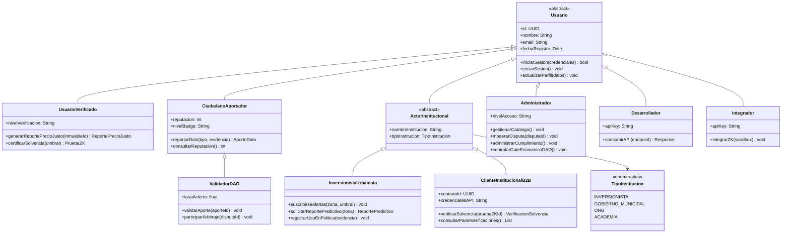
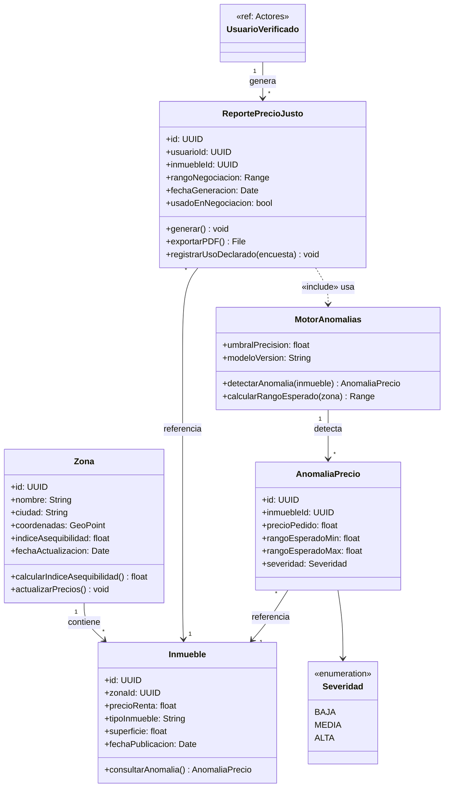
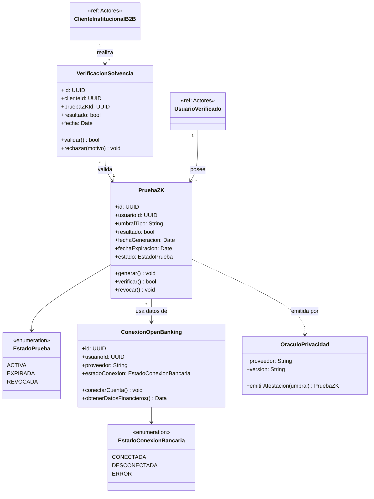
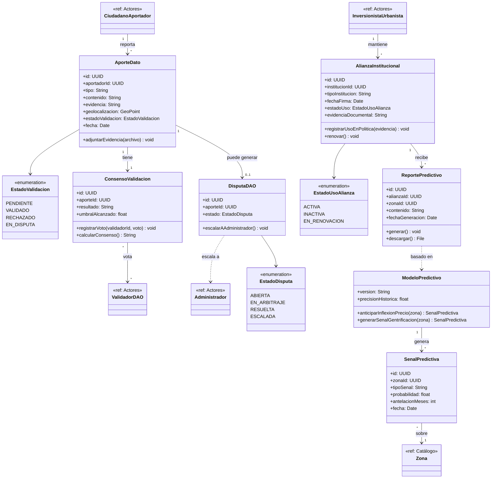
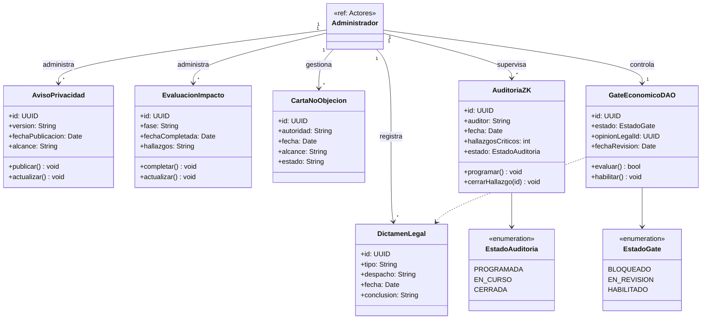

# CIVITAS — UML General

Vista consolidada (todo el sistema en un solo diagrama), a diferencia de los
archivos anteriores que estaban divididos por módulo/actor. Usa esto para la
lámina "diagrama general" que suelen pedir separada de los diagramas de
detalle.

---

## 1. Diagrama de Casos de Uso General

**Correcciones aplicadas**

| # | Problema | Corrección |
|---|---|---|
| 1 | Las 7 relaciones `«extend»` tenían la flecha invertida (base → extensión) | Dirección corregida en las 7: extensión → base (UC-I2.4→UC-I2, UC-I3.4→UC-I3, UC-B2.2→UC-B2, UC-C2.1→UC-C2, UC-D3.1→UC-D3, UC-U3.1→UC-U3, UC-V4.1→UC-V4) |
| 2 | UC-I2.3 (exportar/compartir reporte) modelado como `«include»` obligatorio | Cambiado a `«extend»`, mismo criterio ya aplicado en los diagramas por actor |
| 3 | UC-C3 y UC-Dv3.1 no son objetivos iniciados por el actor | Eliminados del diagrama |
| 4 | Sin actores secundarios (Open Banking, Oráculo ZK, Datos Abiertos, Autoridad Reguladora) | Se agregaron los 4 con sus asociaciones |
| 5 | Faltaban 11 casos de uso 🆕 presentes en los diagramas por actor (UC-I6, UC-U5, UC-C4, UC-D4, UC-A7, UC-B5, UC-Dv5 y sus anidados) | Se añadieron para que la vista general quede completa |
| 6 | Actor "Dev / Integrador" combinaba dos roles: consumo genérico de la API pública y la integración específica del módulo financiero/ZK sensible | Se separó en `Desarrollador` (documentación, credenciales, catálogo/índices, webhooks: UC-Dv1, Dv2, Dv3, Dv5) e `Integrador` (integración del SDK ZK y sandbox: UC-Dv4, Dv4.1), compartiendo ambos el acceso base a documentación y credenciales (UC-Dv1, Dv2) |

Resultado: 9 actores primarios + 4 secundarios, 70 casos de uso.

Sintaxis PlantUML, organizada en paquetes por objetivo específico (OE1–OE4)
más integración para Dev.

```plantuml
@startuml CIVITAS_Casos_de_Uso_General
left to right direction
skinparam packageStyle rectangle

actor "Visitante no\nautenticado" as Visitante
actor "Usuario\nVerificado" as UsuarioVerificado
actor "Ciudadano\nAportador" as CiudadanoAportador
actor "Validador DAO" as ValidadorDAO
actor "Inversionista /\nUrbanista" as Inversionista
actor "Cliente\nInstitucional B2B" as ClienteB2B
actor "Administrador" as Administrador
actor "Desarrollador" as Desarrollador
actor "Integrador" as Integrador

ValidadorDAO --|> CiudadanoAportador

rectangle CIVITAS {

  package "Catálogo (OE1)" {
    usecase "Explorar catálogo\npúblico" as UC_V1
    usecase "Consultar índices\nagregados" as UC_V1_1
    usecase "Buscar y filtrar\nzonas" as UC_V2
    usecase "Consultar índice de\nasequibilidad/anomalía" as UC_I1
    usecase "Generar Reporte\nde Precio Justo" as UC_I2
    usecase "Contrastar precio vs.\nrango esperado" as UC_I2_1
    usecase "Recomendar rango\nde negociación" as UC_I2_2
    usecase "Exportar/compartir\nreporte" as UC_I2_3
    usecase "Responder encuesta\nde uso" as UC_I2_4
    usecase "Guardar favoritos" as UC_I4
    usecase "Recibir alertas de\nanomalías" as UC_I5
    usecase "Comparar inmuebles\no zonas" as UC_I6
    usecase "Generar tabla\ncomparativa" as UC_I6_1
    usecase "Gestionar catálogo\nde colonias" as UC_A1
    usecase "Revisar fuentes de\ndatos abiertas" as UC_A1_1

    UC_V1 ..> UC_V1_1 : <<include>>
    UC_I2 ..> UC_I2_1 : <<include>>
    UC_I2 ..> UC_I2_2 : <<include>>
    UC_I2_3 .down.> UC_I2 : <<extend>>
    UC_I2_4 .down.> UC_I2 : <<extend>>
    UC_I6 ..> UC_I6_1 : <<include>>
    UC_A1 ..> UC_A1_1 : <<include>>
  }

  package "Verificación ZK (OE2)" {
    usecase "Certificar solvencia\nvía ZK" as UC_I3
    usecase "Conectar cuenta\nbancaria" as UC_I3_1
    usecase "Generar prueba ZK\nde umbral" as UC_I3_2
    usecase "Compartir prueba" as UC_I3_3
    usecase "Revocar prueba\ncompartida" as UC_I3_4
    usecase "Integrarse al módulo\nZK (onboarding)" as UC_B1
    usecase "Firmar contrato / KYB" as UC_B1_1
    usecase "Obtener credenciales\nAPI" as UC_B1_2
    usecase "Verificar solvencia\nde un solicitante" as UC_B2
    usecase "Validar prueba ZK\nrecibida" as UC_B2_1
    usecase "Rechazar prueba\ninválida/expirada" as UC_B2_2
    usecase "Consultar panel de\nverificaciones" as UC_B3
    usecase "Gestionar suscripción\ny facturación" as UC_B4
    usecase "Consultar bitácora\nde verificaciones" as UC_B5
    usecase "Exportar bitácora\nfirmada" as UC_B5_1

    UC_I3 ..> UC_I3_1 : <<include>>
    UC_I3 ..> UC_I3_2 : <<include>>
    UC_I3 ..> UC_I3_3 : <<include>>
    UC_I3_4 .down.> UC_I3 : <<extend>>
    UC_B1 ..> UC_B1_1 : <<include>>
    UC_B1 ..> UC_B1_2 : <<include>>
    UC_B2 ..> UC_B2_1 : <<include>>
    UC_B2_2 .down.> UC_B2 : <<extend>>
    UC_B5 ..> UC_B5_1 : <<include>>
  }

  package "Red DAO y Predicción (OE3)" {
    usecase "Reportar dato local" as UC_C1
    usecase "Adjuntar evidencia" as UC_C1_1
    usecase "Consultar reputación\ny estado" as UC_C2
    usecase "Disputar rechazo" as UC_C2_1
    usecase "Consultar historial\nde aportes" as UC_C4
    usecase "Revisar aportes\npendientes" as UC_D1
    usecase "Consultar evidencia\ny contexto" as UC_D1_1
    usecase "Votar validez\ndel dato" as UC_D2
    usecase "Participar en\narbitraje" as UC_D3
    usecase "Escalar a\nAdministrador" as UC_D3_1
    usecase "Consultar tablero de\ndesempeño" as UC_D4
    usecase "Consultar mapa de\nriesgo de gentrificación" as UC_U1
    usecase "Suscribirse a alertas\ntempranas" as UC_U2
    usecase "Configurar umbral/\nzona" as UC_U2_1
    usecase "Solicitar reporte\npredictivo" as UC_U3
    usecase "Solicitar reporte\na medida" as UC_U3_1
    usecase "Registrar uso en\npolítica pública" as UC_U4
    usecase "Adjuntar evidencia\ndocumental" as UC_U4_1
    usecase "Comparar corredores\no zonas" as UC_U5
    usecase "Exportar comparación\na informe" as UC_U5_1
    usecase "Moderar disputas\nDAO escaladas" as UC_A2
    usecase "Controlar gate\neconómico DAO" as UC_A6

    UC_C1 ..> UC_C1_1 : <<include>>
    UC_C2_1 .down.> UC_C2 : <<extend>>
    UC_D1 ..> UC_D1_1 : <<include>>
    UC_D3_1 .down.> UC_D3 : <<extend>>
    UC_U2 ..> UC_U2_1 : <<include>>
    UC_U3_1 .down.> UC_U3 : <<extend>>
    UC_U4 ..> UC_U4_1 : <<include>>
    UC_U5 ..> UC_U5_1 : <<include>>
  }

  package "Cumplimiento (OE4)" {
    usecase "Consultar Aviso\nde Privacidad" as UC_V3
    usecase "Registrarse /\niniciar sesión" as UC_V4
    usecase "Verificación de\nidentidad ligera" as UC_V4_1
    usecase "Administrar\ncumplimiento normativo" as UC_A4
    usecase "Publicar Aviso\nde Privacidad" as UC_A4_1
    usecase "Registrar PIA/DPIA" as UC_A4_2
    usecase "Registrar dictámenes\ny cartas" as UC_A4_3
    usecase "Supervisar auditoría\nZK" as UC_A5
    usecase "Gestionar cuentas y\ncontratos B2B" as UC_A3
    usecase "Emitir/revocar\ncredenciales API" as UC_A3_1
    usecase "Monitorear salud y\nmétricas de uso" as UC_A7
    usecase "Configurar alertas\noperativas" as UC_A7_1

    UC_V4_1 .down.> UC_V4 : <<extend>>
    UC_A4 ..> UC_A4_1 : <<include>>
    UC_A4 ..> UC_A4_2 : <<include>>
    UC_A4 ..> UC_A4_3 : <<include>>
    UC_A3 ..> UC_A3_1 : <<include>>
    UC_A7 ..> UC_A7_1 : <<include>>
  }

  package "Integración (Desarrollador / Integrador)" {
    usecase "Consultar\ndocumentación API" as UC_Dv1
    usecase "Gestionar\ncredenciales API" as UC_Dv2
    usecase "Consumir API de\ncatálogo/índices" as UC_Dv3
    usecase "Suscribirse a\nwebhooks" as UC_Dv5
    usecase "Integrar\nverificación ZK" as UC_Dv4
    usecase "Probar en\nsandbox" as UC_Dv4_1

    UC_Dv5 .down.> UC_Dv3 : <<extend>>
    UC_Dv4 ..> UC_Dv4_1 : <<include>>
  }
}

actor "Proveedor de\nOpen Banking" as OpenBanking
actor "Oráculo de\nPrivacidad ZK" as OraculoZK
actor "Proveedor de\nDatos Abiertos" as DatosAbiertos
actor "Autoridad\nReguladora" as AutoridadReg

Visitante --> UC_V1
Visitante --> UC_V2
Visitante --> UC_V3
Visitante --> UC_V4

UsuarioVerificado --> UC_I1
UsuarioVerificado --> UC_I2
UsuarioVerificado --> UC_I3
UsuarioVerificado --> UC_I4
UsuarioVerificado --> UC_I5
UsuarioVerificado --> UC_I6

CiudadanoAportador --> UC_C1
CiudadanoAportador --> UC_C2
CiudadanoAportador --> UC_C4

ValidadorDAO --> UC_D1
ValidadorDAO --> UC_D2
ValidadorDAO --> UC_D3
ValidadorDAO --> UC_D4

Inversionista --> UC_U1
Inversionista --> UC_U2
Inversionista --> UC_U3
Inversionista --> UC_U4
Inversionista --> UC_U5

ClienteB2B --> UC_B1
ClienteB2B --> UC_B2
ClienteB2B --> UC_B3
ClienteB2B --> UC_B4
ClienteB2B --> UC_B5

Administrador --> UC_A1
Administrador --> UC_A2
Administrador --> UC_A3
Administrador --> UC_A4
Administrador --> UC_A5
Administrador --> UC_A6
Administrador --> UC_A7

Desarrollador --> UC_Dv1
Desarrollador --> UC_Dv2
Desarrollador --> UC_Dv3

Integrador --> UC_Dv1
Integrador --> UC_Dv2
Integrador --> UC_Dv4

OpenBanking --> UC_I3_1
OraculoZK --> UC_I3_2
OraculoZK --> UC_B2_1
DatosAbiertos --> UC_A1_1
DatosAbiertos --> UC_I1
DatosAbiertos --> UC_U3
AutoridadReg --> UC_A4_1
AutoridadReg --> UC_A4_3

@enduml
```

---

## 2. Diagrama de Clases — por módulo

El diagrama de 31 clases en un solo bloque era ilegible para revisar
atributos y relaciones con detalle. Se separó en los mismos 5 módulos que
ya usás para casos de uso (Actores + OE1–OE4). Cada clase vive en un solo
módulo (su "hogar"); cuando otro módulo necesita referenciarla para dibujar
una relación, aparece como una caja vacía marcada `<<ref: Módulo>>` — no es
una clase nueva, es la misma clase señalando dónde está definida completa.

También se formalizaron 8 atributos que eran `String` genéricos pero en
realidad son máquinas de estado o catálogos cerrados, convirtiéndolos en
`<<enumeration>>`: `TipoInstitucion`, `Severidad`, `EstadoPrueba`,
`EstadoConexionBancaria`, `EstadoValidacion`, `EstadoDisputa`,
`EstadoUsoAlianza`, `EstadoAuditoria`, `EstadoGate`.

### 2.0 Actores (jerarquía de roles)

### 2.1 Catálogo e Índices (OE1)

### 2.2 Verificación ZK (OE2)

### 2.3 Red DAO y Predicción (OE3)

### 2.4 Cumplimiento (OE4)

### 2.5 Relaciones entre módulos

Mapa de las aristas que cruzan de un módulo a otro (las cajas `<<ref>>` de
arriba son estas mismas clases, no duplicados):

| Origen | Relación | Destino | Módulo destino |
|---|---|---|---|
| UsuarioVerificado (Actores) | genera | ReportePrecioJusto | 2.1 Catálogo |
| UsuarioVerificado (Actores) | posee | PruebaZK | 2.2 Verificación ZK |
| ClienteInstitucionalB2B (Actores) | realiza | VerificacionSolvencia | 2.2 Verificación ZK |
| CiudadanoAportador (Actores) | reporta | AporteDato | 2.3 Red DAO |
| ValidadorDAO (Actores) | vota (vía ConsensoValidacion) | AporteDato | 2.3 Red DAO |
| DisputaDAO (2.3 Red DAO) | escala a | Administrador | Actores |
| InversionistaUrbanista (Actores) | mantiene | AlianzaInstitucional | 2.3 Red DAO |
| SenalPredictiva (2.3 Red DAO) | sobre | Zona | 2.1 Catálogo |
| Administrador (Actores) | administra / supervisa / controla | AvisoPrivacidad, EvaluacionImpacto, DictamenLegal, CartaNoObjecion, AuditoriaZK, GateEconomicoDAO | 2.4 Cumplimiento |

[[CIVITAS]]
