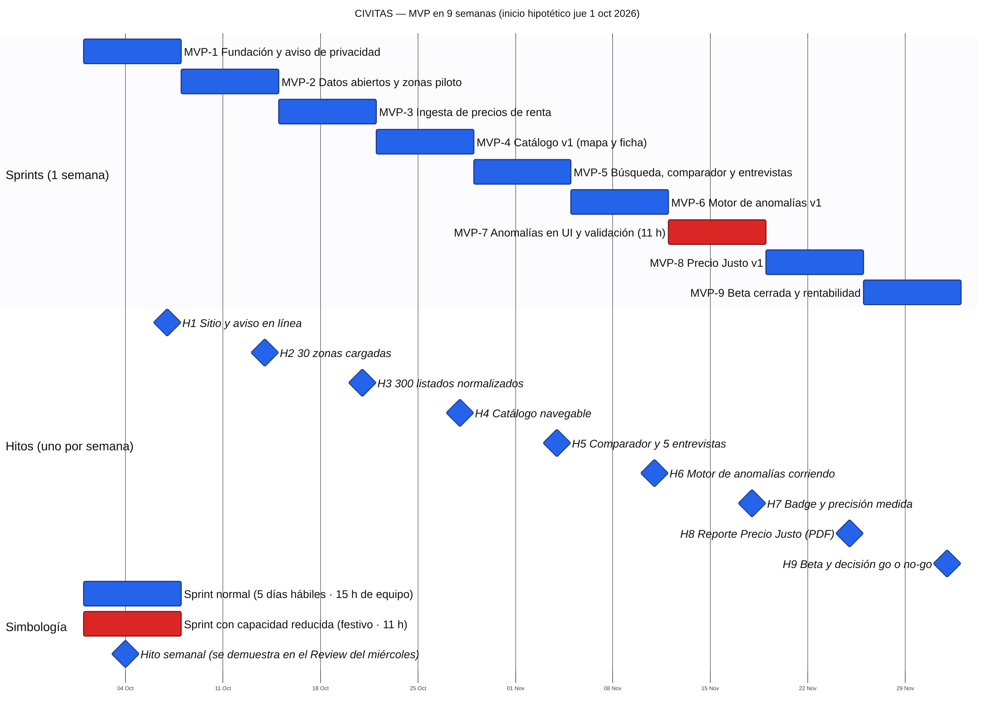
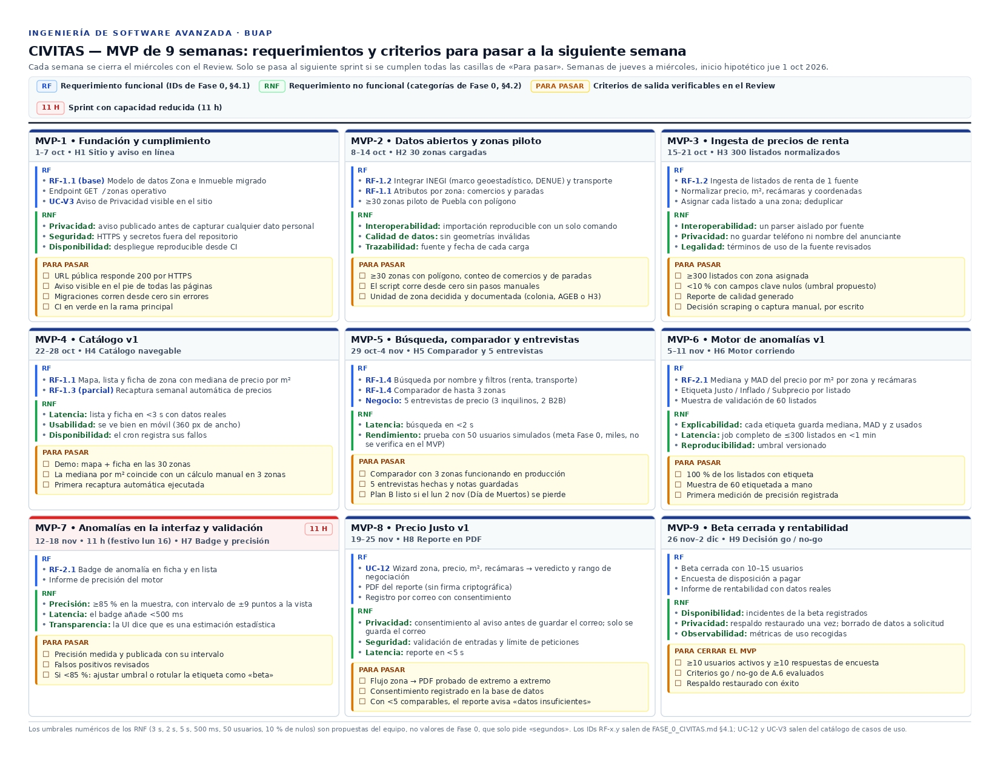

# CIVITAS — Calendario de Actividades y Sprints Scrum

Este documento tiene dos partes:

- **Parte A — MVP en 9 semanas (plan operativo).** 9 sprints de 1 semana, un hito
  por semana, calendario día por día y análisis de precios y rentabilidad.
- **Parte B — Plan completo Fase I y II (referencia).** Los 16 sprints de 2
  semanas (~7.4 meses). Es la numeración que usan `DIAGRAMAS_DE_INTERFAZ.md`,
  `ARQUITECTURA_TECNICA.md`, `CASOS DE USO.md` y `temas faltantes.md`; no se
  renumeró para no romper esas referencias.

> **Nota de alcance.** `FASE_0_CIVITAS.md` declara sprints de 2 semanas y un rango
> de 4–8 meses para las Fases I–II. Las 9 semanas del MVP son un recorte de
> alcance, no una compresión de ese plan: lo que no cabe queda en la Parte B.

---

# Parte A — MVP en 9 semanas

## A.1 Supuestos (corregir si no son ciertos)

| Supuesto | Valor | Efecto si es falso |
|---|---|---|
| Equipo | 2 personas (dato confirmado) | — |
| Horas por persona | **10 h/semana** (no confirmado) | Todo el calendario escala lineal con este número |
| Roles | Persona A: backend/datos · Persona B: frontend/producto | Reasignar filas de A.4 |
| Inicio | jue 1 oct 2026; semanas de jueves a miércoles | Si arranca después, todas las fechas se corren |
| Fin | mié 2 dic 2026 | Verificar contra el cierre del semestre BUAP (no incorporado) |

**Capacidad real.** Cada sprint gasta 2.5 h por persona en ceremonias (Planning
1 h + Review y Retro 1.5 h). Quedan **7.5 h netas por persona = 15 h de equipo
por semana**; el sprint 7 tiene 11 h por el festivo del lun 16 nov. Total del
MVP: **8 × 15 + 11 = 131 horas de desarrollo**. Es poco: todo lo de abajo se
diseñó para caber en esa cifra, y por eso el alcance es tan acotado.

## A.2 Alcance

**Dentro:** una sola ciudad (Puebla), ≥30 zonas piloto, ingesta de datos
abiertos y de una fuente de precios de renta, catálogo con mapa, búsqueda y
comparador, motor de anomalías **estadístico** (no ML), reporte de Precio Justo
en PDF, registro simple por correo y una beta cerrada.

**Fuera (queda en la Parte B o en fases posteriores):**

| Elemento | Dónde vive |
|---|---|
| 2.ª ciudad y meta de 200+ colonias | Sprint 7 del plan completo |
| Identidad completa y roles (Usuario Verificado) | Sprint 6 |
| Histórico de precios real | Sprint 5 — en 9 semanas solo se acumulan ~6 capturas semanales, una serie corta, no un histórico |
| Índice de asequibilidad y mapas de calor | Sprints 11–12 |
| Precio Justo v2 (compartir, encuesta) y predicción local | Sprints 14–15 |
| Favoritos, alertas, notificaciones, soporte | Sin sprint asignado (ver `DIAGRAMAS_DE_INTERFAZ.md`) |
| DAO, ZK, agente predictivo | Fases III y IV |

**Metas de Fase 0 que cambian en el MVP**

| Meta original | En el MVP | Motivo |
|---|---|---|
| 200+ colonias en 2 ciudades | ≥30 zonas en Puebla | 131 h de desarrollo |
| Precisión de anomalías ≥85 % vs. panel de expertos | ≥85 % vs. muestra de 60 listados etiquetados por el propio equipo | No hay panel externo; con n=60 el intervalo de confianza al 95 % es de ±9 puntos, así que un 85 % observado no demuestra un 85 % real |
| ≥5 % menor precio de cierre | Porcentaje de usuarios de la beta que declara usar el reporte al negociar | Medir el precio de cierre exige operaciones cerradas, imposibles en 9 semanas |
| Actualización de precios ≤30 días | Recaptura semanal automatizada | Sin cambio de fondo |

## A.3 Plantilla de sprint de 1 semana

Cada semana tiene 5 días hábiles (jue, vie, lun, mar, mié). Cada persona dedica
2 h por día hábil.

| Día | Actividad | Ceremonia |
|---|---|---|
| Jueves | Planning: revisar backlog, comprometer el sprint (1 h c/u); el resto del día, desarrollo | Sprint Planning |
| Viernes, lunes, martes | Desarrollo. El martes al cierre, congelar el código del sprint | — |
| Miércoles | 0.5 h de QA o buffer; **Review** (demo del hito) y **Retro** (1.5 h c/u) | Review + Retro |

Sin Daily Scrum de 15 min: con 2 personas y 2 h diarias cada una, se sustituye
por un mensaje de estado al inicio de cada sesión.

## A.4 Los 9 hitos y el calendario día por día

| Sprint | Semana (jue–mié) | Horas netas | Hito (se demuestra en el Review del miércoles) |
|---|---|---|---|
| MVP-1 | 1–7 oct | 15 | **H1** Sitio desplegado en URL pública con Aviso de Privacidad y esquema de datos migrado |
| MVP-2 | 8–14 oct | 15 | **H2** ≥30 zonas piloto cargadas con polígono, comercios y paradas de transporte |
| MVP-3 | 15–21 oct | 15 | **H3** ≥300 listados de renta normalizados y asignados a una zona |
| MVP-4 | 22–28 oct | 15 | **H4** Catálogo v1 navegable: mapa, lista y ficha con precio mediano por m² |
| MVP-5 | 29 oct–4 nov | 15 | **H5** Búsqueda, filtros y comparador (hasta 3 zonas) + 5 entrevistas de precio hechas |
| MVP-6 | 5–11 nov | 15 | **H6** Motor de anomalías v1 corriendo sobre los listados (Justo / Inflado / Subprecio) |
| MVP-7 | 12–18 nov | **11** | **H7** Badge de anomalía visible en ficha y lista + informe de precisión medido |
| MVP-8 | 19–25 nov | 15 | **H8** Reporte de Precio Justo v1 en PDF, con registro por correo |
| MVP-9 | 26 nov–2 dic | 15 | **H9** Beta cerrada (10–15 usuarios), encuesta de disposición a pagar y decisión go / no-go |

Las horas de cada fila son horas de equipo (suma de A y B).

La imagen lista, por semana, los requerimientos funcionales (RF), los no
funcionales (RNF) y las casillas que deben cumplirse para pasar a la siguiente.
Los umbrales numéricos de los RNF son propuestas del equipo; Fase 0 solo pide
tiempos «de segundos».

### MVP-1 · Fundación y cumplimiento (1–7 oct)

| Fecha | Actividad | Resp. | Horas |
|---|---|---|---|
| jue 1 oct | Planning. Repo, CI y convenciones según `ARQUITECTURA_TECNICA.md` | A+B | 2 |
| vie 2 oct | Esquema de BD (`Zona`, `Inmueble`) y migraciones (A); esqueleto del front y despliegue (B) | A/B | 4 |
| lun 5 oct | Endpoint `GET /zonas`; despliegue en URL pública | A/B | 4 |
| mar 6 oct | Borrador de Aviso de Privacidad, requisito de OE4 (B); hipótesis de precios v0 (A) | A/B | 4 |
| mié 7 oct | QA y buffer; Review + Retro | A+B | 1 |

### MVP-2 · Datos abiertos y zonas piloto (8–14 oct)

| Fecha | Actividad | Resp. | Horas |
|---|---|---|---|
| jue 8 oct | Planning. **Decidir la unidad de zona:** colonia si hay polígonos disponibles; si no, AGEB urbana de INEGI o hexágonos H3 (ya previstos en `temas faltantes.md` §1.4) | A+B | 2 |
| vie 9 oct | Carga del marco geoestadístico y DENUE de INEGI (A); script de importación reproducible y documentado (B) | A/B | 4 |
| lun 12 oct | Paradas y rutas de transporte: GTFS de RUTA si existe; si no, paradas de OpenStreetMap | A/B | 4 |
| mar 13 oct | Selección de las 30 zonas piloto; conteo de comercios y paradas por zona | A/B | 4 |
| mié 14 oct | QA y buffer; Review + Retro | A+B | 1 |

### MVP-3 · Ingesta de precios de renta (15–21 oct)

| Fecha | Actividad | Resp. | Horas |
|---|---|---|---|
| jue 15 oct | Planning. Revisar términos de uso y `robots.txt` del portal elegido; decidir entre scraping o captura manual asistida | A+B | 2 |
| vie 16 oct | Scraper o parser de 1 portal (A); modelo de normalización de precio, m², recámaras y coordenadas (B) | A/B | 4 |
| lun 19 oct | Geocodificación y asignación a zona (A); deduplicación simple: misma dirección y precio ±5 % (B) | A/B | 4 |
| mar 20 oct | Carga de ≥300 listados; reporte de calidad (nulos, atípicos) | A/B | 4 |
| mié 21 oct | QA y buffer; Review + Retro | A+B | 1 |

### MVP-4 · Catálogo v1 (22–28 oct)

| Fecha | Actividad | Resp. | Horas |
|---|---|---|---|
| jue 22 oct | Planning. Pantallas a partir de P-01 y P-02 de `DIAGRAMAS_DE_INTERFAZ.md` | A+B | 2 |
| vie 23 oct | `GET /zonas/:id` con mediana por m² y conteos (A); mapa Leaflet con capa de zonas (B) | A/B | 4 |
| lun 26 oct | Lista y ficha de zona (B); cron semanal de recaptura de precios (A) | A/B | 4 |
| mar 27 oct | Integración con datos reales; diseño adaptable básico | A/B | 4 |
| mié 28 oct | QA y buffer; Review + Retro | A+B | 1 |

### MVP-5 · Búsqueda, comparador y entrevistas (29 oct–4 nov)

| Fecha | Actividad | Resp. | Horas |
|---|---|---|---|
| jue 29 oct | Planning. Guion de entrevistas de precio | A+B | 2 |
| vie 30 oct | Filtros (renta, transporte) y búsqueda por nombre (B); endpoint de búsqueda (A) | A/B | 4 |
| lun 2 nov | Comparador de hasta 3 zonas. **Día en riesgo:** Día de Muertos, inhábil en muchas universidades | A/B | 4 |
| mar 3 nov | 5 entrevistas cortas (3 inquilinos o estudiantes, 2 inmobiliarias o administradoras): 3 h; correcciones: 1 h | A+B | 4 |
| mié 4 nov | QA y buffer; Review + Retro | A+B | 1 |

### MVP-6 · Motor de anomalías v1 (5–11 nov)

| Fecha | Actividad | Resp. | Horas |
|---|---|---|---|
| jue 5 nov | Planning. Método: mediana y MAD del precio por m² por zona y número de recámaras; z robusto con umbral a calibrar | A+B | 2 |
| vie 6 nov | Etiquetado manual de 60 listados como muestra de validación | A+B | 4 |
| lun 9 nov | Cálculo y job asíncrono (A); endpoint de anomalía (B) | A/B | 4 |
| mar 10 nov | Evaluación contra la muestra y ajuste del umbral | A/B | 4 |
| mié 11 nov | QA y buffer; Review + Retro | A+B | 1 |

### MVP-7 · Anomalías en la interfaz y validación (12–18 nov) — capacidad reducida

| Fecha | Actividad | Resp. | Horas |
|---|---|---|---|
| jue 12 nov | Planning | A+B | 2 |
| vie 13 nov | Badge de anomalía en ficha y lista (B); pruebas del motor (A) | A/B | 4 |
| lun 16 nov | **Festivo (Revolución)** | — | 0 |
| mar 17 nov | Informe de precisión (n=60, con intervalo de confianza); corrección de falsos positivos | A/B | 4 |
| mié 18 nov | QA y buffer; Review + Retro | A+B | 1 |

### MVP-8 · Precio Justo v1 (19–25 nov)

| Fecha | Actividad | Resp. | Horas |
|---|---|---|---|
| jue 19 nov | Planning. Definir el rango de negociación (p. ej. percentiles 25–75 de comparables) | A+B | 2 |
| vie 20 nov | Wizard: zona, precio pedido, m², recámaras (B); veredicto y rango (A) | A/B | 4 |
| lun 23 nov | PDF del reporte, **sin firma criptográfica** (A); registro por correo con consentimiento al Aviso de Privacidad (B) | A/B | 4 |
| mar 24 nov | Integración y pruebas del flujo completo | A/B | 4 |
| mié 25 nov | QA y buffer; Review + Retro | A+B | 1 |

Este es el sprint de mayor riesgo: 15 h para wizard, cálculo, PDF y registro. Si
se atrasa, se recorta primero el registro (el reporte se entrega tras dejar un
correo, sin cuentas) y después el PDF (queda una página imprimible).

### MVP-9 · Beta cerrada y rentabilidad (26 nov–2 dic)

| Fecha | Actividad | Resp. | Horas |
|---|---|---|---|
| jue 26 nov | Planning. Invitar a 10–15 usuarios de la beta | A+B | 2 |
| vie 27 nov | Robustez: errores, rendimiento y respaldos (A); encuesta de disposición a pagar (B) | A/B | 4 |
| lun 30 nov | Beta cerrada y seguimiento de uso | A+B | 4 |
| mar 1 dic | Análisis de la encuesta y de las métricas; actualizar A.6 con datos reales | A/B | 4 |
| mié 2 dic | Review final, Retro y entrega; decisión go / no-go | A+B | 1 |

## A.5 Riesgos del calendario

- **Fuente de precios (MVP-3).** Sin listados no hay anomalías ni Precio Justo:
  es el riesgo que hunde el MVP. Los portales de los que se extrae el dato
  prohíben o restringen el scraping en sus términos de uso (por revisar en
  MVP-3) y además son competidores. Plan B: captura manual asistida de ~200
  listados y aceptar una muestra menor.
- **Polígonos de colonias.** INEGI publica AGEB, no colonias. El catastro
  municipal exige convenio (`temas faltantes.md` §1.1), que no cabe en 9
  semanas. Por eso MVP-2 admite AGEB o H3 como unidad de zona.
- **131 horas.** Cualquier tarea que tome el doble se come un sprint completo.
  No hay holgura entre sprints: solo 0.5 h de buffer por persona cada
  miércoles.
- **Validación débil.** Etiquetar la muestra el mismo equipo que calibra el
  umbral sesga el resultado hacia arriba.
- **Semestre BUAP.** El 2 dic es una fecha hipotética; el calendario escolar
  no está incorporado. Los festivos siguen la Ley Federal del Trabajo (3.er
  lunes de nov = 16 nov); el 2 nov no es festivo legal.
- **Equipo de 2.** Con 2 personas, una enfermedad de una semana
  reduce la capacidad a la mitad.

## A.6 Precios y rentabilidad

**Todas las cifras de esta sección son supuestos, no datos de mercado.** Ninguna
está verificada contra precios de proveedores ni contra la disposición a pagar
real; MVP-5 (entrevistas) y MVP-9 (encuesta) existen para reemplazarlas. La
tarifa de procesamiento de pagos y los costos de infraestructura hay que
cotizarlos.

### Hallazgo principal

1. **Durante las 9 semanas el ingreso es cero.** Es inversión, no negocio.
2. `FASE_0_CIVITAS.md` (líneas 124–128) sitúa el ingreso temprano en clientes B2B
   con los módulos ZK (Fase IV) y de IA predictiva (Fase III). **Ninguno está en
   este MVP.** Lo que sí se construye es B2C: un producto de uso episódico (una
   persona renta una vez al año, más o menos).
3. Un plan de suscripción mensual B2C no encaja con ese uso; por eso las
   opciones de abajo son pago por reporte y pase de 30 días.

### Tarifas propuestas (hipótesis)

| Plan | Qué incluye | Precio |
|---|---|---|
| Gratis | Catálogo, mapa, búsqueda, comparador, etiqueta de anomalía | $0 |
| Reporte Precio Justo | 1 reporte en PDF | $49 MXN (IVA incluido) |
| Pase de búsqueda | Reportes ilimitados durante 30 días | $99 MXN (IVA incluido) |
| B2B — Reporte de zona | Mapa de precios y anomalías de Puebla, exportación CSV, para inmobiliarias y administradoras locales | $2,900 MXN/mes + IVA |

El plan B2B solo es vendible con más cobertura que 30 zonas; en el MVP sirve para
probar interés en las entrevistas, no para cobrar. **Recomendación: no cobrar en
la beta**; medir disposición a pagar.

### Costo del MVP (9 semanas)

| Concepto | Cálculo | MXN |
|---|---|---|
| Trabajo del equipo | 2 personas × 10 h × 9 sem = 180 h × $150/h (costo de oportunidad supuesto) | 27,000 |
| Infraestructura | ~2 meses × $800/mes (servidor y BD pequeños, por cotizar) | 1,600 |
| Dominio | 1 año | 250 |
| Revisión del Aviso de Privacidad | Opcional, por cotizar | 3,000 |
| **Total** | | **31,850** (4,850 en efectivo) |

Se usan 180 h y no 131 porque las ceremonias también cuestan tiempo.

### Punto de equilibrio mensual después del MVP

Costo fijo mensual supuesto: infraestructura $800 + datos y proxies $500 +
contabilidad y trámites del SAT $500 = **$1,800 en efectivo**. Con trabajo de
mantenimiento (40 h de equipo × $150 = $6,000): **$7,800**.

Ingreso neto por venta B2C: precio sin IVA menos comisión del procesador de pagos
(supuesto: 3.6 % + $3 + IVA sobre la comisión).

| Producto | Neto por venta | Ventas/mes para cubrir $1,800 | Ventas/mes para cubrir $7,800 |
|---|---|---|---|
| Reporte a $49 | ≈ $37 | ≈ 49 | ≈ 211 |
| Pase a $99 | ≈ $78 | ≈ 23 | ≈ 100 |
| B2B a $2,900 | $2,900 | 1 cliente (0.6) | 3 clientes (2.7) |

Con una conversión supuesta del 2 % de visitantes a compradores, 211 reportes
al mes exigen ~10,500 visitas mensuales. Esa cifra no la respalda ningún dato del
proyecto.

### Conclusión honesta

- **El B2C por sí solo puede cubrir el costo en efectivo** (~50 reportes al mes)
  pero no paga el trabajo del equipo. Cubrir las horas requiere tráfico que hoy
  no hay motivo para suponer.
- **La viabilidad depende del B2B**, y el producto B2B fuerte (ZK, predicción)
  está fuera de las 9 semanas. Es una contradicción estructural entre el plan de
  monetización de la Fase 0 y el alcance de este MVP.
- **El dato y el competidor son los mismos.** Los portales inmobiliarios
  alimentan el motor de anomalías y pueden replicar una etiqueta de "precio
  inflado" sin costo para el usuario. Si lo hacen, el plan gratuito pierde
  diferenciación y el reporte de $49 pierde razón de ser.
- **Cobrar exige alta fiscal** (SAT) y aviso de privacidad conforme a la ley de
  datos personales. No hay presupuesto de tiempo para ninguna de las dos cosas
  en las 9 semanas.

### Criterios go / no-go para el 2 dic (propuestos)

| Criterio | Umbral |
|---|---|
| Encuestados dispuestos a pagar ≥ $49 por un reporte | ≥ 30 % |
| Entrevistados B2B que aceptarían pagar por un reporte de zona | ≥ 2 de 5 |
| Beta: usuarios que generan al menos un reporte | ≥ 50 % de los invitados |
| Precisión medida del motor en la muestra | ≥ 85 % (con el intervalo de ±9 puntos a la vista) |

Si no se cumplen al menos los dos primeros, el análisis de A.6 indica que el
modelo B2C no sostiene al proyecto y hay que replantear el foco.

---

# Parte B — Plan completo Fase I y II (referencia)

Según el marco metodológico ya definido en el documento de Fase 0, Scrum
aplica específicamente a **Fase I y Fase II (Web 1.0 / 2.0)** — el resto del
proyecto usa KDD/CRISP-DM (motor de anomalías), espiral (Web 3.0/ZK) y XP
(auditoría de circuitos). Este plan cubre esas dos fases: **16 sprints de 15
días ≈ 8 meses**, coincidiendo con el rango "0–8 meses" ya declarado en el
roadmap. Ya no es el plan operativo: el operativo es la Parte A.

Roles Scrum sugeridos: **Product Owner** (prioriza backlog contra los KPIs de
OE1), **Scrum Master** (facilita ceremonias), **Equipo de desarrollo**
(full-stack + 1 perfil de datos desde Sprint 9).

---

## 1. Calendario de actividades — sprint promedio (15 días)

Plantilla reutilizable para cualquiera de los 16 sprints. Daily Scrum ocurre
todos los días hábiles (15 min); solo se listan aparte los días con
ceremonia adicional.

| Día | Actividad principal                                                                                                  | Ceremonia / hito                   |
| --- | -------------------------------------------------------------------------------------------------------------------- | ---------------------------------- |
| 1   | Sprint Planning: revisión de backlog priorizado, estimación (story points), compromiso del sprint backlog            | Sprint Planning (2–3 h)            |
| 2   | Desarrollo — diseño técnico de las historias comprometidas (modelos de datos, contratos de API)                      | Daily Scrum                        |
| 3   | Desarrollo — implementación backend/core                                                                             | Daily Scrum                        |
| 4   | Desarrollo — implementación backend/core                                                                             | Daily Scrum                        |
| 5   | Desarrollo — implementación frontend/integración                                                                     | Daily Scrum                        |
| 6   | Desarrollo — implementación frontend/integración                                                                     | Daily Scrum                        |
| 7   | Desarrollo + pruebas unitarias tempranas                                                                             | Daily Scrum                        |
| 8   | **Revisión intermedia**: avance vs. sprint backlog, reestimación si hay bloqueos                                     | Daily Scrum + Mid-sprint check-in  |
| 9   | Desarrollo — cierre de historias pendientes                                                                          | Daily Scrum                        |
| 10  | Desarrollo — cierre de historias pendientes                                                                          | Daily Scrum                        |
| 11  | QA: pruebas de integración, corrección de bugs                                                                       | Daily Scrum                        |
| 12  | QA: pruebas de integración, corrección de bugs                                                                       | Daily Scrum                        |
| 13  | Buffer: bugs críticos, documentación, preparación de demo                                                            | Daily Scrum                        |
| 14  | **Sprint Review**: demo del incremento a stakeholders (Product Owner, y según la fase, Administrador/Cliente piloto) | Sprint Review                      |
| 15  | **Sprint Retrospective** + refinamiento del backlog para el siguiente sprint                                         | Retrospective + Backlog Refinement |

*Los días 13–15 pueden caer en fin de semana según el calendario real; por
eso el sprint se cuenta en 15 días naturales y no en 14 (2 semanas exactas)
— da un día de colchón para que Review/Retro no se muevan por festivos.*

---

## 2. Los 16 sprints — Fase I y Fase II

### Fase I — Fundación (Web 1.0) · Sprints 1–8 · Días 1–120 (~0–4 meses)

| Sprint | Días | Objetivo del sprint | Entregable clave |
|---|---|---|---|
| 1 | 1–15 | Arquitectura base y gate de cumplimiento | Modelo de datos inicial (`Zona`, `Inmueble`); Aviso de Privacidad publicado (requisito OE4 antes de cualquier registro) |
| 2 | 16–30 | Ingesta de datos abiertos | Integración de datos abiertos gubernamentales y de movilidad, ciudad piloto 1 |
| 3 | 31–45 | Catálogo v1 | Catálogo estandarizado de colonias (transporte, equipamiento, seguridad, servicios) |
| 4 | 46–60 | Búsqueda y comparación | Buscador y comparador geolocalizado |
| 5 | 61–75 | Histórico de precios | Histórico de precios de alquiler y servicios por zona |
| 6 | 76–90 | Identidad de usuario | Registro / login, roles base (Visitante → Usuario Verificado) |
| 7 | 91–105 | Segunda ciudad piloto | Expansión de cobertura hacia la meta de 200+ colonias |
| 8 | 106–120 | Cierre de Fase I | Hardening, beta cerrada, ajuste por feedback — **hito: catálogo en producción en zonas piloto** |

### Fase II — Inteligencia algorítmica (Web 2.0) · Sprints 9–16 · Días 121–240 (~4–8 meses)

| Sprint | Días | Objetivo del sprint | Entregable clave |
|---|---|---|---|
| 9 | 121–135 | Diseño del motor | Pipeline KDD/CRISP-DM: selección y limpieza de datos de precio |
| 10 | 136–150 | Motor de anomalías v1 | Detección de anomalías de precio; panel de expertos de control (meta ≥85% precisión) |
| 11 | 151–165 | Asequibilidad | Índice de asequibilidad dinámico por zona |
| 12 | 166–180 | Visualización | Mapas de calor interactivos (anomalías + asequibilidad) |
| 13 | 181–195 | Precio Justo v1 | Módulo de Precio Justo (B2C): generación de reporte y rango de negociación |
| 14 | 196–210 | Precio Justo v2 | Exportar/compartir reporte; encuesta de uso declarado en negociación |
| 15 | 211–225 | Predicción local | Modelo de inflación local proyectada (primera versión) |
| 16 | 226–240 | Cierre de Fase II | Validación de precisión del motor; piloto controlado de efecto de negociación (meta ≥5% menor precio de cierre) — **hito: motor de anomalías y mapas de calor validados** |

---

## 3. Calendario con fechas reales (inicio hipotético: jueves 1 oct 2026)

**Convención de fechas.** Para que las ceremonias nunca caigan en fin de semana,
esta sección usa **sprints de 14 días naturales (2 semanas, jueves a miércoles)
con 10 días hábiles**, en línea con el "sprints de 2 semanas" de la Fase 0. La
plantilla de la sección 1 sigue vigente; se aplica así: Planning el jueves de
inicio, Mid-sprint check-in el jueves de la segunda semana, Review el martes
(penúltimo día) y Retro + refinamiento el miércoles (último día). El día 13 de
la plantilla (buffer) queda absorbido en los días previos al Review.

Con este cálculo el proyecto dura **16 × 14 = 224 días (~7.4 meses)**, no 240;
los "Días 1–240" de la sección 2 son la referencia original en días naturales
de 15.

| Sprint | Inicio (Planning) | Review | Retro / fin | Días hábiles | Festivos en el sprint |
|---|---|---|---|---|---|
| 1 | jue 1 oct 2026 | mar 13 oct | mié 14 oct 2026 | 10 | — |
| 2 | jue 15 oct 2026 | mar 27 oct | mié 28 oct 2026 | 10 | — |
| 3 | jue 29 oct 2026 | mar 10 nov | mié 11 nov 2026 | 10 | — |
| 4 | jue 12 nov 2026 | mar 24 nov | mié 25 nov 2026 | 9 | lun 16 nov (Revolución) |
| 5 | jue 26 nov 2026 | mar 8 dic | mié 9 dic 2026 | 10 | — |
| 6 | jue 10 dic 2026 | mar 22 dic | mié 23 dic 2026 | 10 | — |
| 7 | jue 24 dic 2026 | mar 5 ene | mié 6 ene 2027 | 8 | vie 25 dic (Navidad), vie 1 ene (Año Nuevo) |
| 8 | jue 7 ene 2027 | mar 19 ene | mié 20 ene 2027 | 10 | — |
| 9 | jue 21 ene 2027 | mar 2 feb | mié 3 feb 2027 | 9 | lun 1 feb (Constitución) |
| 10 | jue 4 feb 2027 | mar 16 feb | mié 17 feb 2027 | 10 | — |
| 11 | jue 18 feb 2027 | mar 2 mar | mié 3 mar 2027 | 10 | — |
| 12 | jue 4 mar 2027 | mar 16 mar | mié 17 mar 2027 | 9 | lun 15 mar (Benito Juárez) |
| 13 | jue 18 mar 2027 | mar 30 mar | mié 31 mar 2027 | 8 | jue 25 mar (Jueves Santo), vie 26 mar (Viernes Santo) |
| 14 | jue 1 abr 2027 | mar 13 abr | mié 14 abr 2027 | 10 | — |
| 15 | jue 15 abr 2027 | mar 27 abr | mié 28 abr 2027 | 10 | — |
| 16 | jue 29 abr 2027 | mar 11 may | mié 12 may 2027 | 10 | — |

**Hitos por fecha**

| Hito | Sprint | Fecha |
|---|---|---|
| Catálogo en producción en zonas piloto (fin Fase I) | 8 | mié 20 ene 2027 |
| Motor de anomalías y mapas de calor validados (fin Fase II) | 16 | mié 12 may 2027 |

**Riesgos de calendario**

- **Sprint 7 (24 dic – 6 ene):** cae en el receso decembrino, con solo 8 días
  hábiles según la ley y probablemente menos en la práctica. El calendario
  escolar de la BUAP no está incorporado aquí; hay que verificarlo. Si el equipo
  no trabaja esas semanas, el Sprint 7 (segunda ciudad piloto) debe reducirse
  o correrse, y con él todas las fechas posteriores.
- **Sprint 13 (18–31 mar):** Semana Santa. Usa fechas de Jueves y Viernes Santo
  (no son festivo oficial, pero sí inhábiles en la práctica escolar); si la
  semana completa es de vacaciones, la capacidad baja más.
- **Sprint 16:** termina el 12 may 2027. Si la materia cierra antes (fin de
  semestre), las Fases I y II completas no caben.
- Fechas de festivos: Ley Federal del Trabajo (1.º ene, 1.er lun feb, 3.er lun
  mar, 3.er lun nov, 25 dic). No incluye días de descanso institucional ni
  suspensiones de la universidad.

---

## Nota

A partir de Fase III (Web 3.0 / DAO) el proyecto cambia a desarrollo en
espiral y ya no aplica este ritmo de sprints de 15 días — si necesitas
también el desglose de esa fase dime y lo armo por iteraciones de espiral
en vez de sprints.

[[CIVITAS]][[CIVITAS - SECUENCIA]]
